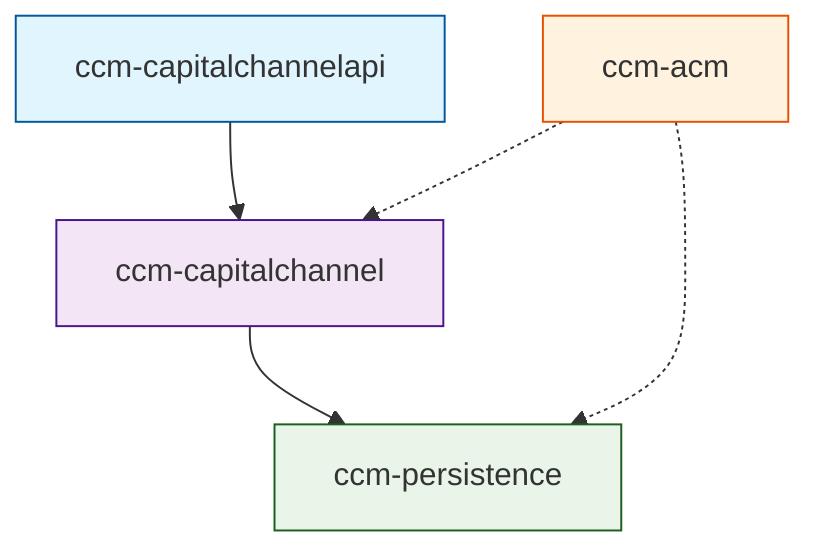
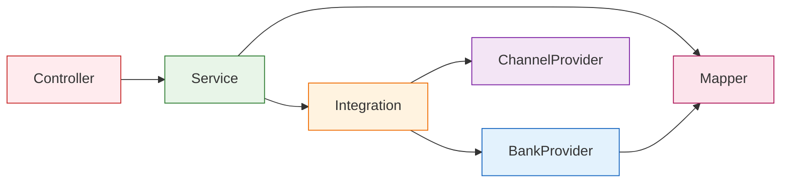

## 工程模块规范

### 根模块结构
```
capitalchannelmanager/
├── pom.xml                          # 父POM文件
├── ccm-capitalchannel/              # 核心业务模块
├── ccm-capitalchannelapi/           # API接口模块
├── ccm-persistence/                 # 数据持久化模块
└── ccm-acm/                         # 应用配置模块
```

### 模块依赖关系

#### 工程依赖关系


#### 分层依赖关系


## ccm-capitalchannel 核心业务模块

### 包结构描述
```
com.hundsun.ccm.fundtransfer/
├── FundTransferApplication.java     # 主启动类
├── atom/                           # 原子服务层
│   └── impl/                          # 原子服务实现
├── bankprovider/                   # 银行适配器
│   ├── BankAbstractProviderApi.java    # 银行适配器抽象基类
│   ├── BankProviderApi.java           # 银行适配器接口
│   ├── BankProviderApiFactory.java    # 银行适配器工厂
│   ├── impl/                       # 银行适配器实现
│   │   ├── AbcBankProviderApi.java        # 农业银行适配器
│   │   ├── CcbBankProviderApi.java        # 建设银行适配器
│   │   ├── CmbBankProviderApi.java        # 招商银行适配器
│   │   ├── IcbcBankProviderApi.java       # 工商银行适配器
│   │   └── ...                            # 其他银行适配器
│   └── xmlhelper/                     # XML帮助类
├── channelprovider/                # 通道提供者
│   ├── ChannelProviderApi.java        # 通道提供者接口
│   ├── ChannelProviderApiFactory.java # 通道提供者工厂
│   ├── ProcessRevMsg.java             # 消息处理
│   ├── ProcessRevMsgApi.java          # 消息处理接口
│   ├── ProcessRevMsgFactory.java      # 消息处理工厂
│   ├── XStreamSingleTon.java          # XStream单例
│   ├── dataprocess/                   # 数据处理
│   └── impl/                          # 通道实现
├── config/                        # Java配置类
│   ├── ApplicationContextHelper.java # 应用上下文帮助类
│   ├── AsyncTaskExecutorConfiguration.java # 异步任务配置
│   ├── DataSourceAutoConfiguration.java # 数据源自动配置
│   ├── DozerBeanMapperConfiguration.java # Dozer映射配置
│   ├── ExceptionHandlingAsyncTaskExecutor.java # 异常处理执行器
│   ├── InstructionFiledConfiguration.java # 指令字段配置
│   └── WebDataConvertConfig.java   # Web数据转换配置
├── controller/                     # 控制器层
│   ├── AccBalanceController.java      # 账户余额控制器  
│   ├── AccDetailController.java       # 账户明细控制器
│   ├── BackendController.java         # 后端控制器
│   ├── ChannelServeController.java    # 通道服务控制器
│   ├── CheckAcccodeController.java    # 账户检查控制器
│   ├── InitialHkMainController.java   # 初始化控制器
│   ├── LimiterMonitorController.java  # 限流监控控制器
│   ├── MoneyOrderController.java      # 划款指令控制器
│   ├── SztConfigSynchronizeController.java # 配置同步控制器
│   └── SztLogController.java          # 日志控制器
├── dto/                           # 数据传输对象
│   ├── field/                      # 字段定义
│   │   ├── FiledUnit.java
│   │   ├── InstructionFiled.java
│   │   └── InstructionFiledMap.java
│   └── ...                        # 其他DTO
├── encryptor/                     # 加密服务
├── enums/                         # 枚举类
├── exception/                     # 异常类
├── integration/                   # 集成服务
│   ├── CommRateLimiterHandler.java    # 通用限流处理器
│   ├── SztStrategyFactory.java        # 策略工厂
│   ├── message/                       # 消息集成
│   └── stragy/                        # 策略模式实现
│       └── BankLimiterStrategy.java   # 银行限流策略
├── properties/                    # 属性配置类
├── service/                       # 业务服务层
│   ├── AccBalanceService.java             # 账户余额服务接口
│   ├── AccDetailSerive.java               # 账户明细服务接口
│   ├── AutoSendFeedbackSevice.java        # 自动发送反馈服务
│   ├── ChannelServeSerive.java            # 通道服务接口
│   ├── CheckAcccodeService.java           # 账户检查服务
│   ├── HandleBalanceDetailService.java    # 余额明细处理服务
│   ├── HandleFileSendService.java         # 文件发送处理服务
│   ├── HandleStatusQueryService.java      # 状态查询处理服务
│   ├── HandleTransferService.java         # 转账处理服务
│   ├── InitialHkMainService.java          # 初始化服务
│   ├── MoneyOrderFileService.java         # 划款指令文件服务
│   ├── MoneyOrderService.java             # 划款指令服务
│   ├── SztConfigSynchronizeService.java   # 配置同步服务
│   ├── SztLogService.java                 # 日志服务
│   ├── impl/                       # 服务实现
│   │   ├── HandleBalanceDetailService.java   # 余额明细处理服务
│   │   ├── HandleStatusQueryService.java     # 状态查询处理服务
│   │   ├── HandleTransferService.java        # 转账处理服务
│   │   ├── MoneyOrderServiceImpl.java        # 划款指令服务实现
│   │   └── ...                               # 其他服务实现
│   └── thread/                        # 线程服务
├── task/                          # 定时任务
└── util/                          # 工具类
    ├── CCMResultCodeConstant.java     # 结果码常量
    ├── Constants.java                # 常量定义
    ├── DateUtils.java                # 日期工具类
    ├── Utils.java                    # 通用工具类
    └── XmlUtils.java                 # XML工具类
```

### 资源配置文件(位于src/main/resources)
```
resources/
├── application.properties          # 主配置文件
├── log4j2.xml                      # 日志配置
├── BankOperationTypeMap.xml        # 银行操作类型映射
├── InstructionFileds.xml           # 指令字段配置  
├── IntrucStateMap.xml              # 指令状态映射
├── DozerBean.xml                   # Dozer映射配置
├── parameter.properties            # 参数配置
├── abc_cert.dat                    # 农业银行证书
├── EKey.lib                        # 加密库
├── A1/                             # A1版本配置
├── V4/                             # V4版本配置
├── V5/                             # V5版本配置
├── META-INF/                       # 元数据配置
├── assemble/                       # 组装配置
└── generate/                       # 生成配置
```

## ccm-capitalchannelapi API接口模块

### 包结构描述
```
com.hundsun.ccm.fundtransfer.api/
├── service/                    # 服务接口
│   ├── MoneyOrderService.java  # 划款指令服务接口
│   ├── AccBalanceService.java  # 账户余额服务接口
│   ├── AccDetailService.java   # 账户明细服务接口
└── ...
├── dto/                        # API数据传输对象
│   ├── MoneyOrderDTO.java      # 划款指令DTO
│   ├── AccBalanceDTO.java      # 账户余额DTO
│   ├── AccDetailDTO.java       # 账户明细DTO
│   └── ...                     
├── vo/                         # 视图对象
│   ├── MoneyOrderVO.java       # 划款指令VO
│   ├── AccBalanceVO.java       # 账户余额VO
│   ├── AccDetailVO.java        # 账户明细VO
│   └── ...                     
└── util/                       # 工具类
    └── ...                     # API相关工具类
```

## ccm-persistence 数据持久化模块

### 包结构描述
```
com.hundsun.ccm.datasource/
├── annotation/                         # 注解
├── common/                             # 通用数据模型
│   ├── dto/                            # 持久化DTO
│   │   ├── MoneyOrderRetDTO.java       # 划款指令提交响应DTO
│   │   ├── MoneyOrderStandDTO.java     # 划款指令提交请求DTO
│   │   └── ...                         # 其他DTO
│   └── model/                          # 持久化Model
│       ├── CheckAcccode.java           # 账户检查Model
│       ├── HkAccBalance.java           # 账户余额Model
│       ├── HkAccDetail.java            # 账户详情Model
│       ├── HkMain.java                 # 主表Model
│       ├── SztLog.java                 # 日志Model
│       └── ...                         # 其他Model
└── mapper/                             # MyBatis映射器
    ├── AccCapitalAdjustmentRetMapper.java # 资本调整返回映射器
    ├── CheckAcccodeBalDetailMapper.java # 账户检查余额明细映射器
    ├── CheckAcccodeBalMapper.java      # 账户检查余额映射器
    ├── CheckAcccodeDetailMapper.java   # 账户检查详情映射器
    ├── CheckAcccodeMapper.java         # 账户检查映射器
    ├── HkAccBalanceMainMapper.java     # 账户余额主表映射器
    ├── HkAccBalanceMapper.java         # 账户余额映射器
    ├── HkAccDetailMainMapper.java      # 账户详情主表映射器
    ├── HkAccDetailMapper.java          # 账户详情映射器
    ├── HkMainMapper.java               # 主表映射器
    ├── SztLogMapper.java               # 日志映射器
    ├── enums/                          # 枚举类
    │   ├── AccountStateEnum.java       # 账户主表状态枚举
    │   ├── BasicBizTypeEnum.java       # 基本业务类型枚举
    │   ├── HkBizTypeEnum.java          # 划款业务类型枚举
    │   └── ...                         # 其他枚举类
    └── ...                             # 其他映射器及对应的SqlProvider
```

## ccm-acm 应用配置模块

### 部署配置文件
```
ccm-acm/
├── deploy.xml                       # 部署配置
├── scripts/                         # 部署脚本
│   ├── install.sh                   # 安装脚本
│   ├── uninstall.sh                 # 卸载脚本
│   └── afterinstall.sh              # 安装后脚本
├── sqls/                            # 数据库脚本
│   ├── mysql/                       # MySQL脚本
│   │   └── ccmserver/               # 服务器脚本
│   │       └── COP2.0-CCM.V版本号    # 数据库脚本
│   │           └── 序号.类型.ddl.sql #DDL脚本 
│   │           └── 序号.类型.dml.sql #DML脚本
│   ├── oracle/                      # Oracle脚本
│   ├── dm/                          # 达梦脚本
│   ├── gaussdbopengauss/            # OpenGauss脚本
│   ├── obmysql/                     # OceanBase MySQL脚本
│   ├── oboracle/                    # OceanBase Oracle脚本
│   └── tdsqlmysql/                  # TDSQL MySQL脚本
└── template/                        # 配置模板
    ├── application.properties       # 应用配置模板
    ├── log4j2.xml                   # 日志配置模板
    ├── startup.sh                   # 启动脚本模板
    ├── shutdown.sh                  # 停止脚本模板
    ├── bootstrap.sh                 # 引导脚本模板
    ├── validateStart.sh             # 启动验证脚本
    ├── validateStop.sh              # 停止验证脚本
    └── getDump.sh                   # 转储脚本
```