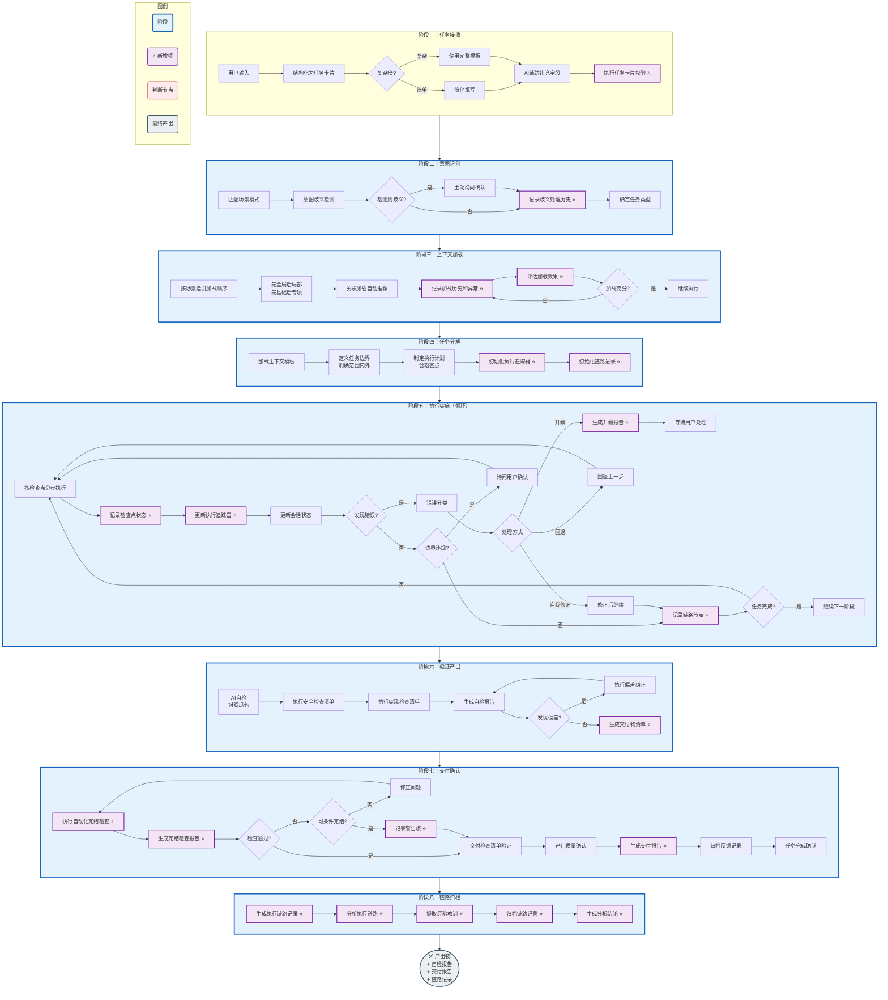

# AI 工作上下文体系设计

> 版本：11.0
> 创建日期：2026-05-19
> 最后更新：2026-05-22
> 状态：精简版

---

## 一、设计背景与目标

### 1.1 核心问题

**如何让 AI 高效、稳定地完成研发相关的工作？**

AI 工作的本质是"基于上下文推理与生成"——AI 的产出质量直接取决于输入上下文的完整度和准确度。然而，在软件工程场景中，AI 面临以下挑战：

| 问题 | 表现 | 影响 |
|-----|------|-----|
| **上下文缺失** | AI 不了解项目背景、业务领域、技术栈 | 产出泛泛而谈，缺乏针对性 |
| **上下文混乱** | AI 误解术语、混淆概念 | 产生幻觉、错误推断 |
| **上下文不稳定** | 每次会话 AI 对项目的理解不一致 | 产出质量波动大 |
| **上下文构建成本高** | AI 需要从大量源码中自行理解系统 | 效率低下、耗时久 |
| **过程缺乏引导** | AI 不知道做到哪了、下一步该做什么 | 执行效率低、容易偏差 |

### 1.2 设计目标

让 AI 能高效稳定地完成工作：

| 目标维度 | 具体要求 |
|---------|---------|
| **高效性** | 快速加载所需上下文，减少理解歧义，避免重复劳动 |
| **稳定性** | 产出格式一致，质量可预期，减少偏差和返工 |
| **可追溯** | 知识资产有清晰的来源和引用关系 |
| **可演进** | 规约和模板可随项目发展持续优化 |
| **可验证** | 规约遵守情况可检查、可量化 |
| **可持续** | 知识资产随代码变更保持时效性 |
| **过程可控** | 执行过程有检查点、边界明确、错误可处理 |
| **成本可控** | 根据任务复杂度差异化执行，避免过度设计导致的资源浪费 |

---

## 二、体系概览

本体系由五个层次构成，各层有明确的职责边界和协作关系。

### 2.1 层次总览

| 层次 | 核心职责 | 回答的问题 |
|-----|---------|-----------|
| **知识层** | 静态沉淀系统设计与实现的结构化知识 | AI 需要理解什么？ |
| **规约层** | 对上下文使用的约束和产出规范 | AI 应该怎么做对？ |
| **交互层** | 任务执行过程中的动态信息 | AI 做到哪了？ |
| **工具层** | AI 可用的操作工具及其约束 | AI 能做什么？ |
| **集成层** | Agent平台与四层资产的连接机制 | 怎么桥接AI平台与资产？ |

### 2.2 层次关系

```
┌─────────────────────────────────────────────────────────────────┐
│                         用户输入                                 │
└─────────────────────────────────────────────────────────────────┘
                              │
                              ▼
┌─────────────────────────────────────────────────────────────────┐
│  ① 知识层 ──▶ 知道"是什么" + "怎么做参考"                      │
│     静态沉淀的系统设计知识，支撑 AI 理解业务和技术                 │
├─────────────────────────────────────────────────────────────────┤
│  ② 规约层 ──▶ 知道"怎么做对"                                   │
│     对上下文使用的约束，定义产出标准和行为边界                     │
├─────────────────────────────────────────────────────────────────┤
│  ③ 交互层 ──▶ 知道"做到哪了"                                   │
│     任务执行过程中的动态信息，支撑 AI 按正确流程执行                │
├─────────────────────────────────────────────────────────────────┤
│  ④ 工具层 ──▶ 知道"能做什么"                                   │
│     AI 可用的操作工具及其约束，定义能力边界                       │
├─────────────────────────────────────────────────────────────────┤
│  ⑤ 集成层 ──▶ 桥接"AI平台"与"四层资产"                        │
│     Agent平台读取和使用四层资产的通道                             │
└─────────────────────────────────────────────────────────────────┘
                              │
                              ▼
┌─────────────────────────────────────────────────────────────────┐
│                         产出交付                                 │
└─────────────────────────────────────────────────────────────────┘
```

### 2.3 层次依赖

| 层次 | 依赖关系 | 说明 |
|-----|---------|------|
| 交互层 | 依赖知识层、规约层、工具层 | 执行时需要调用这三层的资产 |
| 工具层 | 被交互层调用 | 为交互层提供操作能力 |
| 集成层 | 连接所有层 | 负责正向读取和反向反哺 |

### 2.4 后续章节

各层的详细设计在后续章节展开：

| 章节 | 内容 |
|-----|------|
| 三 | 知识层设计 |
| 四 | 规约层设计 |
| 五 | 交互层设计 |
| 六 | 工具层设计 |
| 七 | 集成层设计 |
| 八 | AI工作完整流程 |
| 九 | 资产优先级 |
| 十 | 成本控制策略 |
| 十一 | 设计原则 |
| 十二 | 体系文件清单 |

---

## 三、知识层设计

### 3.1 知识层结构

```
KnowledgeLayer/
├── 01-business-knowledge/        # 业务知识（语义切片、领域模型、术语）
├── 02-technical-knowledge/     # 技术知识（代码模式、诊断流程、架构规则）
├── 03-structural-knowledge/    # 结构知识（模块目录、系统概览）
└── 04-knowledge-management/     # 知识管理（资产归属、保鲜机制）
```

**说明**：详细目录在资产实际创建时定义，保持灵活性。

### 3.2 核心资产类型

| 资产类型 | 说明 | 优先级 |
|---------|------|--------|
| **业务术语** | 统一项目中的业务和技术用语 | P0 |
| **语义切片** | 业务知识的原子单元 | P0 |
| **代码模式库** | 同类代码的组织方式和风格示例 | P0 |
| **诊断流程图** | 系统化排查问题的决策树 | P1 |
| **架构规则** | 技术约束和设计原则 | P1 |
| **问题模式库** | 常见问题的根因和解决方案 | P1 |

### 3.3 语义切片

语义切片是业务知识的原子单元，以"业务做什么"为核心组织单元。

**语义切片结构**

 每个语义切片包含完整的业务语义信息：

 - `slice_profile.md` - 切片概要：名称、编码、所属域、关联模块
 - `business_goal.md` - 业务目标：解决的问题、创造的价值
 - `business_rules.md` - 业务规则：约束条件、计算逻辑、业务校验
 - `execution_flow.md` - 执行流程：步骤序列、分支条件、异常处理
 - `state_machine.md` - 状态机：状态定义、转换事件、转换条件
 - `edge_cases.md` - 边界场景：边界条件、异常情况、特殊处理
 - `ai_context.md` - AI执行提示：分析切入点、代码定位、常见问题

**语义切片索引**

 - **入口**：`semantic-index.md` - 按域分类的语义切片总索引
 - **依赖关系**：`semantic-dependencies.md` - 切片间依赖关系图

**使用场景**：
 - AI 理解业务时，从索引找到相关切片
 - AI 实现功能时，参考切片的执行流程和规则

### 3.4 领域模型

领域模型描述业务实体的结构和关系。

**领域模型索引**

 - **领域地图** (`domain-map.md`) - 业务域划分、域间关系
 - **领域目录** (`domain-catalog/`) - 各领域下的实体清单
 - **实体关系** - 实体间的关联、聚合、继承关系

**使用场景**：
 - AI 理解业务实体时，查找领域模型
 - AI 设计数据结构时，参考已有的实体定义
 - AI 定位问题时，理解数据流转路径

### 3.5 术语词汇

术语词汇统一项目中的业务和技术用语，避免歧义。

**术语词汇索引**

 - **业务术语** (`business-terms.md`) - 业务相关的专业术语定义
 - **同义词表** (`synonyms.md`) - 不同表述的同一概念映射

**使用场景**：
 - AI 理解用户输入时，统一术语认知
 - AI 编写文档时，使用标准术语
 - AI 处理歧义时，参考同义词表

### 3.6 代码模式库

代码模式库告诉 AI"怎么做参考"，与语义切片"要做什么"互补。

**代码模式库索引**

- **目录**：dao-patterns.md、service-patterns.md、controller-patterns.md、transaction-patterns.md、error-handling-patterns.md
- **使用场景**：
  - AI 实现新功能时，参考同类代码的组织方式
  - AI 编写代码时，参考已有的代码风格
  - AI 理解代码结构时，对照模式理解意图

### 3.7 诊断流程图

诊断流程图帮助 AI 系统化地排查问题。

**诊断流程图索引**

- **目录**：state-problem-guide.md、transaction-problem-guide.md、api-problem-guide.md

**使用场景**：
- 缺陷修复时，快速定位问题根因
- 异常排查时，系统化分析

### 3.8 问题模式库

问题模式库沉淀常见问题的根因和解决方案。

**问题模式库索引**

- **目录**：problem-index.md、error-patterns.md
- **问题分类**：
  - 状态问题 - 状态异常、状态转换失败
  - 事务问题 - 事务超时、数据不一致
  - 接口问题 - 调用超时、返回异常

**使用场景**：
- 遇到已知问题时，快速匹配问题模式
- 问题定位时，参考历史根因分析
- 预防问题时，参考常见错误场景

### 3.9 架构规则

架构规则定义系统设计的技术约束和设计原则。

**架构规则索引**

- **分层规则** (layering.md) - 分层职责、依赖方向、禁止跨层调用
- **RPC规范** (rpc.md) - 接口设计、服务调用、版本管理
- **消息队列** (mq.md) - 消息格式、发布订阅、事务处理
- **缓存策略** (cache.md) - 缓存粒度、失效策略、一致性要求
- **事务规则** (transaction.md) - 事务边界、传播行为、隔离级别
- **设计模式** (design-patterns.md) - 通用设计模式在本项目的应用

**使用场景**：
- AI 实现功能时，确保符合架构约束
- AI 进行技术决策时，参考设计模式
- AI 评审代码时，检查是否违反架构规则

### 3.10 模块目录

模块目录提供代码组织的结构化视图。

**模块目录索引**

- **模块索引** (module-index.md) - 所有模块的总览和分类
- **模块详情** (module-catalog/) - 各模块的详细说明
- **依赖关系** (module-dependencies.md) - 模块间的依赖图

**使用场景**：
- AI 定位代码时，从模块索引找到目标模块
- AI 理解代码结构时，参考模块依赖关系
- AI 规划变更时，评估影响范围

### 3.11 系统概览

系统概览提供项目的高层整体视图。

**系统概览索引**

- **系统概要** (system-profile.md) - 项目背景、定位、目标
- **系统范围** (system-scope.md) - 功能范围、边界、集成点
- **技术基线** (tech-baseline.md) - 技术栈、版本、约束

**使用场景**：
- AI 初次接触项目时，建立整体认知
- AI 进行架构分析时，参考技术基线
- AI 确定实现方案时，了解系统边界

### 3.12 资产归属

资产归属明确各类知识资产的责任人和维护规则。

**资产归属索引**

- **Owner矩阵** (owner-matrix.md) - 资产类型与Owner角色的映射
- **归属规则** (ownership-rules.md) - 归属判定规则、变更流程
- **交接流程** (handover-procedure.md) - 资产交接的标准化流程

**Owner矩阵**

| 资产类型 | Owner角色 | 维护内容 |
|---------|---------|---------|
| 业务术语 | 业务分析师 | 术语定义、解释 |
| 业务规则 | 业务分析师+架构师 | 规则定义、约束条件 |
| 状态机 | 架构师 | 状态定义、转换规则 |
| 代码模式 | 核心开发 | 代码组织、风格示例 |
| 诊断流程 | 架构师+核心开发 | 排查路径、常见问题 |
| 边界场景 | 测试+开发 | 异常情况、边界条件 |
| AI执行提示 | AI研发专家 | 分析切入点、代码定位 |
| 架构规则 | 架构师 | 技术约束、分层规则 |
| 问题模式 | 开发/运维 | 错误模式、根因分析 |

**使用场景**：
- 知识资产需要更新时，找对应Owner
- Owner变更时，按交接流程执行
- 出现知识争议时，按归属规则判定

### 3.13 资产维护

资产维护定义知识资产的保鲜策略和更新机制。

#### 资产分级保鲜策略

| 级别 | 内容 | 保鲜策略 | 更新触发 | 维护成本 |
|-----|------|---------|---------|---------|
| **L1 核心** | 业务规则、状态机 | Hook自动触发 | commit包含 `[AUTO-KB]` 前缀 | 高 |
| **L2 重要** | 业务术语、执行流程 | CI分析触发 | `/refresh-kb` 命令 | 中 |
| **L3 一般** | 边界场景、问题模式 | 人工触发 | 季度审查+反馈触发 | 低 |
| **L4 辅助** | AI执行提示、示例代码 | 按需更新 | 反馈驱动 | 极低 |

**L1核心资产保鲜Hook实现**

**触发条件**：commit message包含 `[AUTO-KB]`

```bash
# .git/hooks/pre-commit 或 CI配置
if commit message contains "[AUTO-KB]"; then
  # 分析commit涉及哪些语义切片
  affected_slices=$(analyze_affected_slices)

  # 自动更新相关切片的 ai_context.md
  for slice in $affected_slices; do
    update_ai_context $slice
  done

  # 记录更新日志
  log_update $affected_slices
fi
```

**工程师操作**

```bash
git commit -m "[AUTO-KB] 修复订单模块实现逻辑"
# 自动触发订单相关语义切片的ai_context.md更新
```

**知识保鲜触发类型**

| 触发类型 | 触发条件 | 自动化程度 | 适用资产 |
|---------|---------|-----------|---------|
| **Hook触发** | commit包含 `[AUTO-KB]` | 自动 | L1核心资产 |
| **命令触发** | 执行 `/refresh-kb` | 半自动 | L2重要资产 |
| **审查触发** | 季度首月1号 | 人工 | L3一般资产 |
| **反馈触发** | 收到知识反馈 | 人工 | L4辅助资产 |

**L1核心资产数量控制原则**

为控制维护成本，L1核心资产应控制在**20个以内**：

- 选取标准：代码中直接引用、变更频率高的业务规则
- 不纳入标准：描述性文档、示例代码
- 定期清理：每季度审查L1资产清单，移除不再活跃的资产

**资产维护索引**

- **保鲜策略** (freshness-strategy.md) - 各级别资产的保鲜规则
- **更新流程** (update-workflow.md) - 资产更新的标准流程
- **变更影响** (change-impact.md) - 资产变更的影响评估

---

## 四、规约层设计

### 4.1 目录结构

```
ConventionLayer/
├── 01-document/                  # 文档规约
│   ├── templates/               # 文档模板
│   │   ├── requirements-template.md     # 需求规格分析模板
│   │   └── user-guide-template.md      # 用户手册模板
│   ├── standards/               # 文档标准
│   │   └── document-quality.md
│   └── checklists/              # 文档检查清单
│       └── document-review.md
│
├── 02-code/                    # 代码规约
│   ├── templates/               # 代码模板
│   │   └── code-style.md
│   ├── standards/               # 代码标准
│   │   ├── naming-convention.md
│   │   └── architecture-rules.md
│   └── checklists/              # 代码检查清单
│       ├── security.md          # 安全检查
│       ├── naming.md            # 命名检查
│       ├── structure.md         # 结构检查
│       └── comment.md           # 注释检查
│
├── 03-test/                    # 测试规约
│   ├── templates/               # 测试模板
│   │   ├── unit-test-template.md
│   │   └── integration-test-template.md
│   ├── standards/               # 测试标准
│   │   └── test-coverage.md
│   └── checklists/              # 测试检查清单
│       └── test-review.md
│
├── 04-behavior/               # 行为规则（通用）
│   ├── safety-red-lines.md     # 安全红线
│   ├── decision-rules.md        # 决策规则
│   └── change-rules.md          # 变更规则
│
├── 05-hierarchy/               # 规约分层
│   ├── MUST.md                 # 强制层
│   └── SHOULD.md               # 指导层
│
├── 06-verification/            # 规约验证
│   ├── self-check.md           # 自检模板
│   ├── audit.md                # 人工抽审
│   └── scoring.md              # 遵守度评分
│
└── 07-extensions/             # 扩展机制
    └── extensions-guide.md      # 扩展指南
```

### 4.2 产出规约体系

规约层为具体产出保驾护航，每类产出都有相似的配套资产模式。

#### 4.2.1 产出类型定义

规约层支持以下产出类型：

| 序号 | 产出类型 | 说明 | Owner |
|-----|---------|------|-------|
| 01 | 文档 | 各类分析、设计文档 | - |
| 02 | 代码 | 源代码及配置 | - |
| 03 | 测试 | 测试代码及用例 | - |

#### 4.2.2 产出规约模式

每类产出类型必须包含以下规约：

| 规约类型 | 说明 | 必须性 |
|---------|------|--------|
| **模板** | 定义产出的格式和结构 | MUST |
| **标准** | 定义产出的质量门槛 | MUST |
| **检查清单** | 定义产出前的验证要点 | MUST |

#### 4.2.3 产出规约详情

##### 文档规约

文档规约为各类文档产出提供模板和验证标准。

**文档模板索引**

- requirements-template.md - 需求规格分析模板
- user-guide-template.md - 用户手册模板

**文档标准索引**

- document-quality.md - 文档质量标准（完整性、一致性、可读性）

**文档检查清单索引**

- document-review.md - 文档产出前的检查要点

##### 代码规约

代码规约为源代码产出提供模板和验证标准。

**代码模板索引**

- code-style.md - 代码风格模板（注释、格式化）

**代码标准索引**

- naming-convention.md - 命名规范（变量、方法、类、包）
- architecture-rules.md - 架构规则（分层、依赖、接口）

**代码检查清单索引**

- security.md - 安全检查（SQL安全、参数校验、敏感数据）
- naming.md - 命名检查（符合规范、前后一致）
- structure.md - 结构检查（分层正确、无循环依赖）
- comment.md - 注释检查（必要注释、无过期注释）

##### 测试规约

测试规约为测试代码产出提供模板和验证标准。

**测试模板索引**

- unit-test-template.md - 单元测试模板（Given-When-Then）
- integration-test-template.md - 集成测试模板

**测试标准索引**

- test-coverage.md - 测试覆盖率标准

**测试检查清单索引**

- test-review.md - 测试代码检查要点

### 4.3 通用规约

通用规约不绑定具体产出类型，适用于所有产出。

#### 4.3.1 行为规则

**行为规则索引**

- safety-red-lines.md - 安全红线（绝对禁止的行为）
- decision-rules.md - 决策规则（边界情况处理原则）
- change-rules.md - 变更规则（修改现有代码的原则）

#### 4.3.2 规约分层

| 层级 | 标识 | 说明 | 违反处理 |
|-----|-----|------|---------|
| **强制层** | MUST | 不可突破，违反则拒绝执行 | 阻止+报错 |
| **指导层** | SHOULD | 可灵活，但需说明理由 | 警告+记录 |

#### 4.3.3 规约验证

**三层验证体系**

- **第一层：AI自检** - 按清单自检，生成自检报告
- **第二层：自动化检查** - 格式检查、结构检查、内容检查、架构检查
- **第三层：人工抽审** - 高风险产出提高抽样率，新AI/新场景提高抽样率

##### 4.3.3.1 门控模型（替代加权评分）

**核心原则：安全检查一票通过，其他检查允许容错**

**门控模型定义**

```
通过条件：ALL(P0检查项通过) AND (P1检查项通过率 ≥ 90%) AND (P2检查项通过率 ≥ 80%)

拒绝条件：任意P0检查项失败
```

**检查项优先级定义**

| 优先级 | 说明 | 示例 | 失败处理 |
|-------|------|------|---------|
| **P0** | 一票否决项 | 安全检查（SQL注入、XSS、敏感数据泄露）、编译失败 | 立即拒绝，阻塞交付 |
| **P1** | 重要项 | 架构规则违规、命名不规范、缺少必要注释 | 警告，需修复或说明 |
| **P2** | 一般项 | 代码格式、注释风格、次要规范 | 建议，可接受说明 |

**门控模型优势**

| 对比维度 | 加权评分模型 | 门控模型 |
|---------|------------|---------|
| **语义清晰度** | 85分含义模糊 | P0全部通过=合格，含义明确 |
| **决策可操作性** | 需要阈值判断 | 明确的通过/拒绝边界 |
| **安全感知** | 安全项权重30%，仍可能被高分掩盖 | P0一票否决，安全底线明确 |
| **工程实践** | 复杂计算 | 简单布尔逻辑 |

##### 4.3.3.2 检查项枚举标准

**P0检查项清单（必须100%通过，否则拒绝交付）**

```text
## P0检查项清单

### 安全类（必须全部通过）

- [ ] SEC-001: 无SQL拼接
  - 检测方法：检查是否使用参数化查询（PreparedStatement、MyBatis #{}）
  - 判定：存在字符串拼接SQL → 失败

- [ ] SEC-002: 无XSS风险
  - 检测方法：检查输出是否使用编码（HTML编码、正则过滤）
  - 判定：用户输入直接输出无编码 → 失败

- [ ] SEC-003: 无敏感数据泄露
  - 检测方法：检查是否存在硬编码密钥、日志是否脱敏
  - 判定：发现硬编码密码/密钥、敏感字段未打码 → 失败

- [ ] SEC-004: 无命令注入
  - 检测方法：检查是否存在动态命令拼接（Runtime.exec、ProcessBuilder）
  - 判定：用户输入拼接命令 → 失败

- [ ] SEC-005: 无越权访问
  - 检测方法：检查关键操作是否有权限校验
  - 判定：修改/删除操作无权限校验 → 失败

### 质量类（必须全部通过）

- [ ] QUL-001: 编译通过
  - 检测方法：执行 mvn compile 或 npm run build
  - 判定：编译错误 → 失败

- [ ] QUL-002: 单元测试通过
  - 检测方法：执行 mvn test 或 npm test
  - 判定：测试失败 → 失败

- [ ] QUL-003: 规约检查通过
  - 检测方法：执行linter检查
  - 判定：linter报错 → 失败
```

**P1检查项清单（允许1项失败，否则警告）**

```text
## P1检查项清单

- [ ] NAM-001: 命名规范符合
  - 检测方法：命名规范检查工具
  - 允许：每类最多1项失败

- [ ] NAM-002: 包路径规范符合
  - 检测方法：包路径检查
  - 允许：每类最多1项失败

- [ ] CMT-001: 必要注释存在
  - 检测方法：公共类/方法是否有JavaDoc
  - 允许：每类最多1项失败

- [ ] STR-001: 分层规范符合
  - 检测方法：检查是否存在跨层调用
  - 允许：每类最多1项失败

- [ ] ARC-001: 无循环依赖
  - 检测方法：依赖分析工具
  - 允许：每类最多1项失败
```

**P2检查项清单（允许2项失败，否则警告）**

```text
## P2检查项清单

- [ ] FMT-001: 代码格式符合
  - 检测方法：格式化工具检查
  - 允许：每类最多2项失败

- [ ] FMT-002: import排序正确
  - 检测方法：import排序检查
  - 允许：每类最多2项失败

- [ ] DOC-001: API文档存在
  - 检测方法：REST API是否有Swagger注解
  - 允许：每类最多2项失败
```

**检查项文件位置**

所有检查项定义存储在：ConventionLayer/02-code/checklists/checklist-enum.md

##### 4.3.3.3 门控执行流程

**门控检查流程**

```
[执行P0检查]
     │
     ▼
┌─────────────────────────────┐
│ P0全部通过？                │
└─────────────────────────────┘
     │
     ├── 否 ──→ [立即拒绝] ──→ [报告P0失败项]
     │
     └── 是 ──→ [执行P1检查]
                     │
                     ▼
             [计算P1通过率]
                     │
                     ▼
             ┌─────────────────────────────┐
             │ P1通过率 ≥ 90%？            │
             └─────────────────────────────┘
                     │
                     ├── 否 ──→ [警告] ──→ [要求修复或说明]
                     │
                     └── 是 ──→ [执行P2检查]
                                     │
                                     ▼
                             [计算P2通过率]
                                     │
                                     ▼
                             ┌─────────────────────────────┐
                             │ P2通过率 ≥ 80%？            │
                             └─────────────────────────────┘
                                     │
                                     ├── 否 ──→ [警告] ──→ [可接受说明]
                                     │
                                     └── 是 ──→ [通过]
```

##### 4.3.3.4 复杂度分级与检查深度

**不同复杂度的检查策略**

| 任务等级 | P0检查 | P1检查 | P2检查 | 说明 |
|---------|--------|--------|--------|------|
| **L1-极简** | 全部执行 | 简化检查 | 跳过 | 仅P0必须 |
| **L2-标准** | 全部执行 | 全部执行 | 抽样检查 | 标准策略 |
| **L3-完整** | 全部执行 | 全部执行 | 全部执行 | 严格策略 |

##### 4.3.3.5 规约遵守度报告格式

**门控检查报告**

```text
## 规约遵守度报告

**任务ID**：{TSK-YYYYMMDD-NNN}
**检查时间**：{时间}
**任务等级**：{L1/L2/L3}

### 检查结果

| 优先级 | 检查项数 | 通过数 | 通过率 | 结果 |
|-------|---------|-------|-------|------|
| P0 | {N} | {N} | 100% | ✅ 通过 |
| P1 | {N} | {N} | {X}% | {✅通过/⚠️警告} |
| P2 | {N} | {N} | {X}% | {✅通过/⚠️警告} |

### 判定结果

- **P0门控**：✅ 全部通过
- **P1门控**：✅ 90%以上通过
- **P2门控**：✅ 80%以上通过
- **最终判定**：✅ 通过 / ⚠️ 有警告 / ❌ 拒绝

### 失败项详情（如有）

| 优先级 | 检查项 | 状态 | 说明 |
|-------|--------|------|------|
| P0 | SQL注入检查 | ❌ 失败 | {详情} |
| P1 | 命名规范 | ⚠️ 警告 | {详情} |

### 修复建议

1. {建议1}
2. {建议2}
```

### 4.4 扩展机制

#### 4.4.1 扩展原则

| 原则 | 说明 |
|-----|------|
| **模式一致** | 新增产出类型时，必须遵循"模板+标准+检查清单"三件套 |
| **命名规范** | 目录命名为 `NN-{产出类型}/`，序号按创建顺序 |
| **索引更新** | 新增产出类型时，同步更新规约索引 |
| **Owner定义** | 每类产出规约必须指定Owner |

#### 4.4.2 扩展流程

```
1. 识别需求
   └── 新增产出类型的业务场景

2. 评估必要性
   ├── 是否已有类似产出类型可复用？
   ├── 是否适合作为独立产出类型？
   └── 是否符合规约层的设计目标？

3. 创建规约结构
   └── 按模板+标准+检查清单三件套创建

4. 定义元数据
   ├── 产出类型名称
   ├── 适用场景
   ├── Owner
   └── 关联的知识层资产

5. 更新索引
   └── 同步更新规约索引文件

6. 验证可用性
   ├── AI能否正确使用新规约？
   └── 规约间是否有冲突？
```

#### 4.4.3 产出类型定义模板

```text
# {产出类型}规约

## 基本信息

| 属性 | 值 |
|-----|-----|
| 名称 | {产出类型} |
| 说明 | {描述} |
| Owner | {负责人} |
| 创建日期 | {日期} |
| 适用场景 | {使用场景} |

## 关联资产

| 类型 | 关联内容 |
|-----|---------|
| 知识层 | {关联的语义切片/模块等} |
| 产出模板 | {模板文件} |
| 验收标准 | {标准文件} |

## 配套规约

| 规约类型 | 文件 | 说明 |
|---------|-----|------|
| 模板 | {path} | {说明} |
| 标准 | {path} | {说明} |
| 检查清单 | {path} | {说明} |
```

#### 4.4.4 扩展检查清单

新增产出类型时，必须满足：

- [ ] 创建了模板文件
- [ ] 创建了验收标准
- [ ] 创建了检查清单
- [ ] 指定了Owner
- [ ] 更新了规约索引
- [ ] 定义了与其他规约的关系

---

## 五、交互层设计

### 5.1 交互层结构

```
InteractionLayer/
├── 00-task-input/                 # 任务输入（任务卡片模板）
├── 01-task-context/              # 任务上下文（任务边界）
├── 02-session-state/              # 会话状态（执行进度、检查点）
├── 03-feedback-record/           # 反馈记录（错误历史、经验积累）
├── 04-intent-recognition/        # 意图识别（模式匹配、歧义处理）
├── 05-correction-guides/          # 偏差纠正
├── 06-scene-management/           # 场景管理
├── 07-feedback-loop/              # 反馈闭环
├── 08-delivery/                   # 产出交付（交付标准、交付报告）
├── 09-error-handling/             # 错误处理（升级规则、错误分类）
├── 10-error-recovery/            # 错误恢复
└── 11-execution-trace/            # 执行链路追溯（按需生成）
```

### 5.2 交互层整体运作机制

交互层由11个核心组件构成，通过统一的运作机制协同工作，确保AI执行过程可控、可追溯、可纠错。

#### 5.2.1 组件关系总览

```
┌─────────────────────────────────────────────────────────────────────────────────┐
│                              交互层运作机制总览                                  │
├─────────────────────────────────────────────────────────────────────────────────┤
│                                                                                 │
│  ┌─────────────────────────────────────────────────────────────────────────┐   │
│  │                      外部输入：任务卡片                                    │   │
│  └─────────────────────────────────────────────────────────────────────────┘   │
│                                    │                                           │
│                                    ▼                                           │
│  ┌─────────────────────────────────────────────────────────────────────────┐   │
│  │  ① 任务输入 ───▶ ② 任务上下文 ───▶ ④ 意图识别                          │   │
│  │       │                  │                  │                            │   │
│  │       │                  │                  ▼                            │   │
│  │       │                  │           ⑤ 歧义处理（需确认？）              │   │
│  │       │                  │                  │                            │   │
│  └───────┼──────────────────┼──────────────────┼────────────────────────────┘   │
│          │                  │                  │                                 │
│          ▼                  ▼                  ▼                                 │
│  ┌─────────────────────────────────────────────────────────────────────────┐   │
│  │                        ③ 上下文加载指引                                   │   │
│  │                         （按场景加载顺序）                                 │   │
│  └─────────────────────────────────────────────────────────────────────────┘   │
│                                    │                                           │
│                                    ▼                                           │
│  ┌─────────────────────────────────────────────────────────────────────────┐   │
│  │                       ⑥ 场景管理模式                                     │   │
│  │                    （五大场景 + 组合场景处理）                            │   │
│  └─────────────────────────────────────────────────────────────────────────┘   │
│                                    │                                           │
│          ┌─────────────────────────┼─────────────────────────┐                 │
│          │                         │                         │                 │
│          ▼                         ▼                         ▼                 │
│  ┌───────────────────┐    ┌───────────────────┐    ┌───────────────────┐        │
│  │   ⑦ 执行检查点    │    │   ⑧ 任务边界     │    │   ⑨ 错误处理     │        │
│  │  （分步验证）     │    │  （范围管控）     │    │  （升级/回滚）   │        │
│  └───────────────────┘    └───────────────────┘    └───────────────────┘        │
│          │                         │                         │                 │
│          └─────────────────────────┼─────────────────────────┘                 │
│                                    ▼                                           │
│  ┌─────────────────────────────────────────────────────────────────────────┐   │
│  │                      ⑩ 执行链路追溯                                       │   │
│  │                   （记录节点、快照、决策点）                               │   │
│  └─────────────────────────────────────────────────────────────────────────┘   │
│                                    │                                           │
│                                    ▼                                           │
│  ┌─────────────────────────────────────────────────────────────────────────┐   │
│  │                        ⑧ 产出交付                                        │   │
│  │               （交付报告 + 完结确认 + 反馈记录）                          │   │
│  └─────────────────────────────────────────────────────────────────────────┘   │
│                                    │                                           │
│                                    ▼                                           │
│  ┌─────────────────────────────────────────────────────────────────────────┐   │
│  │                      ⑪ 反馈闭环机制                                      │   │
│  │            （收集 → 分类 → 分配 → 修复 → 验证 → 归档）                   │   │
│  └─────────────────────────────────────────────────────────────────────────┘   │
│                                                                                 │
└─────────────────────────────────────────────────────────────────────────────────┘
```

#### 5.2.2 核心流程：任务执行七步曲

交互层将任务执行划分为七个核心步骤，每个步骤由相应组件支撑：

```
[步骤一：任务接收]
         │
         ▼
    ┌────────────┐     ┌────────────┐
    │ ① 任务输入 │ ──▶ │ ② 上下文  │
    │ （任务卡片）│     │   边界     │
    └────────────┘     └────────────┘
                               │
                               ▼
    ┌────────────┐     ┌────────────┐
    │ ④ 意图识别 │ ◀── │ ③ 上下文   │
    │ （歧义处理）│     │   加载      │
    └────────────┘     └────────────┘
                               │
                               ▼
    ┌────────────┐     ┌────────────┐
    │ ⑥ 场景管理 │ ──▶ │ ⑤ 执行计划 │
    │ （场景匹配）│     │ （含检查点）│
    └────────────┘     └────────────┘
                               │
                               ▼
                    ┌──────────────────┐
                    │  步骤二：执行实施  │
                    │   （循环执行）    │
                    └────────┬─────────┘
                             │
         ┌───────────────────┼───────────────────┐
         │                   │                   │
         ▼                   ▼                   ▼
    ┌──────────┐       ┌──────────┐       ┌──────────┐
    │⑦ 检查点  │       │⑧ 边界   │       │⑨ 错误   │
    │ 验证     │       │ 监控     │       │ 处理     │
    └──────────┘       └──────────┘       └──────────┘
         │                   │                   │
         └───────────────────┼───────────────────┘
                             │
                             ▼
                    ┌──────────────────┐
                    │  步骤三：验证产出  │
                    │   （自检报告）    │
                    └────────┬─────────┘
                             │
                             ▼
                    ┌──────────────────┐
                    │  步骤四：交付确认  │
                    │  （交付报告）     │
                    └────────┬─────────┘
                             │
                             ▼
                    ┌──────────────────┐
                    │  步骤五：链路归档  │
                    │  （执行链路）     │
                    └────────┬─────────┘
                             │
                             ▼
                    ┌──────────────────┐
                    │  步骤六：反馈闭环  │
                    │  （反馈记录）     │
                    └──────────────────┘
```

#### 5.2.3 组件职责对照

| 组件 | 编号 | 核心职责 | 运作时机 | 关键产出 |
|-----|------|---------|---------|---------|
| **任务输入** | ① | 规范化用户任务输入 | 任务开始前 | 任务卡片 |
| **任务上下文** | ② | 明确任务边界和范围 | 任务开始时 | 边界定义 |
| **上下文加载** | ③ | 按场景加载相关资产 | 任务开始时 | 加载记录 |
| **意图识别** | ④ | 识别用户意图、歧义处理 | 任务开始后 | 场景模式 |
| **场景管理** | ⑥ | 匹配执行模式、切换规则 | 全程 | 场景状态 |
| **执行检查点** | ⑦ | 关键步骤验证、质量门控 | 执行中 | 检查报告 |
| **任务边界** | ⑧ | 范围管控、边界变更 | 全程 | 边界记录 |
| **错误处理** | ⑨ | 分类、升级、回滚 | 异常时 | 升级报告 |
| **执行链路** | ⑩ | 记录执行路径、快照 | 全程 | 链路记录 |
| **产出交付** | ⑧ | 交付物清单、报告 | 任务完成 | 交付报告 |
| **反馈闭环** | ⑪ | 收集、追踪、改进 | 全程 | 反馈记录 |

#### 5.2.4 信息流与数据传递

```
┌──────────────────────────────────────────────────────────────────────────────┐
│                            信息流与数据传递                                    │
├──────────────────────────────────────────────────────────────────────────────┤
│                                                                              │
│  用户输入                                                                   │
│      │                                                                      │
│      ▼                                                                      │
│  ┌─────────┐     ┌─────────┐     ┌─────────┐                               │
│  │任务卡片 │ ──▶ │边界定义 │ ──▶ │场景匹配 │                               │
│  └─────────┘     └─────────┘     └─────────┘                               │
│       │                              │                                       │
│       │                              ▼                                       │
│       │                         ┌─────────┐                                  │
│       │                         │执行计划 │                                  │
│       │                         └────┬────┘                                  │
│       │                              │                                       │
│       │         ┌────────────────────┼────────────────────┐                 │
│       │         │                    │                    │                 │
│       ▼         ▼                    ▼                    ▼                 │
│  ┌─────────┐ ┌─────────┐       ┌─────────┐       ┌─────────┐              │
│  │加载记录 │ │检查报告 │       │边界记录 │       │异常记录 │              │
│  └─────────┘ └─────────┘       └─────────┘       └─────────┘              │
│       │              │              │              │                        │
│       └──────────────┴──────────────┴──────────────┘                        │
│                              │                                               │
│                              ▼                                               │
│                    ┌─────────────────┐                                       │
│                    │   执行链路记录   │                                       │
│                    └────────┬────────┘                                       │
│                             │                                               │
│                             ▼                                               │
│                    ┌─────────────────┐                                       │
│                    │    交付报告     │                                       │
│                    └────────┬────────┘                                       │
│                             │                                               │
│                             ▼                                               │
│                    ┌─────────────────┐                                       │
│                    │   反馈记录      │                                       │
│                    └─────────────────┘                                       │
│                                                                              │
└──────────────────────────────────────────────────────────────────────────────┘
```

#### 5.2.5 复杂度分级与组件启用策略

交互层组件根据任务复杂度分级启用，确保简单任务不被复杂流程拖累：

| 复杂度 | 启用组件 | 检查点数量 | 报告粒度 | 链路追溯 |
|-------|---------|-----------|---------|---------|
| **L1-极简** | ①④⑨⑧ | 0（完成后自动检查） | 极简（3行） | 不开启 |
| **L2-标准** | ①②③④⑥⑦⑧⑨⑩⑧⑪ | 3个 | 标准报告 | 可选 |
| **L3-完整** | 全部11个组件 | 5个 | 完整报告+链路 | 必选 |

#### 5.2.6 分步建设策略

交互层组件可独立建设、分步启用，无需一步到位。借鉴"够用就好"的理念，先建设核心链路确保任务能跑通，再逐步补充质量保障和高级特性。

##### 5.2.6.1 组件依赖与建设顺序

交互层11个组件按依赖关系分为三个建设梯队：

```
┌──────────────────────────────────────────────────────────────────────────────┐
│                           建设梯队划分                                       │
├──────────────────────────────────────────────────────────────────────────────┤
│                                                                              │
│  【第一梯队：核心链路】                                                      │
│  ┌──────────────────────────────────────────────────────────────────────┐  │
│  │ ① 任务输入 ──▶ ② 任务边界 ──▶ ④ 意图识别 ──▶ ⑥ 场景管理           │  │
│  │                                                        │                │  │
│  │                                                        ▼                │  │
│  │                                               ⑧ 产出交付（极简版）     │  │
│  └──────────────────────────────────────────────────────────────────────┘  │
│  │ 目标：AI能接收任务、按基本流程执行、产出可交付结果                       │
│  │ 原因：其他所有机制都依赖任务能跑通这个基础                             │
│                                                                              │
├──────────────────────────────────────────────────────────────────────────────┤
│                                                                              │
│  【第二梯队：质量保障】                                                      │
│  ┌──────────────────────────────────────────────────────────────────────┐  │
│  │ ③ 上下文加载 ──▶ ⑤ 执行计划 ──▶ ⑦ 执行检查点                         │  │
│  │                                                        │                │  │
│  │                                                        ▼                │  │
│  │                                                        ⑨ 错误处理       │  │
│  └──────────────────────────────────────────────────────────────────────┘  │
│  │ 目标：执行过程有检查点、异常可处理、质量可保障                          │
│  │ 原因：核心链路跑通后，需要机制确保执行质量                            │
│                                                                              │
├──────────────────────────────────────────────────────────────────────────────┤
│                                                                              │
│  【第三梯队：高级特性】                                                      │
│  ┌──────────────────────────────────────────────────────────────────────┐  │
│  │ ⑩ 执行链路 ──▶ ⑪ 反馈闭环 ──▶ ④ 意图识别（歧义处理扩展）            │  │
│  └──────────────────────────────────────────────────────────────────────┘  │
│  │ 目标：执行链路可追溯、反馈形成闭环、歧义处理更完善                      │
│  │ 原因：支撑复杂任务、体系持续优化，基础可用后按需建设                    │
│                                                                              │
└──────────────────────────────────────────────────────────────────────────────┘
```

##### 5.2.6.2 组件建设优先级矩阵

| 组件 | 编号 | 梯队 | 优先级 | 建设前提 | 说明 |
|-----|------|-----|-------|---------|------|
| 任务输入 | ① | 一 | P0 | 无 | 所有机制的起点 |
| 意图识别 | ④ | 一 | P0 | 无 | 场景匹配的基础 |
| 场景管理 | ⑥ | 一 | P0 | ④ | 依赖意图识别确定场景 |
| 产出交付 | ⑧ | 一 | P0 | ① | 需要有产出才能交付 |
| 任务边界 | ② | 一 | P0 | 无 | 任务范围的定义 |
| 上下文加载 | ③ | 二 | P1 | ④⑥ | 依赖场景确定加载内容 |
| 执行计划 | ⑤ | 二 | P1 | ③ | 依赖加载结果制定计划 |
| 执行检查点 | ⑦ | 二 | P1 | ⑤ | 依赖计划设置检查点 |
| 错误处理 | ⑨ | 二 | P1 | 无 | 可独立建设，增强稳定性 |
| 执行链路 | ⑩ | 三 | P2 | ⑦⑧ | 依赖检查点和交付机制 |
| 反馈闭环 | ⑪ | 三 | P2 | ⑧ | 依赖交付机制记录反馈 |

##### 5.2.6.3 分步建设与整体运作的对应关系

分步建设后，整体运作机制仍然完整，只是各阶段启用的组件数量不同：

| 阶段 | 启用组件 | 场景支撑 | 说明 |
|-----|---------|---------|------|
| **阶段一** | ①②④⑥⑧ | L1极简 | 核心流程可用，极简报告 |
| **阶段二** | ①②③④⑤⑥⑦⑧⑨ | L2标准 | 质量保障到位，标准报告 |
| **阶段三** | 全部11个 | L3完整 | 高级特性完整，链路追溯 |

##### 5.2.6.4 分步建设验收标准

每个阶段建设完成后应验证：

**阶段一验收**：
- [ ] 任务卡片能规范接收用户输入
- [ ] 场景匹配能识别5大场景
- [ ] L1任务能完成全流程
- [ ] 极简报告能输出任务结果

**阶段二验收**：
- [ ] P0资产加载率 > 90%
- [ ] 检查点能拦住不符合标准的产出
- [ ] 错误升级机制有效响应
- [ ] L2任务一次通过率 > 80%

**阶段三验收**：
- [ ] 链路记录能辅助问题定位
- [ ] 反馈能沉淀为可复用的知识
- [ ] 歧义处理减少重复确认
- [ ] L3任务质量达标

---

### 5.3 错误恢复机制

**软件工程师提出的关键缺失**：AI把事情搞砸了怎么办？

AI执行过程中可能出现异常，错误恢复机制确保问题可控。

#### 5.2.1 执行前保护

**自动备份机制**

AI在执行前自动备份涉及的文件：

```bash
备份位置：.ai-backup/{timestamp}/
备份内容：涉及的所有源文件
保留期限：最近5次备份
```

#### 5.2.2 执行中保护

**检查点验证失败处理**

```
[检查点验证]
     │
     ▼
┌─────────────────────────────┐
│ 验证通过？                 │
└─────────────────────────────┘
     │
     ├── 是 ──→ [继续执行]
     │
     └── 否 ──→ [自动回滚]
                  │
                  ▼
           [回滚到上一个检查点]
                  │
                  ▼
           [等待用户确认]
```

**异常发生处理**
- 发生异常时立即暂停
- 记录异常上下文
- 自动生成简化链路
- 等待用户确认后继续

#### 5.2.3 执行后保护

**P0检查失败处理**
- 阻止交付
- 自动回滚到备份版本
- 生成问题报告
- 等待用户确认

#### 5.2.4 回滚命令

**回滚操作命令**

```markdown
/回滚          # 回滚上一次操作
/回滚 N        # 回滚上N次操作
/回滚 --list   # 查看可回滚的版本
```

**回滚记录格式**

```text
## 回滚记录

**时间**：{timestamp}
**操作**：{被回滚的操作}
**回滚内容**：{回滚的文件列表}
**状态**：✅ 成功 / ❌ 失败
```

#### 5.2.5 链路追溯（按需生成）

**触发条件**

| 触发条件 | 说明 |
|---------|------|
| 任务失败 | 自动生成简化链路 |
| 任务超时 | 自动生成简化链路 |
| 用户主动要求 | `/链路` 命令 |
| L3任务可选项 | 可选择默认开启 |

**链路详细程度**

| 任务等级 | 失败时链路 | 说明 |
|---------|-----------|------|
| L1 | 5行简化链路 | 关键节点 + 失败位置 + 简要原因 |
| L2 | 标准链路 | 节点 + 耗时 + 决策点 + 失败原因 |
| L3 | 完整链路 | 节点 + 快照 + 评估 + 建议 |

**链路命令**

```markdown
/链路      # 查看当前链路
/链路 详细 # 查看完整链路
/链路 保存 # 存档到反馈记录
```

### 5.3 错误恢复机制

任务卡片规范用户输入，让 AI 获得完整任务信息。根据任务复杂度，提供三种模板选择。

#### 5.3.1 三档模板体系

**模板选择原则**

| 任务等级 | 推荐模板 | 说明 |
|---------|---------|------|
| **L1-极简** | 极简模板 | 仅保留核心字段，适合快速任务 |
| **L2-标准** | 标准模板 | 平衡完整性和效率，适合日常开发 |
| **L3-完整** | 完整模板+校验 | 全面规范，适合重要任务 |

#### 5.3.2 极简模板（L1-极简任务）

适用于快速任务（<30分钟，单一文件修改）。

**极简模板**

```markdown
**任务**：`{简洁描述要做什么}`
**范围**：`{涉及的模块/文件}`
**验收**：`{如何判断完成}`
```

**字段说明**：
- 任务：必填，一句话描述
- 范围：必填，模块名或文件路径
- 验收：必填，至少1项验收标准

**示例**：
```markdown
**任务**：修复登录接口的NPE问题
**范围**：see-common/src/main/java/.../LoginService.java
**验收**：登录接口不再抛出NPE异常
```

#### 5.3.3 标准模板（L2-标准任务）

适用于常规任务（0.5-2小时）。

**标准模板**

```text
# 任务卡片

## 基本信息

**任务标题**：`{简洁描述任务}`
**任务类型**：[需求实现 | 缺陷修复 | 文档编写 | 测试 | 其他]
**任务优先级**：[P0 | P1 | P2]

## 任务范围

**涉及范围**：`{模块/文件列表}`
**前置依赖**：`{无/依赖项}`

## 任务描述

**任务描述**：`{详细描述任务目标}`
**约束条件**：`{技术约束/特殊要求}`

## 验收标准

1. ___
2. ___
3. ___
```

**字段说明**：
- 任务标题：必填，简洁描述
- 任务类型：必填，从枚举选择
- 任务优先级：必填，影响执行策略
- 涉及范围：必填，模块/文件路径
- 前置依赖：可选，无填"无"
- 任务描述：推荐填写
- 约束条件：可选
- 验收标准：必填，至少1项

#### 5.3.4 完整模板（L3-完整任务）

适用于复杂任务（>2小时，多模块依赖）。

**完整模板**

```text
# 任务卡片

## 基本信息

**任务标题**：`{简洁描述任务}`
**任务类型**：[系统规格分析 | 需求实现 | 缺陷修复 | 文档编写 | 测试 | 其他]
**任务优先级**：[P0-阻塞 | P1-重要 | P2-一般]
**复杂度评估**：[L1-极简 | L2-标准 | L3-完整]

## 任务范围

**涉及范围**：模块/系统、功能点、代码位置
**前置依赖**：[无 | 依赖任务ID | 依赖外部系统]

## 任务描述

**任务描述**：`{详细描述任务目标、背景、期望}`
**约束条件**：时间要求、技术约束、特殊要求

## 验收标准

**验收标准**：
1. ___
2. ___
3. ___

## 参考资料

**参考资料**：相关文档、相关代码、历史任务

---

**字段完整性检查**：
- [ ] 任务标题：必填
- [ ] 任务类型：必填
- [ ] 涉及范围：必填
- [ ] 验收标准：必填（至少1项）
- [ ] 任务优先级：可选，默认 P1
- [ ] 复杂度评估：可选，由AI辅助评估
- [ ] 前置依赖：可选，无依赖填"无"
- [ ] 其他字段：可选，缺失时由AI辅助补充
```

#### 5.3.5 模板自动推荐机制

**AI自动推荐模板流程**

```
[用户输入]
     │
     ▼
[分析任务特征]
     │
     ▼
[评估复杂度]
     │
     ▼
[推荐合适模板]
     │
     ▼
[等待用户确认/调整]
```

**模板推荐规则**：

| 触发条件 | 推荐模板 | 说明 |
|---------|---------|------|
| 包含"快速"、"简单"、"小"等词 | 极简模板 | 快速任务 |
| 单文件、单模块 | 极简或标准模板 | 简单任务 |
| 包含"重要"、"紧急"、"核心"等词 | 标准或完整模板 | 重要任务 |
| 多模块、多系统 | 完整模板 | 复杂任务 |
| 用户未指定 | AI评估后推荐 | 智能推荐 |

#### 5.3.6 任务卡片校验规则

任务卡片在正式使用前必须通过校验，确保信息完整且有效。

**校验规则定义**

| 字段类别 | 字段名称 | L1要求 | L2要求 | L3要求 | 缺失处理 |
|---------|---------|--------|--------|--------|---------|
| 基本信息 | 任务标题 | MUST | MUST | MUST | 拒绝 |
| 基本信息 | 任务类型 | 可选 | MUST | MUST | L2拒绝，L1自动推断 |
| 任务范围 | 涉及范围 | MUST | MUST | MUST | 拒绝 |
| 验收标准 | 验收标准 | MUST | 推荐 | MUST | 拒绝 |
| 扩展信息 | 任务优先级 | 可选 | 推荐 | 推荐 | 自动补充 |
| 扩展信息 | 复杂度评估 | 可选 | 推荐 | 推荐 | AI评估 |
| 扩展信息 | 前置依赖 | 可选 | 可选 | 推荐 | 自动补充"无" |
| 扩展信息 | 约束条件 | 可选 | 可选 | 推荐 | 自动补充"无" |
| 参考资料 | 参考资料 | 可选 | 可选 | 推荐 | 自动补充"无" |

### 5.4 任务卡片模板

当意图模糊时，主动询问确认，避免错误理解导致返工。

#### 5.4.1 歧义分类体系

**歧义分类与处理策略**

| 歧义类型 | 特征 | 检测信号 | 处理策略 | 升级阈值 |
|---------|------|---------|---------|---------|
| **语义歧义** | 同义词、多义词 | 术语冲突、词义不明 | 术语表查询 → 选项确认 | 术语表中无定义 |
| **范围歧义** | 指代不明 | "这个""它"等指代过多 | 候选列表 → 范围确认 | >3个候选仍不确定 |
| **目标歧义** | 多种实现路径 | "或者""都可以"结构 | 路径对比 → 目标确认 | 超过2轮仍不确定 |
| **深度歧义** | 分析深度不明 | "分析""优化"等泛词 | 深度选项 → 范围确认 | 用户未明确深度 |
| **关系歧义** | 依赖关系不清 | 涉及多方但关系不明 | 关系图示 → 确认 | >3个关系待确认 |

#### 5.4.2 歧义处理机制

**意图歧义处理流程**

```
[用户输入]
     │
     ▼
[歧义检测]
     │
     ▼
┌─────────────────────────────┐
│ 检测到歧义？                │
└─────────────────────────────┘
     │
     ├── 否 ──→ [继续执行]
     │
     └── 是 ──→ [歧义分类]
                   │
                   ▼
           [选择处理策略]
                   │
                   ▼
           [生成确认选项]
                   │
                   ▼
           [等待用户确认]
                   ▼
       ┌─────────────────────────┐
       │ 连续未确认次数 ≥ 3？  │
       └─────────────────────────┘
                   │
                   ├── 是 ──→ [使用最可能选项+记录不确定性]
                   │
                   └── 否 ──→ [继续等待]
```

**歧义处理终止条件**

| 条件 | 处理方式 | 记录 |
|-----|---------|------|
| 连续未确认 ≥ 3次 | 使用最可能选项，继续执行 | 记录"用户未确认，使用推断选项" |
| 超过5分钟未响应 | 继续执行，记录时间戳 | 记录"用户超时未响应" |
| 用户明确放弃 | 记录并关闭 | 记录"用户放弃确认" |

**歧义处理规则**：
- **Step 1: 识别歧义** - 检测到输入可能对应多个场景或意图时，暂停执行
- **Step 2: 分类歧义** - 判定歧义类型，选择对应处理策略
- **Step 3: 提供选项** - 例如：您的"分析"是指：1. 分析代码结构 2. 分析架构设计 3. 分析业务逻辑
- **Step 4: 等待确认** - 根据用户回复确定意图，继续执行
- **Step 5: 终止处理** - 连续3次未确认时，使用最可能选项并记录

#### 5.4.3 常见歧义场景与处理

**歧义场景处理对照表**

| 输入示例 | 歧义类型 | 候选理解 | 确认方式 |
|---------|---------|---------|---------|
| "分析这个模块" | 范围歧义 | see-base / see-monitor / see-deploy | 列出模块清单供选择 |
| "优化性能" | 目标歧义 | 代码优化 / 架构优化 / 配置优化 | 描述差异后选择 |
| "升级这个接口" | 语义歧义 | 版本升级 / 安全升级 / 依赖升级 | 查询术语后确认 |
| "看看这个功能" | 深度歧义 | 了解功能 / 分析实现 / 评审设计 | 提供深度选项 |
| "改一下配置" | 范围歧义 | 单个配置项 / 配置文件 / 配置模块 | 确认具体范围 |

#### 5.4.4 歧义处理记录

**歧义处理记录格式**

每次歧义处理都应记录，用于后续学习和优化：

```text
## 歧义处理记录

**歧义ID**：AMB-{日期}-{序号}
**检测时间**：{YYYY-MM-DD HH:mm:ss}
**歧义类型**：{语义歧义|范围歧义|目标歧义|深度歧义|关系歧义}
**用户输入**：`{原始输入内容}`
**候选列表**：
1. {候选1}
2. {候选2}
3. {候选3}
**用户选择**：{选择的序号或内容}
**处理结果**：{已确认|升级处理|用户放弃}
**是否升级**：{是|否}
**升级原因**（如升级）：{原因描述}
**学习价值**：{是否可沉淀为意图模式}

---

## 歧义处理历史积累

歧义处理记录应归档到 03-feedback-record/ambiguity-history.md，形成歧义模式库，供后续参考。
```

**记录使用场景**：
- 同一歧义再次出现时，可直接使用历史确认结果
- 高频歧义应沉淀为意图模式，减少重复确认
- 无效歧义记录可优化检测逻辑

### 5.5 意图歧义处理

指导 AI 按正确顺序加载上下文，避免遗漏或顺序混乱。

#### 5.5.1 P0资产清单

**会话开始必须加载的P0资产（不可跳过）**

```text
# CLAUDE.md 必须字段
context_loading:
  # P0资产清单：会话开始必须全部加载
  p0_assets:
    - path: "KnowledgeLayer/glossary/business-terms.md"
      purpose: "术语统一"
      min_read: "全部"
      
    - path: "ConventionLayer/02-code/checklists/security.md"
      purpose: "安全红线"
      min_read: "全部"
      
    - path: "ConventionLayer/02-code/checklists/checklist-enum.md"
      purpose: "检查项枚举"
      min_read: "全部"
      
    - path: "ToolLayer/tool-registry.md"
      purpose: "工具能力"
      min_read: "摘要"
      
    - path: "KnowledgeLayer/system-overview/tech-baseline.md"
      purpose: "技术栈基线"
      min_read: "摘要"

  # 任务类型加载配置
  task_based_assets:
    需求实现:
      - path: "KnowledgeLayer/semantic-slices/{domain}/"
        pattern: "匹配任务涉及的域"
      - path: "KnowledgeLayer/code-patterns/"
        pattern: "匹配涉及的代码类型"
        
    缺陷修复:
      - path: "KnowledgeLayer/problem-patterns/"
        pattern: "匹配问题关键词"
      - path: "KnowledgeLayer/diagnostics/"
        pattern: "匹配问题类型"
        
    文档编写:
      - path: "ConventionLayer/01-document/templates/"
        pattern: "匹配文档类型"
```

**加载判定标准**

| 评估维度 | 判定标准 | 说明 |
|---------|---------|------|
| **P0资产加载** | 100%加载 | 任意P0资产缺失 → 提示警告 |
| **充分度** | P0资产100% + P1资产≥80% | 低于阈值 → 提示升级复杂度 |
| **信息完整性** | 关键信息已获取 | 关键信息缺失 → 暂停加载询问 |

#### 5.5.2 加载原则

**上下文加载四大原则**

| 原则 | 说明 | 优先级 |
|-----|------|--------|
| **先全局后局部** | 先理解整体，再深入细节 | P0 |
| **先基础后专项** | 先加载基础资产，再加载专项资产 | P0 |
| **先稳定后变动** | 先加载稳定资产，再加载易变资产 | P1 |
| **按需加载** | 根据任务类型选择相关资产，避免信息过载 | P0 |

#### 5.5.3 场景加载顺序

**系统规格分析场景加载顺序**

| 优先级 | 资产类型 | 资产名称 | 加载目的 |
|-------|---------|---------|---------|
| P0 | 业务术语 | business-terms.md | 建立术语基础 |
| P0 | 领域地图 | domain-map.md | 确定业务域 |
| P1 | 模块索引 | module-index.md | 找到目标模块 |
| P1 | 模块详情 | module-catalog/*.md | 理解模块概况 |
| P1 | 技术基线 | tech-baseline.md | 了解技术栈 |
| P2 | 架构规则 | layering.md | 理解架构约束 |
| P2 | 语义切片 | 相关切片 | 深入业务理解 |

**需求实现场景加载顺序**

| 优先级 | 资产类型 | 资产名称 | 加载目的 |
|-------|---------|---------|---------|
| P0 | 业务术语 | business-terms.md | 理解术语 |
| P0 | 语义索引 | semantic-index.md | 找到相关切片 |
| P0 | 语义切片 | 相关切片 | 理解业务 |
| P0 | AI执行提示 | ai_context.md | 获取分析提示 |
| P0 | 代码模式库 | dao/service patterns | 获取实现参考 |
| P1 | 模块详情 | module-catalog/*.md | 定位模块 |
| P1 | 架构规则 | layering.md | 理解技术约束 |
| P1 | 安全检查清单 | security.md | 安全要求 |
| P2 | 状态机 | state_machine.md | 理解状态流转 |

**缺陷修复场景加载顺序**

| 优先级 | 资产类型 | 资产名称 | 加载目的 |
|-------|---------|---------|---------|
| P0 | 业务术语 | business-terms.md | 理解问题描述 |
| P0 | 问题模式库 | problem-index.md | 查找已知问题 |
| P0 | 语义切片 | 相关切片 | 理解相关业务 |
| P0 | 诊断流程图 | diagnostic-index.md | 获取排查路径 |
| P1 | 状态机 | state_machine.md | 相关技术规则 |
| P1 | 事务规则 | transaction.md | 事务约束 |
| P2 | 问题模式-根因 | error-patterns.md | 历史根因分析 |

#### 5.5.4 关联加载规则

**关联加载自动推荐**

当加载某个资产时，系统应自动推荐关联资产：

| 加载资产 | 自动推荐关联资产 |
|---------|-----------------|
| 模块详情 | 模块依赖关系 |
| 语义切片 | 代码模式、诊断流程 |
| 架构规则 | 设计模式、RPC规范 |
| 问题模式 | 诊断流程、根因分析 |

**推荐格式**：
```markdown
**推荐加载**：
- [ ] 模块依赖关系（module-dependencies.md）
- [ ] 相关代码模式（dao-patterns.md）
```

#### 5.5.5 加载状态追踪

**上下文加载记录**

AI 在加载上下文时应记录加载状态，便于追踪和诊断：

```text
## 上下文加载记录

**任务ID**：{TSK-YYYYMMDD-NNN}
**场景**：{场景类型}
**开始时间**：{YYYY-MM-DD HH:mm:ss}

### 加载历史

| # | 资产类型 | 资产名称 | 优先级 | 状态 | 耗时 | 来源 |
|---|---------|---------|-------|------|------|------|
| 1 | 业务术语 | business-terms.md | P0 | ✅ 成功 | 0.5s | 知识层 |
| 2 | 语义索引 | semantic-index.md | P0 | ✅ 成功 | 0.3s | 知识层 |
| 3 | 语义切片 | SS-ORDER-001 | P0 | ⚠️ 失败 | - | 资产不存在 |
| 4 | 代码模式 | dao-patterns.md | P0 | ✅ 成功 | 1.2s | 知识层 |
| ... | ... | ... | ... | ... | ... | ... |

### 加载异常处理

| 异常 | 处理策略 | 结果 |
|-----|---------|------|
| SS-ORDER-001 不存在 | 降级到语义索引扫描 | 找到 SS-ORDER-002 |

### 加载效果评估

- **充分度**：85%（17/20项资产成功加载）
- **信息完整性**：充分
- **关键资产加载**：全部P0资产已加载
- **建议**：补充 SS-ORDER-001 资产
```

 **加载状态枚举**：
- ✅ 成功：资产已加载，内容有效
- ⚠️ 失败：资产不存在或加载异常
- ⏸️ 跳过：因前置条件不满足而跳过
- 🔄 降级：使用替代资产
- ⏳ 等待：等待用户提供

#### 5.5.6 加载异常处理策略

**加载异常处理规则**

| 异常类型 | 检测信号 | 处理策略 | 升级条件 |
|---------|---------|---------|---------|
| **资产不存在** | 文件读取失败 | 降级搜索 → 报告缺失 | P0资产缺失 |
| **资产损坏** | 内容解析失败 | 跳过 → 报告损坏 | 影响核心逻辑 |
| **加载超时** | 超过预期耗时 | 超时中断 → 选择性加载 | 超过3分钟 |
| **权限不足** | 读取被拒绝 | 报告权限问题 | 所有权限不足 |

**降级搜索策略**：
1. 精确匹配失败 → 模糊搜索相似名称
2. 搜索失败 → 从代码直接分析
3. 代码分析失败 → 询问用户提供
4. 用户无法提供 → 标记为信息缺失继续执行

### 5.6 上下文加载指引

每个关键步骤后设置检查点，确保执行质量。

#### 5.6.1 检查点设计原则

**执行检查点四大原则**

| 原则 | 说明 | 实施要求 |
|-----|------|---------|
| **关键步骤必检** | 每个关键步骤后设置检查点 | 场景执行规范中定义 |
| **快速反馈** | 检查点应能快速完成 | 单个检查点不超过5分钟 |
| **明确标准** | 检查标准应清晰无歧义 | 每项检查有具体验证方法 |
| **状态可追溯** | 检查结果应记录存档 | 写入执行状态追踪器 |

#### 5.6.2 检查点触发机制

**检查点触发类型**

| 触发类型 | 说明 | 使用场景 |
|---------|------|---------|
| **自动触发** | 到达关键步骤后自动暂停 | 标准流程中的强制检查点 |
| **手动触发** | AI或用户主动要求检查 | 复杂步骤中途检查 |
| **条件触发** | 满足特定条件时触发 | 异常检测后的验证 |

**自动触发规则**：
```
[执行步骤 N]
     │
     ▼
[是检查点步骤？]
     │
     ├── 否 ──→ [继续执行步骤 N+1]
     │
     └── 是 ──→ [暂停执行]
                  │
                  ▼
            [执行检查点]
                  │
                  ▼
            [检查通过？] ── 是 ──→ [继续执行]
                  │
                  否
                  │
                  ▼
            [处理异常]
```

#### 5.6.3 检查点状态结构

**检查点状态记录格式**

```text
## 检查点状态记录

**检查点ID**：CP-{任务ID}-{序号}
**所属任务**：{TSK-YYYYMMDD-NNN}
**检查点名称**：{检查点名称}
**所属场景**：{场景类型}
**执行时间**：{YYYY-MM-DD HH:mm:ss}
**前置步骤**：{步骤描述}

### 检查清单

| 检查项 | 状态 | 检查方法 | 备注 |
|-------|------|---------|------|
| {检查项1} | ✅ 通过 | {验证方法} | {备注} |
| {检查项2} | ❌ 失败 | {验证方法} | {原因} |
| {检查项3} | ⚠️ 部分 | {验证方法} | {说明} |

### 检查结果

- **通过状态**：{全部通过|部分通过|未通过}
- **阻塞项**：{阻塞项描述}（如有）
- **处理建议**：{处理建议}
- **后续操作**：{继续|修正后重检|回退|升级}
```

#### 5.6.4 场景检查点示例

**需求实现场景检查点**

| 检查点 | 名称 | 检查项 | 阻塞条件 |
|-------|-----|-------|---------|
| CP1 | 需求理解 | 业务目标已理解、业务规则已识别、边界情况已覆盖、与相关方确认 | 业务目标未理解 |
| CP2 | 代码设计 | 分层位置正确、遵循代码模式、符合安全要求、考虑扩展性 | 分层位置错误 |
| CP3 | 代码实现 | 编译通过、单元测试通过、安全检查通过、代码风格符合 | 编译失败 |
| CP4 | 自检验证 | 规约检查通过、实现检查通过、安全检查通过 | 规约检查失败 |
| CP5 | 交付确认 | 交付物齐全、文档完整、用户确认 | 交付物缺失 |

**缺陷修复场景检查点**

| 检查点 | 名称 | 检查项 | 阻塞条件 |
|-------|-----|-------|---------|
| CP1 | 问题定位 | 问题现象已复现、影响范围已确定、根因已定位、诊断流程已参考 | 问题未复现 |
| CP2 | 方案设计 | 修复方案已设计、影响已评估、回滚方案已准备 | 影响范围不明确 |
| CP3 | 修复实施 | 修复代码已编写、临时方案已移除、验证已通过 | 修复未生效 |
| CP4 | 回归验证 | 原有功能正常、相关功能正常、边界情况正常 | 回归测试失败 |

#### 5.6.5 检查点执行指南

**检查点执行流程**

```
[到达检查点]
     │
     ▼
[显示检查清单]
     │
     ▼
[逐项执行检查]
     │
     ▼
[生成检查结果]
     │
     ▼
┌─────────────────────────────┐
│ 全部通过？                  │
└─────────────────────────────┘
     │
     ├── 是 ──→ [记录状态 → 继续执行]
     │
     └── 否
          │
          ▼
     ┌─────────────────────────────┐
     │ 可修正？                    │
     └─────────────────────────────┘
          │
          ├── 是 ──→ [修正 → 重检]
          │
          └── 否
               │
               ▼
          ┌─────────────────────────────┐
          │ 需要回退？                  │
          └─────────────────────────────┘
               │
               ├── 是 ──→ [回退到上一步]
               │
               └── 否 ──→ [升级处理]
```

**检查项验证方法标准**

| 检查类型 | 验证方法 | 自动化程度 |
|---------|---------|-----------|
| 业务理解 | 复述并由用户确认 | 人工确认 |
| 代码编译 | 执行编译命令 | 自动 |
| 单元测试 | 执行测试命令 | 自动 |
| 规约检查 | 执行检查清单 | 半自动 |
| 安全检查 | 执行安全扫描 | 半自动 |
| 文档检查 | 检查文件存在性和格式 | 自动 |

### 5.7 执行检查点

管理不同任务场景的执行模式和切换规则。

#### 5.7.1 场景模式定义

**五大场景模式**

| 场景模式 | 执行驱动 | 关注重点 | 标准检查点数 |
|---------|---------|---------|------------|
| **系统规格分析** | 架构驱动 | 整体结构和关系 | 3个 |
| **需求实现** | 代码驱动 | 业务逻辑和技术实现 | 5个 |
| **缺陷修复** | 问题驱动 | 根因分析和验证 | 4个 |
| **文档编写** | 模板驱动 | 格式规范和内容完整性 | 2个 |
| **测试验证** | 用例驱动 | 覆盖率和正确性 | 3个 |

#### 5.7.2 场景执行规范

**场景标准执行流程**

| 场景模式 | 标准流程 | 交付物 | 典型耗时 |
|---------|---------|-------|---------|
| **系统规格分析** | 范围确定→结构分析→关系梳理→产出整理→评审确认 | 架构图 + 规格文档 | 2-4h |
| **需求实现** | 需求理解→方案设计→代码实现→自检验证→交付确认 | 源代码 + 测试 + 文档 | 2-8h |
| **缺陷修复** | 问题复现→根因定位→方案设计→修复实施→回归验证 | 修复代码 + 验证报告 | 0.5-4h |
| **文档编写** | 需求理解→内容编写→格式规范→评审确认 | 目标文档 | 0.5-2h |
| **测试验证** | 测试设计→用例执行→缺陷记录→报告整理 | 测试用例 + 报告 | 1-4h |

#### 5.7.3 场景切换规则

 **场景切换决策树**

```
[任务开始]
     │
     ▼
[识别主场景]
     │
     ▼
[任务涉及多场景？]
     │
     ├── 否 ──→ [单场景执行]
     │
     └── 是 ──→ [识别场景组合]
                  │
                  ▼
           [判断是否可以并行]
                  │
                  ├── 可并行 ──→ [并行执行，各自检查点]
                  │
                  └── 不可并行 ──→ [确定执行顺序]
                                   │
                                   ▼
                            [顺序执行]
                             场景切换时记录检查点
```

**场景切换规则**：
- 单一任务内不应频繁切换场景模式（>3次需说明原因）
- 如需切换，需在检查点明确记录切换原因
- 复杂任务可拆分为多个子任务，分别匹配场景
- 切换记录格式：
   ```text
   ## 场景切换记录
   **切换时间**：{时间}
   **原场景**：{场景}
   **新场景**：{场景}
   **切换原因**：{原因}
   **切换影响**：{影响评估}
   ```

#### 5.7.4 组合场景处理

**常见组合场景**

| 组合类型 | 场景1 | 场景2 | 推荐执行方式 |
|---------|-------|-------|------------|
| 实现+文档 | 需求实现 | 文档编写 | 先实现后文档，或交叉迭代 |
| 修复+测试 | 缺陷修复 | 测试验证 | 修复后立即测试验证 |
| 分析+实现 | 系统规格分析 | 需求实现 | 先分析后实现 |
| 实现+分析 | 需求实现 | 系统规格分析 | 分析作为实现的指导 |

 **组合场景执行示例**

```text
## 组合场景执行记录

**任务**：实现订单管理功能并编写文档

**主场景**：需求实现
**辅场景**：文档编写

**执行顺序**：
1. [需求实现-步骤1-5] → CP3（方案设计检查点）
2. [文档编写-完成初稿] → CP1（内容完整性检查）
3. [需求实现-继续步骤6-8] → CP4（自检验证）
4. [需求实现-最终检查] → CP5（交付确认）
5. [文档编写-更新终稿] → CP2（格式规范检查）

**场景切换记录**：
- 切换点1：步骤5完成后（需求实现→文档编写）
  - 原因：需要先完成初稿再继续实现
  - 耗时：15分钟
- 切换点2：CP4完成后（文档编写→需求实现）
  - 原因：代码实现完成，需更新文档
  - 耗时：5分钟

**执行状态**：✅ 完成
**总耗时**：3.5小时
```

### 5.8 场景管理模式

明确"完成"的定义，让交付有据可依。

#### 5.8.1 交付标准要素

**交付标准四要素**

| 维度 | 标准 | 量化指标 | 验证方法 |
|-----|------|---------|---------|
| **完整性** | 任务目标已达成 | 验收标准覆盖率100% | 对照任务卡验证 |
| **质量合规** | 通过规约检查清单 | 检查清单通过率100% | 执行规约检查 |
| **文档齐全** | 必要说明文档已提供 | 交付物清单齐全 | 交付物清单检查 |
| **可维护性** | 代码可读、注释完整 | 注释覆盖率>80% | 注释检查工具 |

#### 5.8.2 交付分级标准

**交付分级定义**

| 级别 | 适用场景 | 交付要求 | 自检要求 |
|-----|---------|---------|---------|
| **L1-完整** | 正式开发任务 | 完整交付物 + 自检报告 + 交付报告 | 全部自动化检查 |
| **L2-标准** | 常规任务 | 交付物 + 简化检查 | 核心检查 |
| **L3-最小** | 快速验证/探索 | 核心交付物 | 必要检查 |

 **交付级别判定规则**

- **L1-完整**：P0任务、涉及多方依赖、影响核心功能
- **L2-标准**：P1任务、单一模块修改
- **L3-最小**：P2任务、临时验证、快速探索

#### 5.8.3 交付物清单模板

 **交付物清单定义**

 每类任务应明确其交付物清单：

```text
## 交付物清单

**任务ID**：{TSK-YYYYMMDD-NNN}
**任务类型**：{类型}
**交付级别**：{L1/L2/L3}

### 必选交付物

| 交付物类型 | 文件路径 | 格式要求 | 检查状态 |
|-----------|---------|---------|---------|
| 源代码 | {路径} | .java | ✅ 已交付 |
| 单元测试 | {路径} | .java | ✅ 已交付 |

### 可选交付物

| 交付物类型 | 文件路径 | 格式要求 | 交付状态 |
|-----------|---------|---------|---------|
| 设计文档 | {路径} | .md | N/A（不适用） |
| 集成测试 | {路径} | .java | N/A |

### 交付物检查

- [ ] 必选交付物齐全
- [ ] 文件格式符合要求
- [ ] 文件内容非空
- [ ] 文件可正常访问
```

**任务类型-交付物对照表**：

| 任务类型 | 必选交付物 | 可选交付物 |
|---------|-----------|-----------|
| 系统规格分析 | 架构图、规格文档 | - |
| 需求实现 | 源代码、单元测试 | 集成测试、设计文档 |
| 缺陷修复 | 修复代码、验证报告 | 回归测试 |
| 文档编写 | 目标文档 | - |
| 测试验证 | 测试用例、测试报告 | - |

#### 5.8.4 交付报告分级模板

根据任务复杂度，提供三种交付报告格式。

##### 5.7.4.1 极简报告（L1-极简任务）

适用于快速任务，3行摘要即可。

 **极简报告格式**

```text
## 交付报告

**任务**：`{任务标题}`
**状态**：✅ 完成 / ⚠️ 有警告 / ❌ 未完成
**结果**：{一句话描述完成情况}
**下一步**：{如有后续工作，简要说明}
```

**示例**：
```text
## 交付报告

**任务**：修复登录接口NPE
**状态**：✅ 完成
**结果**：NPE已修复，已验证登录接口正常返回
**下一步**：无
```

##### 5.7.4.2 标准报告（L2-标准任务）

适用于常规任务，标准格式。

 **标准报告格式**

```text
## 交付报告

**报告ID**：DEL-{YYYYMMDD}-{序号}
**任务ID**：{TSK-YYYYMMDD-NNN}
**任务类型**：{类型}
**开始时间**：{时间}
**结束时间**：{时间}
**总耗时**：{耗时}

### 执行摘要

{简述任务执行过程和结果}

### 交付物清单

| 交付物 | 路径 | 状态 |
|-------|------|------|
| {交付物} | {路径} | ✅ 已交付 |

### 自检结果

| 检查类型 | 结果 |
|---------|------|
| 安全检查 | ✅ 通过 |
| 规约检查 | ✅ 通过 |

---
**交付状态**：✅ 正常完结 / ⚠️ 有警告完结
**确认人**：{用户确认}
**确认时间**：{时间}
```

##### 5.7.4.3 完整报告（L3-完整任务）

适用于复杂任务，包含完整链路追溯。

 **完整报告格式**

```text
## 交付报告

**报告ID**：DEL-{YYYYMMDD}-{序号}
**任务ID**：{TSK-YYYYMMDD-NNN}
**任务类型**：{类型}
**交付级别**：L3-完整
**开始时间**：{时间}
**结束时间**：{时间}
**总耗时**：{耗时}
**Token消耗**：{估算值}

### 执行摘要

{简述任务执行过程和结果}

### 关键里程碑

| 里程碑 | 时间 | 状态 |
|-------|------|------|
| 上下文加载完成 | {时间} | ✅ |
| 方案设计通过 | {时间} | ✅ |
| 代码实现完成 | {时间} | ✅ |

### 问题与解决

| 问题描述 | 类型 | 解决方式 |
|---------|------|---------|
| {问题} | {类型} | {解决方式} |
>
### 交付物清单

| 交付物 | 路径 | 格式 | 大小 |
|-------|------|------|------|
| 源代码 | {路径} | .java | {大小} |
| 单元测试 | {路径} | .java | {大小} |

### 自检结果

| 检查类型 | 检查项数 | 通过数 | 通过率 | 状态 |
|---------|---------|-------|-------|------|
| 安全检查 | 10 | 10 | 100% | ✅ |
| 规约检查 | 15 | 14 | 93% | ⚠️ |

### 执行链路摘要

| 阶段 | 耗时 | 状态 |
|-----|------|------|
| 上下文加载 | {耗时} | ✅ |
| 任务执行 | {耗时} | ✅ |
| 验证交付 | {耗时} | ✅ |

### 警告项（如有）

{描述警告项及影响}

### 后续建议

{后续建议}

---
**交付状态**：✅ 正常完结 / ⚠️ 有警告完结 / ❌ 未完结
**确认人**：{用户确认}
**确认时间**：{时间}
```

##### 5.7.4.4 报告格式选择规则

**报告格式自动选择**

| 任务等级 | 默认报告格式 | 可选升级 | Token占比 |
|---------|------------|---------|---------|
| **L1-极简** | 极简报告 | 可升级为标准报告 | <5% |
| **L2-标准** | 标准报告 | 可升级为完整报告 | 10-15% |
| **L3-完整** | 完整报告 | 可选是否包含链路追溯 | 15-25% |

**升级条件**：
- 用户主动要求
- 执行中发现复杂情况
- 需要链路追溯用于问题诊断

#### 5.8.5 交付标准量化表

**交付标准量化指标**

| 维度   | 具体指标    | 阈值       | 验证方式 |
| ---- | ------- | -------- | ---- |
| 完整性  | 验收标准覆盖率 | 100%     | 对照检查 |
| 完整性  | 交付物齐全率  | 100%（必选） | 清单检查 |
| 质量合规 | 规约检查通过率 | 100%     | 自动检查 |
| 质量合规 | 安全检查通过率 | 100%     | 安全扫描 |
| 可维护性 | 注释覆盖率   | >80%     | 工具统计 |
| 可维护性 | 命名规范符合度 | 100%     | 规范检查 |
|      |         |          |      |
 | 可维护性 | 代码重复率 | <5% | 重复检测 |

### 5.9 产出交付标准

明确任务的范围内外定义，防止任务蔓延。

#### 5.9.1 边界定义规范

 **任务边界定义时机**

```
[任务卡片接收]
     │
     ▼
[初步边界识别]
     │
     ▼
[结合上下文加载结果]
     │
     ▼
[边界确认] ──→ 与用户确认
     │
     ▼
[边界记录] ──→ 写入会话状态
     │
     ▼
[执行监控] ──→ 检测边界违规
```

 **边界定义时机**：
 - 初步边界：任务卡片接收时初步识别
 - 确认边界：意图识别后、上下文加载后与用户确认
 - 记录边界：确认后写入会话状态
 - 监控边界：执行过程中持续检测

#### 5.9.2 边界定义格式

 **任务边界记录模板**

```text
## 任务边界记录

**任务ID**：{TSK-YYYYMMDD-NNN}
**定义时间**：{时间}
**确认状态**：{已确认|待确认}

### 范围定义

**涵盖范围**：
- 模块：{模块列表}
- 功能点：{功能点列表}
- 文件：{文件列表}

### 排除事项

**不涵盖内容**：
- 模块：{排除的模块}
- 功能点：{排除的功能点}
- 文件：{排除的文件}

### 依赖处理

**外部依赖**：
| 依赖项 | 依赖类型 | 处理方式 | 状态 |
|-------|---------|---------|------|
| {依赖} | {内部/外部} | {自行处理/等待/外部提供} | {已解决/待处理} |
>
### 边界变更记录
>
| 变更时间 | 变更类型 | 变更内容 | 原因 | 确认人 |
|---------|---------|---------|------|-------|
| {时间} | {扩大/缩小} | {变更内容} | {原因} | {确认人} |
```

#### 5.9.3 边界冲突检测

**边界冲突检测规则**

| 冲突类型 | 检测时机 | 检测信号 | 处理方式 |
|---------|---------|---------|---------|
| **范围扩大** | 执行中 | 涉及未定义模块/文件 | 暂停 → 边界变更申请 |
| **范围缩小** | 执行中 | 跳过已定义范围 | 警告 → 用户确认 |
| **依赖冲突** | 识别时 | 涉及多方但关系不清 | 报告 → 解决依赖 |
| **架构违规** | 执行中 | 违反分层规则/禁止调用 | 阻止 → 规则冲突报告 |
| **任务蔓延** | 执行中 | 超出原定工作量预估 | 警告 → 重新评估 |

 **冲突检测流程**：
```
[执行步骤]
     │
     ▼
[检测是否在边界内]
     │
     ├── 是 ──→ [继续执行]
     │
     └── 否 ──→ [识别冲突类型]
                  │
                  ▼
           [选择处理策略]
                  │
                  ▼
           [执行处理]
```

#### 5.9.4 边界变更流程

 **边界变更处理**

 当需要扩大或缩小任务边界时，必须执行边界变更流程：

```text
## 边界变更申请

**原任务ID**：{TSK-YYYYMMDD-NNN}
**变更类型**：{范围扩大|范围缩小|依赖变更}
**申请时间**：{时间}

### 变更原因

{描述变更原因}

### 原边界

- 范围：{原范围}
- 排除：{原排除项}

### 新边界

- 范围：{新范围}
- 排除：{新排除项}

### 影响评估

- 工作量变化：{增加/减少}约 {XX} 小时
- 风险评估：{无新增风险/存在风险}
- 时间影响：{影响说明}

### 已执行部分处理

{已执行部分的处理方式：继续有效/需要调整/回退}

---
**变更状态**：{待用户确认|已批准|已拒绝}
**审批人**：{审批人}
**审批时间**：{时间}
```

**边界变更规则**：
- 任何边界变更必须经用户确认
- 扩大范围需评估影响并征得同意
- 缩小范围需说明原因并确认
- 变更后需重新评估任务复杂度和时间

### 5.10 任务边界定义

当遇到无法处理的问题时，明确升级规则。

#### 5.10.1 升级分级体系

**升级分级定义**

| 级别 | 触发条件 | 处理方式 | 响应时效 | 任务状态 |
|-----|---------|---------|---------|---------|
| **L1-咨询** | 方向不明确，需要指导 | 询问用户 | 即时 | 继续等待 |
| **L2-阻塞** | 缺少必要信息/工具 | 暂停，等待提供 | 任务级 | 已暂停 |
| **L3-风险** | 发现潜在问题 | 警告，附风险说明 | 任务级 | 继续执行 |
| **L4-危机** | 严重错误/安全风险 | 立即停止，紧急升级 | 立即 | 已停止 |

 **升级类型说明**：
- **L1-咨询**：需要用户提供方向性指导，不阻塞执行
- **L2-阻塞**：缺少完成任务所必需的信息或工具，阻塞执行
- **L3-风险**：发现可能影响任务质量或后续工作的问题
- **L4-危机**：发现严重问题（如安全漏洞、数据风险）必须立即处理

#### 5.10.2 升级前检查清单

 **升级前必须完成的检查**

 升级前必须确认已尝试以下解决方案：

| 检查项 | 说明 | 最低要求 |
|-------|------|---------|
| 知识检索 | 已查阅相关知识层资产 | 至少尝试3种知识来源 |
| 规约检查 | 已检查规约层约束 | 确认不是规约限制 |
| 工具验证 | 已确认不是工具问题 | 执行工具诊断 |
| 尝试记录 | 已记录失败尝试 | 至少3种尝试 |
| 上下文完整 | 已加载必要上下文 | P0资产已加载 |

 **升级前检查流程**：
```
[发现问题]
     │
     ▼
[尝试解决方案 1]
     │
     ▼
[成功？] ── 是 ──→ [继续执行]
     │
     否
     │
     ▼
[尝试解决方案 2]
     │
     ▼
[成功？] ── 是 ──→ [继续执行]
     │
     否
     │
     ▼
[尝试解决方案 3]
     │
     ▼
[成功？] ── 是 ──→ [继续执行]
     │
     否
     │
     ▼
[执行升级前检查]
     │
     ▼
[生成升级报告]
     │
     ▼
[执行升级]
```

#### 5.10.3 升级报告模板

 **升级报告格式**

```text
## 升级报告

**报告ID**：ESC-{YYYYMMDD}-{序号}
**任务ID**：{TSK-YYYYMMDD-NNN}
**升级级别**：{L1/L2/L3/L4}
**报告时间**：{时间}
**升级类型**：{知识缺失|权限不足|技术瓶颈|架构冲突|其他}

### 问题描述

{详细描述遇到的问题}

### 问题分类依据

- 问题现象：{现象}
- 影响范围：{影响}
- 紧急程度：{程度}

### 已尝试的解决方案

| 尝试序号 | 解决方案 | 结果 | 失败原因 |
|---------|---------|------|---------|
| 1 | {方案描述} | ❌ 失败 | {原因} |
| 2 | {方案描述} | ❌ 失败 | {原因} |
| 3 | {方案描述} | ❌ 失败 | {原因} |

### 当前上下文状态

- 已加载资产：{资产列表}
- 已执行步骤：{步骤}/{总步骤}
- 任务状态：{状态}
- 执行耗时：{耗时}

### 建议解决方案

1. {方案1}
2. {方案2}
3. {方案3}

### 升级影响

- 任务进度影响：{影响描述}
- 风险评估：{风险}
- 建议：{建议}

---
**升级状态**：{待处理|处理中|已解决|已取消}
**处理人**：
**处理时间**：
**解决说明**：
```

#### 5.10.4 升级处理流程

 **升级处理规范**

```
[生成升级报告]
     │
     ▼
[任务状态更新]
挂起任务 → 更新会话状态
     │
     ▼
[反馈用户]
显示升级报告，等待处理
     │
     ▼
┌─────────────────────────────┐
│ 用户响应                    │
└─────────────────────────────┘
     │
     ├── 提供解决方案 ──→ [执行方案 → 继续任务]
     ├── 调整任务范围 ──→ [边界变更 → 继续任务]
     ├── 取消任务 ──→ [任务取消]
     └── 延期处理 ──→ [任务挂起]
```

 **升级记录归档**：
 - 升级报告应归档到 `03-feedback-record/error-history.md`
 - 高频升级问题应沉淀为问题模式
 - 升级记录用于优化知识资产

### 5.11 升级处理机制

任务完成后进行最终确认，确保交付质量。

#### 5.11.1 完结检查流程

 **任务完结检查流程**

```
[产出验证完成]
     │
     ▼
[执行自动化检查]
     │
     ▼
[生成完结检查报告]
     │
     ▼
┌─────────────────────────────┐
│ 全部检查通过？              │
└─────────────────────────────┘
     │
     ├── 是 ──→ [生成交付报告] ──→ [任务完结]
     │
     └── 否
          │
          ▼
     ┌─────────────────────────────┐
     │ 可有条件完结？              │
     └─────────────────────────────┘
          │
          ├── 是 ──→ [记录警告项] ──→ [生成交付报告] ──→ [有条件完结]
          │
          └── 否 ──→ [修正问题] ──→ [重新检查]
```

 **有条件完结判定**：
 - 警告项不影响核心功能
 - 警告项有明确的后续解决方案
 - 用户同意接受有条件完结

#### 5.11.2 自动化检查清单

**任务完结自动化检查**

| 检查项 | 自动化程度 | 检查方式 | 阈值 |
|-------|-----------|---------|------|
| 产出物与目标匹配 | 半自动 | 对照任务卡验证 | 100% |
| 规约检查-安全 | 自动 | 安全扫描 | 100% |
| 规约检查-命名 | 自动 | 命名规范检查 | 100% |
| 规约检查-结构 | 自动 | 架构检查 | 100% |
| 代码编译 | 自动 | mvn compile | 通过 |
| 单元测试 | 自动 | mvn test | 通过率>80% |
| 交付物清单 | 自动 | 文件存在性检查 | 100% |

 **人工确认项**：
 - [ ] 业务目标达成确认
 - [ ] 用户反馈已收集
 - [ ] 用户验收已通过

#### 5.11.3 完结检查报告模板

 **完结检查报告格式**

```text
## 完结检查报告

**任务ID**：{TSK-YYYYMMDD-NNN}
**任务类型**：{类型}
**开始时间**：{时间}
**结束时间**：{时间}
**总耗时**：{耗时}

### 自动化检查结果

| 检查项 | 自动化验证 | 结果 | 详情 |
|-------|-----------|------|------|
| 产出物与目标匹配 | ✅ 对照任务卡 | 通过 | 5/5项验收标准 |
| 规约检查-安全 | ✅ 安全扫描 | 通过 | 10/10项通过 |
| 规约检查-命名 | ✅ 命名检查 | 通过 | 0违规 |
| 代码编译 | ✅ mvn compile | 通过 | - |
| 单元测试 | ⚠️ 测试执行 | 78% | 覆盖率78%（标准80%） |
| 交付物清单 | ✅ 文件检查 | 通过 | 2/2项 |

### 人工确认项

| 检查项 | 确认状态 | 确认人 | 确认时间 |
|-------|---------|-------|---------|
| 业务目标达成 | ✅ 已确认 | {用户} | {时间} |
| 用户反馈收集 | ✅ 已收集 | - | {时间} |

### 警告项（如有）

| 警告项 | 详情 | 影响 | 后续建议 |
|-------|------|------|---------|
| 单元测试覆盖率低 | 78% < 80%标准 | 无阻塞风险 | 补充2个测试用例 |

### 交付物清单

| 交付物 | 路径 | 格式 | 大小 |
|-------|------|------|------|
| 源代码 | {路径} | .java | {大小} |
| 单元测试 | {路径} | .java | {大小} |
| 自检报告 | {路径} | .md | {大小} |

---
**完结状态**：✅ 正常完结 / ⚠️ 有警告完结 / ❌ 未完结
**确认人**：{用户}
**确认时间**：{时间}
```

#### 5.11.4 未完成项处理

**未完成项处理规则**

| 未完成项类型 | 处理方式 | 后续要求 |
|-------------|---------|---------|
| **验收标准未达成** | 不完结 | 修正直到达标 |
| **规约检查失败** | 不完结 | 修正直到通过 |
| **测试覆盖率不足** | 可条件完结 | 补充测试后闭环 |
| **文档缺失** | 可条件完结 | 补充文档后闭环 |
| **用户未验收** | 不完结 | 等待用户确认 |

**部分完成标记**：
- 任务因客观原因无法完成时，可标记为"部分完成"
- 部分完成需说明：已完成内容、待完成内容、原因
- 部分完成的任务可在条件具备时继续

### 5.12 任务完结确认

收集、处理、追踪反馈，形成持续改进闭环。

#### 5.12.1 反馈类型与处理时效

**反馈类型对照表**

| 反馈类型 | 处理方 | 确认时效 | 修复时效 | 验证时效 |
|---------|-------|---------|---------|---------|
| **知识缺失/过时** | 知识Owner | 1天内确认 | 1周内修复 | 下次使用验证 |
| **规约不清晰/冲突** | 规约Owner | 1天内确认 | 1周内修复 | 下次使用验证 |
| **执行流程卡点** | AI研发专家 | 1周内评估 | 1月内修复 | 下次任务验证 |
| **工具问题** | 工具Owner | 按优先级 | 按优先级 | 修复后验证 |
| **其他反馈** | AI研发专家 | 视情况 | 视情况 | 视情况 |

#### 5.12.2 反馈自动分类规则

**反馈分类识别规则**

| 反馈关键词 | 分类 | 处理方 | 优先级 |
|-----------|-----|-------|-------|
| "找不到""没有定义""术语不对" | 知识缺失/过时 | 知识Owner | P1 |
| "不清晰""有冲突""不适用""太复杂" | 规约问题 | 规约Owner | P1 |
| "卡住""不知道怎么做""流程不对""步骤不清" | 执行流程卡点 | AI研发专家 | P2 |
| "工具不能用""命令失败""超时""报错" | 工具问题 | 工具Owner | P0 |
| "太慢""效率低""重复劳动" | 效率问题 | AI研发专家 | P2 |
| 其他 | 其他反馈 | AI研发专家 | P3 |

 **自动分类流程**：
```
[收集反馈]
     │
     ▼
[关键词匹配]
     │
     ▼
[确定反馈类型]
     │
     ▼
[分配处理方]
     │
     ▼
[生成反馈记录]
```

#### 5.12.3 反馈追踪表

 **反馈闭环追踪格式**

```text
## 反馈闭环追踪表

**统计周期**：{YYYY-MM}

| 反馈ID | 类型 | 提出时间 | 确认时间 | 修复时间 | 验证时间 | 有效 | 处理人 |
|--------|-----|---------|---------|---------|---------|------|-------|
| FB-001 | 知识缺失 | 05-19 | 05-19 | 05-25 | 待验证 | - | 知识Owner |
| FB-002 | 规约冲突 | 05-19 | 05-20 | 05-26 | 待验证 | - | 规约Owner |
| FB-003 | 工具问题 | 05-18 | 05-18 | 05-18 | 05-19 | ✅ | 工具Owner |

### 反馈统计

| 类型 | 数量 | 已解决 | 待处理 | 解决率 |
|-----|------|-------|-------|-------|
| 知识缺失 | 5 | 4 | 1 | 80% |
| 规约问题 | 3 | 3 | 0 | 100% |
| 执行流程 | 2 | 1 | 1 | 50% |
| 工具问题 | 1 | 1 | 0 | 100% |

### 反馈有效性评估

{评估反馈处理是否有效，形成改进建议}
```

#### 5.12.4 反馈闭环流程

 **反馈处理标准流程**

```
[收集反馈]
     │
     ▼
[自动分类] ──→ [分配处理方]
     │
     ▼
[处理方确认] ──→ [评估反馈]
     │
     ▼
┌─────────────────────────────┐
│ 有效反馈？                  │
└─────────────────────────────┘
     │
     ├── 否 ──→ [归档无效反馈] ──→ [关闭]
     │
     └── 是 ──→ [制定修复方案]
                  │
                  ▼
             [执行修复]
                  │
                  ▼
             [验证修复效果]
                  │
                  ▼
             ┌─────────────────────────────┐
             │ 修复有效？                  │
             └─────────────────────────────┘
                  │
                  ├── 是 ──→ [闭环确认] ──→ [关闭]
                  │
                  └── 否 ──→ [重新处理]
```

**反馈归档要求**：
- 有效反馈：修复完成后归档
- 无效反馈：说明原因后归档
- 待处理反馈：定期追踪直到关闭
- 高频反馈：沉淀为模式或规则

---

### 5.13 反馈闭环机制

记录和分析 AI 执行过程，便于专家诊断和问题定位。

#### 5.13.1 链路追溯价值

**链路追溯三大价值**

| 价值维度 | 说明 | 受益方 |
|---------|------|-------|
| **问题诊断** | 出现问题时可追溯执行路径 | AI研发专家 |
| **质量评估** | 评估执行过程规范性 | AI研发专家 |
| **经验沉淀** | 优秀执行链路可作为参考 | 全体 |

**不使用链路追溯的风险**：
- 问题出现时无法定位原因
- 执行质量无法评估
- 优秀经验无法复用

#### 5.13.2 链路格式定义

 **执行链路记录格式**

```text
## 执行链路记录

**链路ID**：TRC-{YYYYMMDD}-{序号}
**任务ID**：{TSK-YYYYMMDD-NNN}
**任务类型**：{类型}
**场景模式**：{场景}
**开始时间**：{时间}
**结束时间**：{时间}
**总耗时**：{耗时}

### 执行节点

| 节点ID | 节点类型 | 节点名称 | 开始时间 | 耗时 | 状态 | 备注 |
|-------|---------|---------|---------|------|------|------|
| N1 | 阶段 | 任务接收 | 10:00 | 0.5min | ✅ | - |
| N2 | 阶段 | 意图识别 | 10:00 | 1min | ✅ | - |
| N3 | 动作 | 上下文加载 | 10:01 | 3min | ✅ | 17项资产 |
| N4 | 检查点 | 需求理解 | 10:04 | 2min | ✅ | 通过 |
| N5 | 动作 | 代码实现 | 10:06 | 45min | ⚠️ | 有警告 |
| N6 | 检查点 | 代码设计 | 10:51 | 3min | ✅ | 通过 |
| N7 | 异常 | 编译错误 | 11:20 | 5min | ❌ | 修复后继续 |
| N8 | 阶段 | 交付确认 | 11:25 | 5min | ✅ | 有条件通过 |

### 关键决策点

| 决策ID | 决策内容 | 选项分析 | 选择结果 | 选择原因 |
|-------|---------|---------|---------|---------|
| D1 | 上下文加载顺序 | 按优先级/按依赖 | 按优先级 | 更高效 |
| D2 | 异常处理方式 | 回退/修正/升级 | 修正 | 问题可修复 |

### 上下文状态快照

**N3时刻（上下文加载完成）**：
- 已加载资产：17项
- P0资产：5/5
- 加载异常：1项（已降级）

**N5时刻（代码实现完成）**：
- 实现文件：3个
- 代码行数：450行
- 测试覆盖：78%
- 警告项：1项（覆盖率略低）

### 执行评估

| 评估维度 | 评分 | 说明 |
|---------|------|------|
| 执行规范性 | 9/10 | 基本规范，有1处小优化空间 |
| 效率 | 8/10 | 总体高效，编译错误略耗时 |
| 质量 | 8/10 | 达到标准，有警告项待处理 |
| 总体评分 | 7.3/10 | 良好 |

---
**链路状态**：✅ 正常完成 / ⚠️ 有异常完成 / ❌ 中断
**分析结论**：{专家分析}
```

#### 5.13.3 链路记录器

**链路记录规则**

| 记录时机 | 记录内容 | 自动化程度 |
|---------|---------|-----------|
| 阶段开始/结束 | 阶段名称、时间、状态 | 自动 |
| 检查点执行 | 检查清单、结果、耗时 | 自动 |
| 上下文加载 | 加载历史、异常处理 | 自动 |
| 异常发生 | 异常类型、处理方式 | 自动 |
| 关键决策 | 决策内容、选项、选择 | 半自动 |
| 用户交互 | 交互内容、确认事项 | 自动 |

**记录原则**：
- 核心节点必须记录
- 异常情况详细记录
- 决策点选择性记录
- 避免过度记录（信息噪音）

#### 5.13.4 链路分析器

**链路分析用途**

| 用途 | 分析内容 | 输出 |
|-----|---------|------|
| **问题诊断** | 定位执行异常节点 | 问题报告 |
| **质量评估** | 评估执行规范性 | 质量评分 |
| **效率分析** | 分析耗时分布 | 优化建议 |
| **经验提取** | 识别优秀执行模式 | 参考模板 |

**链路分析检查清单**：
- [ ] 执行顺序是否符合规范？
- [ ] 检查点设置是否合理？
- [ ] 异常处理是否得当？
- [ ] 决策选择是否最优？
- [ ] 耗时分布是否合理？
- [ ] 有无可复用的执行模式？

 **分析结论模板**：
```text
## 链路分析结论

**链路ID**：{TRC-XXX}

### 优点

- {优点1}
- {优点2}

### 不足

- {不足1}
- {不足2}

### 优化建议

1. {建议1}
2. {建议2}

### 经验沉淀

{可复用的执行模式或方法}

---
**分析人**：{专家}
**分析时间**：{时间}
```

### 5.14 任务复杂度分级

#### 5.14.1 分级原则

**核心原则：差异化执行，避免过度设计**

| 原则 | 说明 | 实施要求 |
|-----|------|---------|
| **复杂度匹配** | 简单任务用简单流程，复杂任务用完整流程 | 根据任务复杂度自动选择执行策略 |
| **Token成本可控** | 简单任务避免大量模板、检查、报告 | 预估节省60%以上Token消耗 |
| **质量底线** | 无论复杂度高低，安全检查一票通过 | P0检查项必须100%通过 |
| **可扩展** | 用户可调整默认分级策略 | 支持信任级别设置 |

#### 5.14.2 复杂度等级定义

| 等级 | 标识 | 判定条件 | 典型场景 | Token预算占比 |
|-----|------|---------|---------|-------------|
| **L1-极简** | P2 | <30分钟，单一文件，无新增逻辑 | 修复小bug、添加日志、格式调整 | 10-15% |
| **L2-标准** | P1 | 0.5-2小时，2-5个文件，简单逻辑 | 功能实现、配置变更、简单优化 | 40-50% |
| **L3-完整** | P0 | >2小时，>5个文件，复杂逻辑，多方依赖 | 新模块开发、架构重构、多系统集成 | 35-50% |

#### 5.14.3 复杂度判定规则

##### 5.14.3.1 复杂度评分公式

**核心改进**：使用可量化的代理指标计算复杂度评分，避免主观判断。

 **复杂度评分公式**

```
complexity_score =
    file_count × 1        // 需要修改的文件数
  + module_count × 2      // 涉及模块数
  + dependency_count × 3  // 外部依赖数（跨系统调用）
  + test_required × 5      // 是否需要写测试（0或5）
  + rollback_risk × 3     // 回滚风险（0或3）
```

 **评分因子说明**

| 因子 | 计算方式 | 说明 |
|-----|---------|------|
| file_count | 任务涉及的文件数 | 可通过Git统计 |
| module_count | 涉及的业务模块数 | 参考系统模块划分 |
| dependency_count | 外部依赖数 | 调用其他系统/服务的数量 |
| test_required | 是否需要测试 | 0=无需测试，5=需要测试 |
| rollback_risk | 回滚风险 | 0=低风险，3=高风险（数据迁移等） |

 **分级阈值**

| 等级 | 阈值 | 典型场景 | Token预算 |
|-----|------|---------|---------|
| **L1-极简** | score < 5 | 修复小bug、添加日志、格式调整 | ~5K tokens |
| **L2-标准** | 5 ≤ score < 15 | 功能实现、配置变更、简单优化 | ~15K tokens |
| **L3-完整** | score ≥ 15 | 新模块开发、架构重构、多系统集成 | ~40K tokens |

 **评分示例**

| 任务 | file_count | module_count | dependency_count | test_required | rollback_risk | score | 等级 |
|-----|-----------|-------------|----------------|--------------|--------------|-------|------|
| 修复NPE | 1 | 1 | 0 | 0 | 0 | 1+2+0+0+0=**3** | L1 |
| 添加新字段 | 3 | 1 | 0 | 5 | 0 | 3+2+0+5+0=**10** | L2 |
| 新模块开发 | 10 | 3 | 2 | 5 | 3 | 10+6+6+5+3=**30** | L3 |

 **【示例】完整计算过程**

 **任务描述**：帮我实现订单状态批量更新功能

 **AI分析过程**：
```
1. 涉及文件统计：
   - OrderService.java
   - OrderMapper.xml
   - OrderStatusService.java
   - OrderController.java
   → file_count = 4

1. 涉及模块统计：
   - see-cmdb（订单服务模块）
   → module_count = 1

1. 外部依赖统计：
   - 调用库存服务（外部依赖）
   → dependency_count = 1

1. 测试需求判断：
   - 新增业务逻辑，需要测试
   → test_required = 5

1. 回滚风险评估：
   - 涉及数据更新，有回滚风险
   → rollback_risk = 3
```

 **评分计算**：
```
complexity_score = 4×1 + 1×2 + 1×3 + 5×1 + 3×3
                 = 4 + 2 + 3 + 5 + 9
                 = 23
```

 **判定结果**：L3-完整（23 ≥ 15）

 **AI输出**：
```
已自动评估任务复杂度：L3-完整（评分23）
预计Token消耗：~40K
检查点数量：5个
是否继续执行？
```

##### 5.14.3.2 复杂度自动评估流程

 **复杂度评估流程**

```
[任务接收]
     │
     ▼
[AI自动统计评分因子]
     │
     ├── file_count: 统计任务涉及的文件
     ├── module_count: 统计涉及的模块
     ├── dependency_count: 统计外部依赖
     ├── test_required: 判断是否需要测试
     └── rollback_risk: 评估回滚风险
     │
     ▼
[计算复杂度评分]
     │
     ▼
[匹配复杂度等级]
     │
     ▼
[向用户展示评分详情]
     │
     ├── 示例：L2-标准（评分10/15）
     └── 用户可覆盖：/级别 L1  # 强制使用L1
     │
     ▼
[确定执行策略]
```

 **工程师操作命令**

```text
# 自动评估（默认）
/评估复杂度  # 查看当前任务的复杂度评分详情

# 强制指定级别
/级别 L1  # 强制使用L1模式
/级别 L2  # 强制使用L2模式
/级别 L3  # 强制使用L3模式
```

##### 5.14.3.3 复杂度调整规则

**复杂度调整触发条件**

| 触发条件 | 调整方向 | 处理方式 | 工程师感知 |
|---------|---------|---------|-----------|
| 执行中发现范围扩大 | 升级 | 自动提示评分变化，用户确认 | "评分从8升至12，建议升级到L3" |
| 执行中发现范围缩小 | 降级 | 自动提示评分变化，用户确认 | "评分从12降至6，建议降级到L2" |
| 用户主动指定 | 使用用户级别 | 记录并在报告中标注 | "使用用户指定级别：L1" |

#### 5.14.4 差异化执行策略

##### 5.14.4.1 任务卡片策略

| 策略维度 | L1-极简 | L2-标准 | L3-完整 |
|---------|---------|---------|---------|
| **模板选择** | 极简模板（3字段） | 标准模板 | 完整模板 |
| **字段必须性** | 仅任务、范围（验收可选） | 标准字段 | 全部字段 |
| **AI辅助补充** | 不需要 | 可选 | 推荐 |
| **工程师操作** | `/极简 [任务]` | `/任务 [描述]` | `/任务 [详细描述]` |

 **L1-极简模板**

```markdown
**任务**：修复登录页面的样式错位
**范围**：Light-SEE-FE/see-console/assets/styles.css
```

**L1简化原则**：
- 验收标准可选（AI自动推断）
- 不强制填写任务类型
- AI自动判定为L1后不再确认

##### 5.14.4.2 上下文加载策略

| 策略维度 | L1-极简 | L2-标准 | L3-完整 |
|---------|---------|---------|---------|
| **加载方式** | 按需加载 | 标准加载顺序 | 完整加载+关联分析 |
| **P0资产** | 仅业务术语 | 业务术语+代码模式 | 全部P0资产 |
| **关联推荐** | 关闭 | 开启 | 开启+深度关联 |
| **加载记录** | 简化（仅异常） | 标准记录 | 详细记录 |

##### 5.14.4.3 检查点策略

| 策略维度 | L1-极简 | L2-标准 | L3-完整 |
|---------|---------|---------|---------|
| **检查点数量** | 0个（完成后自动检查） | 3个（关键节点） | 5个（每步必检） |
| **检查内容** | 仅P0检查（自动） | P0+P1检查 | 完整检查清单 |
| **检查方式** | AI自检（静默） | AI自检+确认 | 三层验证 |
| **阻断条件** | P0项失败 | P0+P1失败 | 全部失败 |

**L1-极简检查点配置**

- **CP0（完成后自动检查）**：执行完成后，AI自动执行P0检查
- **工程师确认**：仅在检查通过后展示结果，不打断执行流
- **工程师操作**：/检查 可手动触发检查

**L2-标准检查点配置**

- CP1：需求理解检查（业务目标、边界、验收标准）
- CP2：方案设计检查（分层、模式、安全）
- CP3：交付确认检查（完整性、规约通过）

**L3-完整检查点配置**

- CP1：需求理解检查
- CP2：方案设计检查
- CP3：代码实现检查（中间节点）
- CP4：自检验证检查
- CP5：交付确认检查

##### 5.14.4.4 交付报告策略

| 策略维度 | L1-极简 | L2-标准 | L3-完整 |
|---------|---------|---------|---------|
| **报告格式** | 3行摘要 | 标准报告 | 完整报告+链路 |
| **包含内容** | 做了什么、结果如何、下一步 | 执行摘要+检查结果+交付物 | 完整链路+分析结论+建议 |
| **Token占比** | <5% | 10-15% | 15-25% |
| **链路追溯** | 不开启 | 可选 | 必选 |

##### 5.14.4.5 Token预算分配

**各复杂度等级的Token预算参考**

| 等级 | 上下文加载 | 执行实施 | 交付报告 | 总预算参考 |
|-----|-----------|---------|---------|-----------|
| L1-极简 | 10% | 80% | 5% | ~5K tokens |
| L2-标准 | 20% | 65% | 15% | ~15K tokens |
| L3-完整 | 25% | 50% | 25% | ~40K tokens |

#### 5.14.5 意图识别驱动模式

AI自动识别用户的表达方式，自动调整执行模式，无需用户额外操作。

**意图识别规则**

AI通过识别用户的表达特征，自动判断执行模式：

| 识别模式 | 用户表达特征 | AI执行行为 |
|---------|-------------|-----------|
| **紧迫模式** | "快帮我"、"紧急"、"马上"、"立刻" | 最小确认，快速执行 |
| **谨慎模式** | "仔细看看"、"小心点"、"核心模块"、"重要" | 详细检查，每步确认 |
| **常规模式** | 普通任务描述 | 标准流程，适度确认 |

 **意图识别示例**

```markdown
用户："登录功能挂了，快帮我看看"
AI识别：紧迫模式
AI行为：跳过确认，快速诊断并修复

用户："这是核心支付模块，仔细点"
AI识别：谨慎模式
AI行为：详细检查，每步确认

用户："帮我实现订单查询功能"
AI识别：常规模式
AI行为：标准流程，适度确认
```

 **意图识别优势**

| 对比维度 | 信任级别设置 | 意图识别 |
|---------|-------------|---------|
| **用户操作** | 需要设置信任级别 | 无需操作 |
| **灵活性** | 3个固定级别 | 任意表达方式 |
| **学习成本** | 需要理解级别含义 | 自然语言即可 |
| **适应能力** | 静态设置 | 动态识别 |

## 六、工具层设计

工具层定义 AI 可用的操作工具及其约束，回答"AI 能做什么"的问题。

> **重要说明**：本体系的工具层建设基于 Claude Code 平台，**不需要从零定义所有工具**。Claude Code 已内置完整的文件操作、代码操作、进程管理工具，本层重点是：
> 1. 定义内置工具的使用规范
> 2. 通过 MCP/Skill 机制扩展项目特有能力
> 3. 与集成层协同实现工具发现与调用

### 6.1 工具层架构

#### 6.1.1 工具分类

| 类型 | 来源 | 管理方式 | 示例 |
|-----|------|---------|------|
| **内置工具** | Claude Code 原生 | 平台管理，无需注册 | Read、Write、Glob、Grep、Bash |
| **MCP 工具** | Model Context Protocol | MCP 配置声明 | see-deploy-cli、db-migration |
| **Skill 技能** | Claude Code 技能系统 | Skill 定义文件 | /review、/qa、/ship |
| **Bash 命令** | Shell 可执行程序 | settings.json 白名单 | mvn、npm、git |

#### 6.1.2 工具发现机制

```
┌─────────────────────────────────────────────────────────────────┐
│                      Claude Code Agent                          │
├─────────────────────────────────────────────────────────────────┤
│                                                                 │
│  [启动时加载]                                                    │
│      │                                                          │
│      ▼                                                          │
│  ┌─────────────────────────────────────────────────────────┐   │
│  │ 1. 读取 CLAUDE.md                                        │   │
│  │ 2. 加载 MCP 工具配置 (mcpServers)                         │   │
│  │ 3. 发现可用 Skill (/skills 目录)                         │   │
│  │ 4. 激活 Bash 白名单 (allowRules)                          │   │
│  └─────────────────────────────────────────────────────────┘   │
│      │                                                          │
│      ▼                                                          │
│  [运行时发现]                                                    │
│      │                                                          │
│      ▼                                                          │
│  ┌─────────────────────────────────────────────────────────┐   │
│  │ 内置工具 → 平台内置，自动发现                              │   │
│  │ MCP 工具 → 运行时注册，按需调用                           │   │
│  │ Skill    → 用户调用时激活                                │   │
│  │ Bash     → 按白名单执行                                  │   │
│  └─────────────────────────────────────────────────────────┘   │
│                                                                 │
└─────────────────────────────────────────────────────────────────┘
```

### 6.2 内置工具（Claude Code 原生）

#### 6.2.1 内置工具清单

| 工具名称 | 能力 | 输入 | 输出 | 权限 |
|---------|------|------|------|------|
| `Read` | 读取文件内容 | file_path | 文件内容 | R |
| `Write` | 覆盖式写入文件 | file_path, content | 执行结果 | W |
| `Edit` | 精确字符串替换 | file_path, old_string, new_string | 修改结果 | W |
| `Glob` | glob 模式匹配文件 | pattern | 文件列表 | R |
| `Grep` | 内容正则搜索 | path, pattern | 匹配行 | R |
| `Bash` | 执行 Shell 命令 | command | 输出+状态 | RW |
| `Agent` | 启动子 Agent | prompt, tools | Agent 输出 | RW |
| `TodoWrite` | 管理任务列表 | todos | 执行结果 | W |
| `NotebookEdit` | 编辑 Jupyter | notebook_path, cell_id | 修改结果 | W |

#### 6.2.2 内置工具能力矩阵

| 能力 | Read | Write | Edit | Glob | Grep | Bash | Agent | Todo |
|-----|------|-------|------|------|------|------|-------|------|
| 读取文件 | ✅ | ❌ | ❌ | ❌ | ❌ | ❌ | ❌ | ❌ |
| 写入文件 | ❌ | ✅ | ❌ | ❌ | ❌ | ❌ | ❌ | ❌ |
| 精确替换 | ❌ | ❌ | ✅ | ❌ | ❌ | ❌ | ❌ | ❌ |
| 模式搜索 | ❌ | ❌ | ❌ | ✅ | ❌ | ❌ | ❌ | ❌ |
| 内容搜索 | ❌ | ❌ | ❌ | ❌ | ✅ | ❌ | ❌ | ❌ |
| 执行命令 | ❌ | ❌ | ❌ | ❌ | ❌ | ✅ | ❌ | ❌ |
| 启动子 Agent | ❌ | ❌ | ❌ | ❌ | ❌ | ❌ | ✅ | ❌ |
| 任务管理 | ❌ | ❌ | ❌ | ❌ | ❌ | ❌ | ❌ | ✅ |

### 6.3 扩展机制：MCP 与 Skill

#### 6.3.1 MCP（Model Context Protocol）

MCP 是 Claude 推出的标准化协议，用于连接外部工具和数据源。

**MCP 配置示例**（在 Claude Code settings.json 中）：

```json
{
  "mcpServers": {
    "see-deploy": {
      "command": "node",
      "args": ["./mcp-tools/see-deploy/dist/index.js"],
      "env": {
        "DEPLOY_API": "http://deploy-service:8080/api"
      }
    },
    "db-migration": {
      "command": "python",
      "args": ["./mcp-tools/db-migration/mcp_server.py"],
      "env": {}
    }
  }
}
```

**MCP 工具特点**：
- 标准化接口（JSON-RPC 2.0）
- 自动发现，无需手动注册
- 支持工具元数据（描述、参数 schema）
- 内置错误处理和超时机制

#### 6.3.2 Skill 技能封装

Skill 是 Claude Code 的任务封装机制，将常用操作序列打包为可复用技能。

**Skill 目录结构**：

```
.skills/                              # Skill 根目录
├── SKILL.md                          # Skill 注册清单
├── review/                           # 代码评审 Skill
│   ├── SKILL.md                      # Skill 定义
│   └── impl.*                        # 实现文件
├── qa/                               # QA 测试 Skill
│   ├── SKILL.md
│   └── impl.*
├── ship/                             # 发布 Skill
│   ├── SKILL.md
│   └── impl.*
└── {custom-skill}/                   # 自定义 Skill
    ├── SKILL.md
    └── impl.*
```

**Skill 定义格式**（SKILL.md）：

```text
# Skill 名称：代码评审

> 版本：1.0
> Owner：@developer
> 说明：对代码变更进行安全和质量问题检查

## 触发条件

- 用户调用 `/review`
- 任务类型匹配：`代码评审`

## 执行流程

1. 加载项目规约（安全检查清单、代码规范）
2. 获取变更文件列表
3. 按规约逐项检查
4. 生成评审报告

## 依赖工具

- Read（读取文件）
- Grep（内容搜索）
- Bash（执行检查命令）

## 输出

- 评审报告（markdown 格式）
- 问题清单（含行号和修复建议）
```

### 6.4 Bash 命令管理

#### 6.4.1 Bash 白名单配置

在 Claude Code settings.json 中配置允许和禁止的命令：

```json
{
  "allow": [
    "git status",
    "git diff",
    "git log",
    "git add",
    "git commit",
    "mvn *",
    "npm *",
    "gradle *",
    "ls",
    "mkdir",
    "cat",
    "curl"
  ],
  "deny": [
    "git push --force",
    "git reset --hard",
    "rm -rf /*",
    "DROP TABLE"
  ]
}
```

#### 6.4.2 危险命令处理流程

```
[检测到危险命令]
       │
       ▼
[显示警告提示]
┌─────────────────────────────┐
│ ⚠️ 危险操作确认              │
│ 命令：{command}             │
│ 影响：{impact}               │
└─────────────────────────────┘
       │
       ▼
[等待用户授权]
       │
   ┌───┴───┐
   │       │
  同意    拒绝
   │       │
   ▼       ▼
[执行]  [终止]
```

### 6.5 编译与构建命令规范

#### 6.5.1 项目构建命令

| 项目类型 | 编译 | 测试 | 打包 |
|---------|------|------|------|
| **Java Maven** | `mvn compile` | `mvn test` | `mvn package` |
| **Java Gradle** | `gradle build -x test` | `gradle test` | `gradle build` |
| **Node.js** | `npm run build` | `npm test` | `npm run build` |
| **前端(Gulp)** | `gulp build` | `npm test` | `gulp build` |

#### 6.5.2 编译检查清单

| 检查项 | 标准 | 失败处理 |
|-------|------|---------|
| 依赖下载 | 无下载错误 | 检查网络和仓库配置 |
| 编译成功 | 无 ERROR（警告可忽略） | 查看编译器输出定位问题 |
| 测试通过 | P0 用例 100%，整体 >= 80% | 修复失败用例后继续 |
| 打包完整 | 资源文件正确打包 | 检查打包配置 |

### 6.6 工具链编排

工具链编排将多个操作序列封装为可复用的任务流程。在 Claude Code 体系中，通过 Skill 实现。

#### 6.6.1 常用工具链

| 工具链 | 用途 | 封装方式 |
|-------|------|---------|
| **构建-测试** | 编译+单元测试 | Skill: `/build` |
| **代码评审** | 安全+质量检查 | Skill: `/review` |
| **QA 测试** | 功能+集成测试 | Skill: `/qa` |
| **发布** | 构建+部署+验证 | Skill: `/ship` |

#### 6.6.2 工具链失败处理

| 失败点 | 处理策略 |
|-------|---------|
| 编译失败 | 阻塞，输出编译错误 |
| 测试失败 | 阻塞，列出失败用例 |
| 安全扫描失败 | 阻塞，阻断后续流程 |
| 部署失败 | 回滚，告警通知 |

### 6.7 超时与错误处理

#### 6.7.1 超时配置原则

| 工具类型 | 推荐超时 | 说明 |
|---------|---------|------|
| 文件操作（Read/Write/Edit） | 30秒 | 小文件 |
| 搜索操作（Glob/Grep） | 60秒 | 大型项目可延长 |
| Bash 命令 | 120秒 | 视命令复杂度 |
| 编译命令 | 300秒 | 首次编译较慢 |
| 部署命令 | 600秒 | 涉及多系统 |

> **说明**：Claude Code 有内置超时机制，此处定义的是项目级覆盖值。超出配置时间的操作会提示用户。

#### 6.7.2 错误处理规范

**错误分类与处理**：

| 错误类型 | 说明 | 处理策略 |
|---------|------|---------|
| 权限不足 | 未授权的操作 | 申请授权或终止 |
| 资源不存在 | 文件/目录不存在 | 创建或报告 |
| 参数错误 | 输入格式错误 | 修正参数 |
| 执行失败 | 工具执行异常 | 重试或报告 |
| 超时 | 执行超过预期时间 | 延长超时或终止 |

**错误响应标准格式**：

```
工具调用失败

工具名称：{tool_name}
错误类型：{error_type}
错误消息：{error_message}

可能原因：
1. {原因1}
2. {原因2}

处理建议：
- [ ] 检查参数
- [ ] 验证前置条件
- [ ] 如持续失败，联系工具 Owner
```

### 6.8 可观测性设计

#### 6.8.1 核心可观测能力

| 能力 | 实现方式 | 说明 |
|-----|---------|------|
| 调用日志 | Claude Code 内置 | 错误时自动记录 |
| 超时检测 | Claude Code 内置 | 超出配置时间告警 |
| 失败提示 | Claude Code 内置 | 工具失败时展示错误信息 |

> **说明**：详细监控看板、调用链路追踪等高级可观测性能力在实际需要时按需建设，不做预设计。

#### 6.8.2 工具层与集成层的协作

工具层在 AI 工作流程中与集成层紧密协作：

```
┌─────────────────────────────────────────────────────────────────┐
│                     AI 工作流程中的工具调用                        │
├─────────────────────────────────────────────────────────────────┤
│                                                                 │
│  [任务执行]                                                      │
│       │                                                          │
│       ▼                                                          │
│  ┌─────────────────────────────────────────────────────────┐    │
│  │ 1. 集成层加载工具层资产（CLAUDE.md、Skill 定义）         │    │
│  │ 2. Agent 感知可用工具                                    │    │
│  │ 3. 工具调用时记录到交互层（执行追踪）                    │    │
│  │ 4. 工具失败时查询知识层（诊断流程）                      │    │
│  │ 5. 执行结果反哺到知识层（问题模式、边界场景）            │    │
│  └─────────────────────────────────────────────────────────┘    │
│                                                                 │
└─────────────────────────────────────────────────────────────────┘
```

#### 6.8.3 工具调用记录

工具调用自动记录到交互层的执行追踪器：

| 记录字段 | 说明 |
|---------|------|
| 调用时间 | 时间戳 |
| 工具名称 | 使用的工具 |
| 调用参数 | 参数（敏感信息脱敏） |
| 执行结果 | 成功/失败 |
| 耗时 | 执行时长 |
| 错误信息 | 失败时的错误详情 |

### 6.9 工具层文件结构

```
ToolLayer/
├── CLAUDE.md                      # 工具配置入口（引用配置）
├── skills/                        # Skill 定义目录
│   ├── SKILL.md                   # Skill 注册清单
│   ├── review/
│   │   └── SKILL.md
│   ├── qa/
│   │   └── SKILL.md
│   └── ship/
│       └── SKILL.md
├── mcp/                           # MCP 工具配置
│   └── mcp-config.json           # MCP 服务器配置
└── README.md                      # 使用说明
```

> **与集成层的关系**：工具层的 Skill 定义通过集成层的 CLAUDE.md 配置被 Agent 感知和调用。

## 七、集成层设计

集成层解决两个核心问题：

| 问题 | 答案 |
|-----|------|
| **正向使用** | Agent平台如何读取和使用四层资产？ |
| **反向反哺** | 执行结果如何沉淀回四层资产？ |

### 7.1 集成架构

#### 7.1.1 数据流向

 **集成层与Agent平台的协作**

```
┌─────────────────────────────────────────────────────────────────┐
│                                                                 │
│   用户输入 ──▶ Agent平台 ──▶ LLM ──▶ 执行                    │
│                        ↑                        ↓                   │
│                    正向使用                  反向反哺               │
│                        │                        │                   │
│                        ▼                        ▼                   │
│              ┌─────────────────┐      ┌─────────────────┐       │
│              │  四层资产       │◀────│   执行结果       │       │
│              │                 │      │                 │       │
│              │ 知识层（读取） │      │ 问题模式（新增） │       │
│              │ 规约层（读取） │      │ 反馈记录（新增） │       │
│              │ 交互层（读取） │      │ 边界场景（新增） │       │
│              │ 工具层（调用） │      │ 成功模式（新增） │       │
│              └─────────────────┘      └─────────────────┘       │
│                                                                 │
└─────────────────────────────────────────────────────────────────┘
```

#### 7.1.2 与其他层的关系

 **集成层连接Agent平台与上下文体系**

```
┌─────────────────────────────────────────────────────────────────┐
│                        Agent平台                                │
│                        (Claude Code)                           │
│                                                                 │
│   用户输入 ──▶ 意图理解 ──▶ 资产读取 ──▶ 执行 ──▶ 结果输出 │
│                                │                               │
└────────────────────────────────┼───────────────────────────────┘
                                 │
                                 ▼
┌─────────────────────────────────────────────────────────────────┐
│  集 成 层  │  正向：资产读取机制                              │
│            │  反向：资产反哺机制                              │
│            │  配置：CLAUDE.md                                │
└───────────────────────────────────────────────────────────────┘
                                  │
                                  ▼
┌─────────────────────────────────────────────────────────────────┐
│  上 下 文 体 系 （四层）                                      │
│                                                                 │
│  知识层 ─ 规约层 ─ 交互层 ─ 工具层                          │
│     │         │         │         │                           │
│     └─────────┴─────────┴─────────┘                           │
│                      │                                          │
│              被读取、被调用、被更新                              │
└─────────────────────────────────────────────────────────────────┘
```

### 7.2 正向使用：资产读取机制

#### 7.2.1 读取时机

| 时机 | 读取内容 | 说明 |
|-----|---------|------|
| **Agent启动** | 全局资产（术语表、项目索引、工具表） | 建立基础认知 |
| **任务开始** | 任务相关资产 | 按任务类型匹配 |
| **执行检查点** | 规约检查清单 | 验证产出 |
| **遇到问题** | 诊断流程、问题模式 | 问题定位 |
| **用户切换任务** | 新任务相关资产 | 上下文切换 |

#### 7.2.2 读取流程

 **资产读取流程**

```
[Agent启动]
     │
     ▼
[读取CLAUDE.md]
     │
     ▼
[加载全局资产]
     │
     ├── 业务术语表
     ├── 项目结构索引
     └── 工具注册表
     │
     ▼
[接收用户任务]
     │
     ▼
[识别任务类型]
     │
     ▼
[按需加载资产]
     │
     ├── 需求实现 ──▶ 语义切片 + 代码模式
     ├── 缺陷修复 ──▶ 问题模式 + 诊断流程
     └── 代码评审 ──▶ 规约清单 + 安全检查
     │
     ▼
[执行任务]
```

#### 7.2.3 按需加载原则

| 原则 | 说明 |
|-----|------|
| **先全局后局部** | 先加载通用资产，再加载专项资产 |
| **先基础后专项** | 先加载基础资产，再加载专业资产 |
| **按任务类型** | 根据任务类型决定加载范围 |
| **避免信息过载** | 只加载当前任务需要的资产 |

### 7.3 反向反哺：资产反哺机制

#### 7.3.1 反哺时机

| 时机 | 反哺内容 | 目标资产 |
|-----|---------|---------|
| **任务完成** | 成功模式、创新实现 | 知识层 → 代码模式 |
| **问题定位** | 问题根因、解决方案 | 知识层 → 问题模式 |
| **边界发现** | 边界条件、特殊处理 | 知识层 → 边界场景 |
| **流程问题** | 执行卡点、改进建议 | 交互层 → 反馈记录 |
| **规约不适用** | 规约问题、改进建议 | 规约层 → 反馈记录 |

#### 7.3.2 反哺流程

 **资产反哺流程**

```
[任务完成]
     │
     ▼
[结果分析]
     │
     ├── 有价值模式？
     ├── 有问题根因？
     ├── 有边界场景？
     └── 有流程问题？
     │
     ▼
[生成反哺内容]
     │
     ├── 新问题模式 → 问题模式库
     ├── 新代码模式 → 代码模式库
      ├── 新边界场景 → 边界场景
      └── 反馈记录   → 反馈闭环
      │
      ▼
 [审核与确认]
      │
      ├── Owner审核（重要资产）
      └── 自动记录（一般资产）
      │
      ▼
[提交到Git]
```

#### 7.3.3 反哺质量保障

| 保障机制 | 说明 |
|---------|------|
| **Owner审核** | 重要资产的添加需要Owner审核 |
| **最小颗粒度** | 单个反哺内容不宜过大，便于审核 |
| **可追溯** | 记录反哺来源的任务和执行链路 |
| **版本管理** | 反哺内容纳入Git版本管理 |

### 7.4 CLAUDE.md 配置设计

#### 7.4.1 核心配置项

CLAUDE.md 是Agent平台感知上下文体系的入口文件。

 **CLAUDE.md 核心配置**

```text
# 项目名称

## 上下文体系位置

| 层级 | 目录 |
|-----|------|
| 知识层 | `./docs/KnowledgeLayer/` |
| 规约层 | `./docs/ConventionLayer/` |
| 交互层 | `./docs/InteractionLayer/` |
| 工具层 | `./docs/ToolLayer/` |

## 关键资产索引

- 业务术语：`KnowledgeLayer/glossary/business-terms.md`
- 代码模式：`KnowledgeLayer/code-patterns/`
- 安全检查：`ConventionLayer/checklists/security.md`
- 任务卡片：`InteractionLayer/task-card-template.md`

## 任务类型与资产映射

| 任务类型 | 必加载资产 |
|---------|-----------|
| 需求实现 | 业务术语、语义切片、代码模式 |
| 缺陷修复 | 业务术语、问题模式、诊断流程 |
| 代码评审 | 规约清单、安全检查 |
```

#### 7.4.2 完整配置模板

**CLAUDE.md 完整模板**
>
```text
# {项目名称}

 版本：{version}
 更新日期：{date}

---

## 1. 项目认知

**项目简介**：`{一句话描述}`
**技术栈**：`{后端} / {前端} / {中间件}`

---

## 2. 上下文体系位置

| 层级 | 目录 |
|-----|------|
| 知识层 | `./docs/KnowledgeLayer/` |
| 规约层 | `./docs/ConventionLayer/` |
| 交互层 | `./docs/InteractionLayer/` |
| 工具层 | `./docs/ToolLayer/` |

---

## 3. 关键资产

- 业务术语：`KnowledgeLayer/glossary/business-terms.md`
- 安全检查：`ConventionLayer/checklists/security.md`
- 任务卡片：`InteractionLayer/task-card-template.md`
- 工具注册：`ToolLayer/tool-registry.md`

---

## 4. 任务类型与资产映射

| 任务类型 | 必加载资产 |
|---------|-----------|
| 需求实现 | 业务术语、语义切片、代码模式 |
| 缺陷修复 | 业务术语、问题模式、诊断流程 |
| 代码评审 | 规约清单、安全检查、代码模式 |
| 文档编写 | 文档模板、文档标准 |

---

## 5. 规约约束（摘要）

**安全红线**：
- 禁止SQL拼接（使用参数化查询）
- 禁止前端暴露敏感配置
- 禁止提交硬编码密钥

**产出标准**：
- 代码必须通过编译
- 必须有单元测试（覆盖率>80%）
- 安全检查必须通过
```

### 7.5 集成层文件清单

 **集成层文件结构**

```
IntegrationLayer/
├── CLAUDE.md                   # Agent主配置文件
├── AGENT_CONFIG_TEMPLATE.md     # 配置模板
└── README.md                    # 使用说明
```

## 八、AI工作完整流程



### 流程说明

| 阶段 | 核心功能 | 新增项 |
|-----|---------|--------|
| **阶段一** | 用户输入结构化为任务卡片 | 任务卡片校验 |
| **阶段二** | 场景匹配、歧义处理 | 歧义处理历史 |
| **阶段三** | 按序加载相关资产 | 加载历史记录、效果评估 |
| **阶段四** | 制定执行计划 | 执行追踪器初始化、链路记录初始化 |
| **阶段五** | 分步执行、检查点验证、异常处理 | 状态记录、升级报告、链路节点 |
| **阶段六** | 规约自检、偏差纠正 | 交付物清单生成 |
| **阶段七** | 自动化检查、交付报告 | 完结检查报告、交付报告 |
| **阶段八** | 链路分析、经验沉淀 | 链路记录、分析结论 |

### 关键增强点

1. **⭐ 新增项高亮**：紫色边框标识本次版本新增功能
2. **执行循环**：阶段五支持自我修正/回退/升级三种异常处理
3. **链路追溯**：全流程记录执行链路，便于专家诊断问题
4. **阶段内横向布局**：每个阶段内的活动从左到右排列，逻辑清晰
5. **阶段间纵向流转**：八个阶段从上到下依次执行

## 九、资产优先级

### 9.1 核心理念：够用就好

**核心理念：够用就好，渐进建设**

体系落地的最大风险是"完备设计但无人使用"。因此，P0资产应定义为"最小可用资产集"，而非"完备资产集"。

```
启动原则：
├── 第一阶段：只建真正必须的（2-3周可完成）
├── 按需补充：使用时发现缺失再建设
├── 渐进验证：每个资产的价值通过实际使用验证
└── 允许债务：技术债务同样适用于资产建设
```

### 9.2 资产分级体系

#### 9.2.1 P0：启动资产（必须）

会话开始必须加载的核心资产，数量控制在 **5-6个**：

| 资产类型 | 层次 | 加载时机 | 精简规模 |
|---------|-----|---------|---------|
| 业务术语表 | 知识层 | 会话开始 | 20-30个核心术语 |
| 技术栈基线 | 知识层 | 会话开始 | 2-3页 |
| 安全检查清单 | 规约层 | 代码实现时 | 5-10项核心检查 |
| 任务卡片模板 | 交互层 | 任务接收时 | 极简版（3字段） |
| 执行检查点 | 交互层 | 任务执行时 | L1可跳过 |

#### 9.2.2 P1：重要资产（按需建设）

高价值资产，实践中验证后逐步建设：

| 资产类型 | 层次 | 建设时机 | 说明 |
|---------|-----|---------|------|
| 语义切片 | 知识层 | 高频业务模块优先 | 每个切片控制在3-5页 |
| 代码模式库 | 知识层 | 核心DAO/Service模式优先 | 5-10个核心模式 |
| 完整安全检查清单 | 规约层 | 团队接受后升级 | P0+P1检查项 |
| 工具注册表 | 工具层 | 自定义工具出现时 | 按需注册 |
| 交付标准定义 | 交互层 | 交付质量要求提升时 | 基础版即可 |

#### 9.2.3 P2：扩展资产（按需扩展）

根据实际需要逐步扩展：

| 资产类型 | 层次 | 建设时机 | 说明 |
|---------|-----|---------|------|
| 诊断流程图 | 知识层 | 问题驱动 | 出现问题后再建设 |
| 问题模式库 | 知识层 | 问题驱动 | 根因分析后沉淀 |
| 意图识别模式 | 交互层 | 默认模式不够用时 | 优先使用默认模式 |
| 完整产出规约 | 规约层 | 复杂度提升时 | 早期用checklist即可 |
| 执行链路追溯 | 交互层 | L3任务增加时 | 可选功能 |

### 9.3 资产优先级对照表

| 资产类型 | 层次 | 优先级 | 加载时机 | 精简规模 |
|---------|-----|-------|---------|---------|
| 业务术语表 | 知识层 | P0 | 会话开始 | 20-30个 |
| 技术栈基线 | 知识层 | P0 | 会话开始 | 2-3页 |
| 安全检查清单 | 规约层 | P0 | 代码实现时 | 5-10项 |
| 任务卡片模板 | 交互层 | P0 | 任务接收时 | 3字段 |
| 执行检查点 | 交互层 | P0 | 任务执行时 | L1跳过 |
| 语义切片 | 知识层 | P1 | 按需 | 3-5页/切片 |
| 代码模式库 | 知识层 | P1 | 按需 | 5-10个模式 |
| 完整安全检查清单 | 规约层 | P1 | 团队接受后 | P0+P1项 |
| 工具注册表 | 工具层 | P1 | 按需 | - |
| 交付标准定义 | 交互层 | P1 | 按需 | 基础版 |
| 诊断流程图 | 知识层 | P2 | 问题驱动 | - |
| 问题模式库 | 知识层 | P2 | 问题驱动 | - |
| 意图识别模式 | 交互层 | P2 | 默认不够用时 | - |
| 完整产出规约 | 规约层 | P2 | 复杂度提升时 | - |
| 执行链路追溯 | 交互层 | P2 | L3任务增加时 | 可选 |

### 9.4 分阶段落地建议

#### 第一阶段：快速启动（第1-2周）

```
┌─────────────────────────────────────────────────────────┐
│ 第一阶段目标：让AI能稳定完成L1/L2任务                      │
├─────────────────────────────────────────────────────────┤
│  建设内容：                                             │
│  ├── 业务术语表（20-30个核心术语）                        │
│  ├── 技术栈基线（语言/框架/工具说明）                      │
│  ├── 安全检查清单（5-10项核心检查）                       │
│  ├── 任务卡片模板（极简版）                               │
│  └── 命名规范（1页）                                     │
│                                                          │
│  验收标准：                                             │
│  ├── AI能正确理解项目背景                                │
│  ├── L1任务完成率 > 80%                                 │
│  └── 无严重安全问题                                      │
└─────────────────────────────────────────────────────────┘
```

#### 第二阶段：核心资产（第1-3个月）

```
┌─────────────────────────────────────────────────────────┐
│ 第二阶段目标：覆盖80%常见任务场景                           │
├─────────────────────────────────────────────────────────┤
│  建设内容：                                             │
│  ├── 语义切片（高频业务模块，每个3-5页）                   │
│  ├── 代码模式库（核心DAO/Service模式，5-10个）              │
│  ├── 完整安全检查清单（P0+P1检查项）                       │
│  ├── 交付标准定义（基础版）                               │
│  └── 错误处理基本规范                                     │
│                                                          │
│  建设原则：                                             │
│  ├── 按需建设，不追求完备                                 │
│  ├── 高频场景优先                                         │
│  └── 每个资产需通过实践验证价值                            │
└─────────────────────────────────────────────────────────┘
```

#### 第三阶段：完善体系（第3-6个月）

```
┌─────────────────────────────────────────────────────────┐
│ 第三阶段目标：体系成熟，支持L3复杂任务                        │
├─────────────────────────────────────────────────────────┤
│  建设内容：                                             │
│  ├── 诊断流程图（问题驱动，逐步积累）                        │
│  ├── 问题模式库                                           │
│  ├── 意图识别模式定制                                      │
│  ├── 完整产出规约体系                                     │
│  ├── 工具注册表完善                                       │
│  └── 执行链路追溯（可选）                                  │
│                                                          │
│  建设原则：                                             │
│  ├── 问题驱动：新问题出现 → 建设对应资产                   │
│  ├── 验证驱动：使用率低的资产降级或删除                     │
│  └── 持续优化：根据反馈调整资产内容                         │
└─────────────────────────────────────────────────────────┘
```

### 9.5 够用就好的判断标准

```
够用就好的判断标准：
├── AI产出的错误率 < 10%（可接受）
├── L1/L2任务完成率 > 80%
├── 没有严重的安全问题
├── 用户反馈积极
└── 没有频繁的上下文缺失抱怨
```

### 9.6 动态调整机制

```
┌─────────────────────────────────────────────────────────┐
│                    资产动态调整机制                         │
├─────────────────────────────────────────────────────────┤
│                                                          │
│   使用中发现缺失 → 立即补充（P0/P1）                       │
│         ↓                                                │
│   实践中验证价值 → 保留或升级                             │
│         ↓                                                │
│   长期不使用 → 降级或删除                                 │
│         ↓                                                │
│   问题驱动建设 → 诊断流程、问题模式                        │
│                                                          │
└─────────────────────────────────────────────────────────┘
```

**调整频率建议**：
- P0资产：稳定后不再频繁调整
- P1资产：每月回顾一次，按需调整
- P2资产：按需创建，使用后评估价值

## 十、成本控制策略

### 10.1 Token成本控制原则

**核心原则：让每个Token都物有所值**

| 原则 | 说明 | 实施方式 |
|-----|------|---------|
| **复杂度匹配** | 简单任务用少量Token | 根据任务等级选择执行策略 |
| **增量记录** | 只记录必要信息 | 简化模板、摘要模式 |
| **按需展开** | 索引常驻，详情按需加载 | 上下文索引+展开机制 |
| **缓存复用** | 已加载资产会话内复用 | 上下文缓存 |

### 10.2 各环节Token预算

 **Token消耗参考模型**

| 环节 | L1-极简 | L2-标准 | L3-完整 | 优化策略 |
|-----|---------|---------|---------|---------|
| **任务接收** | 500 | 1K | 2K | 极简模板 |
| **上下文加载** | 500 | 3K | 10K | 索引+按需加载 |
| **意图识别** | 200 | 500 | 1K | 模式匹配 |
| **任务执行** | 3K | 8K | 20K | 按需加载辅助信息 |
| **自检验证** | 500 | 2K | 4K | 复杂度分级检查 |
| **交付报告** | 200 | 1K | 3K | 分级报告格式 |
| **链路追溯** | 0 | 500 | 2K | 可选开启 |
| **总计参考** | ~5K | ~16K | ~42K | — |

### 10.3 轻量级上下文机制

#### 10.3.1 索引+展开架构

 **上下文访问模式**

```
┌─────────────────────────────────────────────────────────────────┐
│                    上下文访问层级                                 │
├─────────────────────────────────────────────────────────────────┤
│                                                                 │
│   Level 1: 索引层（常驻内存，~500 tokens）                      │
│   ├── 资产清单：所有资产的名称、类型、一句话描述                  │
│   ├── 依赖关系：资产间的引用关系                                  │
│   └── 更新状态：上次同步时间、版本号                              │
│                                                                 │
│   Level 2: 摘要层（按需加载，~2K tokens/资产）                  │
│   ├── 语义切片摘要：业务目标、关键规则、入口点                    │
│   ├── 代码模式摘要：适用场景、关键代码片段                       │
│   └── 规约摘要：核心规则、检查要点                               │
│                                                                 │
│   Level 3: 详情层（按需加载，~5K tokens/资产）                  │
│   ├── 完整语义切片内容                                          │
│   ├── 完整代码模式示例                                          │
│   └── 完整规约清单                                              │
│                                                                 │
└─────────────────────────────────────────────────────────────────┘
```

#### 10.3.2 索引文件结构

 **上下文索引格式（KnowledgeLayer/summary-index.md）**

```text
# 上下文索引

## 知识层资产清单

| 资产ID | 资产名称 | 类型 | 摘要 | 版本 | 上次更新 |
|-------|---------|------|------|------|---------|
| KL-001 | 业务术语表 | glossary | 50+业务术语定义 | v2.1 | 2026-05-15 |
| KL-002 | 订单语义切片 | semantic-slice | 订单创建/查询/取消流程 | v1.3 | 2026-05-10 |
| KL-003 | DAO模式库 | code-pattern | 5种DAO实现模式 | v1.1 | 2026-04-20 |
| ... | ... | ... | ... | ... | ... |

## 资产依赖关系

| 资产 | 被依赖 | 依赖 |
|-----|-------|------|
| 订单语义切片 | 订单DAO、订单Service | 业务术语表 |
| DAO模式库 | 所有DAO实现 | - |

## 快速定位索引

- **按类型**：[术语](/glossary) | [语义切片](/semantic-slices) | [代码模式](/code-patterns)
- **按模块**：[see-common](/modules/see-common) | [see-cmdb](/modules/see-cmdb)
- **按优先级**：[P0资产](/priority/p0) | [P1资产](/priority/p1)
```

#### 10.3.3 按需加载策略

 **加载决策树**

```
[需要某项知识？]
     │
     ▼
[检查缓存]
     │
     ▼
┌─────────────────────────────┐
│ 缓存命中？                  │
└─────────────────────────────┘
     │
     ├── 是 ──→ [使用缓存]
     │
     └── 否 ──→ [检查索引]
                  │
                  ▼
           [加载层级决策]
                  │
                  ▼
    ┌──────────────────────────┐
    │ 只需要知道"存在"？      │
    └──────────────────────────┘
                  │
                  ├── 是 ──→ [使用索引摘要]
                  │
                  └── 否 ──→ [需要具体内容？]
                                │
                                ├── 概要 ──→ [加载摘要层]
                                │
                                └── 细节 ──→ [加载详情层]
```

#### 10.3.4 缓存机制

 **上下文缓存策略**

| 缓存类型 | 内容 | TTL | 适用场景 |
|---------|------|-----|---------|
| **会话缓存** | 当前会话已加载的资产 | 会话结束 | 同一任务的多次访问 |
| **会话缓存** | 高频资产的摘要层 | 会话结束 | 常用资产 |
| **长期缓存** | 索引文件 | 24小时 | 索引层始终可用 |
| **长期缓存** | 核心P0资产摘要 | 24小时 | 安全检查等必读资产 |

### 10.4 报告精简策略

#### 10.4.1 摘要模式

对于详细报告，提供"TL;DR"摘要版。

 **摘要模式触发条件**

 - 用户主动请求
 - 报告长度超过5屏
 - Token预算紧张时

 **摘要格式**

```text
## TL;DR

✅ 完成：{一句话结果}
📊 关键指标：{3个核心数字}
⚠️ 警告：{如有}
📝 下一步：{后续建议}

---
[完整报告按需展开]
```

#### 10.4.2 增量记录

只记录必要信息，避免全量记录。

 **记录精简原则**

| 记录类型 | L1-极简 | L2-标准 | L3-完整 |
|---------|---------|---------|---------|
| 上下文加载 | 仅异常 | 简化记录 | 完整记录 |
| 检查点状态 | 通过/失败 | 关键项 | 全部项 |
| 决策记录 | 不记录 | 重大决策 | 关键决策 |
| 异常记录 | 完整 | 完整 | 完整 |

### 10.5 成本监控与预警

#### Token状态栏规范

**Token状态栏显示格式**

```text
┌─────────────────────────────────────────────────────────────────┐
│ [████████████░░░░░░░░░░░░░░░] 58% · 8.2K / 16K            │
│ 阶段：执行中(CP3)  │ 预计剩余：~6K  │ 状态：✅ 正常          │
└─────────────────────────────────────────────────────────────────┘
```

**状态栏字段说明**

| 字段 | 格式 | 说明 |
|-----|------|------|
| 进度条 | `[████████░░░░░░]` | 实时显示消耗比例 |
| 百分比 | `58%` | 消耗百分比 |
| 消耗量 | `8.2K / 16K` | 已消耗 / 预算 |
| 阶段 | `执行中(CP3)` | 当前执行阶段 |
| 预计剩余 | `~6K` | 预计完成所需 |
| 状态 | `✅正常/⚠️关注/🔴警告` | 根据阈值显示 |

**分段消耗明细**

```markdown
分段消耗：
├── 上下文加载：3.2K (35%)
├── 任务执行：4.8K (52%)
├── 检查点：0.8K (9%)
└── 交付报告：0.4K (4%)
```

#### 预警阈值与处理

| 消耗比例 | 状态 | 状态栏颜色 | 建议动作 | 工程师操作 |
|---------|------|-----------|---------|-----------|
| <50% | 正常 | 绿色 | 继续执行 | 无 |
| 50-80% | 关注 | 黄色 | 检查是否有精简空间 | `/精简` 可精简报告 |
| 80-100% | 警告 | 橙色 | 精简报告，关闭可选功能 | `/精简` 或 `/继续` |
| >100% | 超限 | 红色 | 强制中断或授权超限 | `/授权超限` 或 `/中断` |

 **工程师操作命令**

```markdown
/消耗        # 查看当前Token消耗详情
/精简        # 精简报告格式，关闭链路追溯
/继续        # 忽略警告，继续执行
/授权超限    # 授权超出预算（需说明原因）
/中断        # 中断任务，生成部分交付报告
```

## 十一、设计原则

| # | 原则 | 说明 |
|---|-----|------|
| 1 | **分层解耦** | 四层各有明确职责，互不依赖 |
| 2 | **按需加载** | 不同场景加载不同资产，避免信息过载 |
| 3 | **入口明确** | 每个层次有索引文件，便于定位 |
| 4 | **规约前置** | 在执行前明确产出标准，减少返工 |
| 5 | **闭环反馈** | 执行结果反馈到知识更新，持续优化 |
| 6 | **资产保鲜** | 知识资产随代码变更保持时效性 |
| 7 | **执行可验** | 规约遵守情况可检查、可量化 |
| 8 | **参考完备** | "做什么"和"怎么做参考"同等重要 |
| 9 | **过程可控** | 执行有检查点、边界明确、错误可处理 |
| 10 | **交付有据** | 产出有明确交付标准，完成可定义 |
| 11 | **成本意识** | 差异化执行，简单任务不浪费资源 | |
| 12 | **安全底线** | P0检查一票否决，质量底线不可突破 | |
| 13 | **平台无关** | 配置框架统一，具体语法按平台适配 | |
| 14 | **资产同步** | 上下文资产通过Git管理，保持版本一致 | |

## 十三、度量指标

### 13.1 度量框架总览

度量指标用于评估体系建设进度和执行效果，分为两类：

| 类型 | 关注重点 | 说明 |
|-----|---------|------|
| **过程指标** | 资产建设进度 | 衡量体系建设是否按计划推进 |
| **结果指标** | 任务执行效果 | 衡量体系是否真正提升AI执行质量 |

### 13.2 过程指标

过程指标衡量资产建设的进度和质量。

#### 13.2.1 指标定义

| 指标名称 | 定义 | 计算方式 | 目标值 | 采集频率 |
|---------|------|---------|--------|---------|
| **资产建设完成率** | 实际建设数与计划的比值 | `已完成资产数 / 计划资产数` | 100% | 月 |
| **资产保鲜率** | 定期更新的资产比例 | `近30天更新过的资产数 / 总资产数` | >80% | 月 |
| **P0检查执行率** | 实际执行P0检查的任务比例 | `执行P0检查的任务数 / 总任务数` | 100% | 周 |

#### 13.2.2 资产建设计划前置要求

资产覆盖率的前提是明确的**资产建设计划**，包括：

| 内容 | 说明 |
|-----|------|
| **资产清单** | 计划建设的资产类型和数量 |
| **优先级定义** | 按P0/P1/P2分级 |
| **建设时间表** | 各资产的预计完成时间 |
| **责任人** | 每个资产的Owner |

**资产建设计划模板**

```text
# AI研发体系资产建设计划

**计划周期**：{YYYY-MM ~ YYYY-MM}
**制定人**：{制定人}
**审核人**：{审核人}

## P0资产建设计划

| 资产类型 | 资产名称 | 建设目标 | 完成时间 | Owner |
|---------|---------|---------|---------|-------|
| 业务术语表 | business-terms.md | 30个核心术语 | {日期} | {姓名} |
| 技术栈基线 | tech-baseline.md | 3页 | {日期} | {姓名} |

## P1资产建设计划

| 资产类型 | 资产名称 | 建设目标 | 完成时间 | Owner |
|---------|---------|---------|---------|-------|
| 语义切片 | {域}/slice-*.md | 5个切片 | {日期} | {姓名} |
```

### 13.3 结果指标

结果指标衡量AI任务执行的质量和效率。

#### 13.3.1 指标定义

| 指标名称 | 定义 | 计算方式 | 目标值 | 采集频率 |
|---------|------|---------|--------|---------|
| **一次通过率** | 首次交付即通过验收的比例 | `一次通过的任务数 / 完成的总任务数` | >85% | 周 |
| **P0失败率** | P0检查失败导致返工的比例 | `P0失败的任务数 / 总任务数` | <5% | 周 |
| **规约违规率** | 产出违反规约的比例 | `违规的任务数 / 总任务数` | <10% | 周 |
| **Token效率** | 实际消耗与预算的比值 | `实际Token消耗 / 预算Token` | <100% | 周 |
| **平均任务周期** | 从接收到交付的平均时长 | `总任务耗时 / 任务数` | 持续优化 | 月 |

#### 13.3.2 复杂度分级对应

| 复杂度 | 关注重点 | 核心门控 |
|-------|---------|---------|
| **L1-极简** | Token效率、P0失败率 | P0检查必须通过 |
| **L2-标准** | 一次通过率、规约违规率 | P0+P1检查通过率 |
| **L3-完整** | 平均任务周期 | 全部检查通过 |

### 13.4 指标汇总

| 类型 | 指标数 | 关注重点 |
|-----|--------|---------|
| **过程指标** | 3个 | 资产建设、P0执行 |
| **结果指标** | 5个 | 交付质量、执行效率 |
| **合计** | 8个 | — |

### 13.5 度量采集机制

#### 13.5.1 自动采集点

| 采集时机 | 采集内容 |
|---------|---------|
| **任务开始** | 任务卡片填写情况、复杂度评分 |
| **上下文加载** | P0资产加载率、加载耗时 |
| **检查点执行** | 检查通过率、P0失败数 |
| **任务完成** | Token消耗、一次通过率、规约违规率 |

#### 13.5.2 度量报告模板

```text
## AI研发体系度量周报

**统计周期**：{YYYY-MM-DD ~ YYYY-MM-DD}

### 过程指标

| 指标 | 目标 | 实际 | 状态 |
|-----|------|------|------|
| 资产建设完成率 | 100% | {X}% | 🟢/🟡/🔴 |
| 资产保鲜率 | >80% | {X}% | 🟢/🟡/🔴 |
| P0检查执行率 | 100% | {X}% | 🟢/🟡/🔴 |

### 结果指标

| 指标 | 目标 | 实际 | 状态 |
|-----|------|------|------|
| 一次通过率 | >85% | {X}% | 🟢/🟡/🔴 |
| P0失败率 | <5% | {X}% | 🟢/🟡/🔴 |
| 规约违规率 | <10% | {X}% | 🟢/🟡/🔴 |
| Token效率 | <100% | {X}% | 🟢/🟡/🔴 |
| 平均任务周期 | 持续优化 | {X}分钟 | 📈/📉 |

### 状态说明

- 🟢 达标：实际值在目标范围内
- 🟡 预警：实际值接近目标边界
- 🔴 不达标：实际值超出目标范围

### 问题与改进

{描述发现的问题及改进建议}
```

### 13.6 指标阈值管理

| 状态 | 定义 | 建议动作 |
|-----|------|---------|
| 🟢 **达标** | 实际值在目标范围内 | 保持现状 |
| 🟡 **预警** | 实际值达到阈值的80% | 关注趋势，准备预案 |
| 🔴 **不达标** | 实际值超出目标范围 | 分析原因，制定改进计划 |

## 十二、体系文件清单

```
F:\project\SEE\docs\
├── CLAUDE.md
│
├── ToolLayer/                        # 工具层
│   ├── 01-tool-definition/
│   ├── 02-environment/
│   ├── 03-toolchain/
│   └── 04-call-specs/
│
├── KnowledgeLayer/                   # 知识层
│   ├── 01-business-knowledge/       # 业务知识
│   │   ├── semantic-slices/         # 语义切片
│   │   ├── domain-model/           # 领域模型
│   │   └── glossary/               # 术语词汇
│   │
│   ├── 02-technical-knowledge/      # 技术知识
│   │   ├── code-patterns/          # 代码模式库
│   │   ├── diagnostics/            # 诊断流程图
│   │   ├── problem-patterns/       # 问题模式库
│   │   └── architecture-rules/     # 架构规则
│   │
│   ├── 03-structural-knowledge/     # 结构知识
│   │   ├── modules/               # 模块目录
│   │   └── system-overview/        # 系统概览
│   │
│   └── 04-knowledge-management/    # 知识管理
│       ├── ownership/              # 资产归属
│       └── maintenance/            # 资产维护
│
├── ConventionLayer/                  # 规约层
│   ├── 01-document/                # 文档规约
│   │   ├── templates/
│   │   ├── standards/
│   │   └── checklists/
│   │
│   ├── 02-code/                   # 代码规约
│   │   ├── templates/
│   │   ├── standards/
│   │   └── checklists/
│   │       ├── security.md
│   │       ├── naming.md
│   │       ├── structure.md
│   │       └── comment.md
│   │
│   ├── 03-test/                   # 测试规约
│   │   ├── templates/
│   │   ├── standards/
│   │   └── checklists/
│   │
│   ├── 04-behavior/               # 行为规则（通用）
│   ├── 05-hierarchy/              # 规约分层
│   ├── 06-verification/           # 规约验证
│   └── 07-extensions/             # 扩展机制
│
└── InteractionLayer/                # 交互层
    ├── 00-task-input/
    │   └── task-card-template.md
    ├── 01-task-context/
    ├── 02-session-state/
    │   ├── execution-checkpoint.md
    │   └── task-scope.md
    ├── 03-feedback-record/
    ├── 04-intent-recognition/
    │   ├── intent-disambiguation.md
    │   └── context-loading-guide.md
    ├── 05-correction-guides/
    ├── 06-scene-management/
    ├── 07-feedback-loop/
    ├── 08-delivery/
    │   ├── delivery-standards.md
    │   └── delivery-checklist.md
    └── 09-error-handling/
        ├── error-classification.md
        ├── self-correction-guide.md
        └── escalation-rules.md
```

---

## 附录 A：术语表

| 术语 | 定义 |
|-----|------|
| 语义切片 | 业务语义的最小分析单元，包含业务目标、规则、流程、状态机等 |
| AI 执行上下文 | 语义切片中专为 AI 设计的执行提示文件 |
| 代码模式库 | 同类代码的组织方式和风格示例库 |
| 诊断流程图 | 系统化排查问题的决策树和常见问题速查 |
| 安全检查清单 | 代码实现时必须检查的安全要点清单 |
| 规约遵守度 | AI 产出对规约的符合程度量化评分 |
| 资产保鲜 | 知识资产随代码变更保持时效性的机制 |
| 任务卡片 | 结构化的任务输入模板 |
| 执行检查点 | 关键步骤后的质量验证点 |
| 任务边界 | 明确任务的范围内外定义 |
| 交付标准 | 产出"完成"的判定依据 |
| 任务复杂度分级 | 根据任务规模、影响范围、风险程度对任务进行L1/L2/L3分级 | |
| 门控模型 | 规约验证的门控机制，P0一票否决，其他项允许容错 | |
| Token预算 | 任务执行的Token消耗上限，不同复杂度有不同预算 | |
| 轻量级上下文 | 索引+摘要+详情的分层加载机制，减少不必要的Token消耗 | |
| 信任级别 | 工程师对AI的信任程度（L0/L1/L2），影响确认环节数量 | |
| 工具注册表 | 工具清单、版本、Owner、状态 | |
| 工具能力矩阵 | 工具能力与输入输出的定义 | |
| 工具链编排 | 多个工具的执行顺序和依赖关系 | |
| 权限级别 | 工具操作的权限控制级别（R/RW/RW+/RW++） | |
| 降级处理 | 原工具不可用时使用替代工具的策略 | |
| Skill | 高级工作流封装，调用多个工具完成特定任务 | |
| 原子操作 | 不可再分的单一操作，如读文件、执行命令 | |
| Agent主配置文件 | Agent平台的配置文件（CLAUDE.md等），定义项目认知、AI资产位置、加载规则 | |
| 资产加载触发 | Agent根据任务类型自动加载相关上下文的机制 | |
| Git同步 | 本地AI资产与Git仓库保持一致的机制 | |
| 多Agent协作 | 多个Agent在同一项目中协同工作的配置和流程 | |
| 正向使用 | Agent平台读取和使用四层资产的过程 | |
| 反向反哺 | 执行结果沉淀回四层资产的过程 | |
| 复杂度评分公式 | 用于计算任务复杂度的可量化公式，基于文件数、模块数、依赖数等代理指标 | |
| P0检查项枚举 | 明确列出所有P0检查项及其具体检测方法，消除歧义 | |
| P0资产清单 | 会话开始必须加载的核心资产清单，定义在CLAUDE.md中 | |
| Token状态栏 | 实时显示Token消耗进度的可视化组件，对工程师透明可见 | |
| 歧义处理终止条件 | 连续N次未确认时自动使用最可能选项的规则，避免无限追问 | |
| 知识保鲜Hook | commit message包含特定前缀时自动触发知识资产更新的Git Hook | |
| 意图识别驱动模式 | AI自动识别用户表达特征（紧迫/谨慎/常规），自动调整执行模式 | |
| 错误恢复机制 | 执行前备份、执行中回滚、执行后验证的完整保护机制 | |
| 链路按需生成 | 链路追溯不在默认开启，只在失败或用户要求时生成 | |
| ~~信任级别~~ | ~~工程师对AI的信任程度（L0/L1/L2），已被意图识别替代~~ | |
| 快速索引 | 按任务/复杂度/命令分类的文档导航，帮助读者快速定位需要的内容 | |
| 术语规范 | 统一全文术语的定义表，消除歧义 | |

---

## 附录 B：版本历史

| 版本 | 日期 | 说明 |
|-----|------|------|
| 1.0 | 2026-05-19 | 初稿完成 |
| 1.1 | 2026-05-19 | 优化上下文分类：新增工具层、交互层 |
| 2.0 | 2026-05-19 | 正式版发布：核心机制内嵌到正文 |
| 3.0 | 2026-05-19 | AI视角审视后优化：新增代码模式库、诊断流程图、安全检查清单等 |
| 4.0 | 2026-05-19 | **增强版**：补充过程管控资产：任务卡片、执行检查点、任务边界、交付标准、错误处理 |
| 4.1 | 2026-05-19 | 修复章节结构：补全缺失章节（6.6-6.10），清理章节标题中的修订状态标记 |
| 4.2 | 2026-05-19 | 优化思维链路图：采用标准流程图图例，添加图例说明 |
| 4.3 | 2026-05-19 | 重构知识层目录结构：按用途分类（业务知识、技术知识、结构知识、知识管理），章节配套调整 |
| 4.4 | 2026-05-19 | 重构规约层目录结构：产出类型优先，新增扩展机制，章节配套调整 |
| 5.0 | 2026-05-20 | **交互层大版本升级**：基于审视报告完善交互层，新增执行链路追溯、交付报告模板、升级分级机制、反馈自动分类等12项核心资产 |
| 6.0 | 2026-05-20 | **成本优化版本**：基于三人头脑风暴评审修订，新增任务复杂度分级、规约门控模型、交付报告分级、Token成本控制策略、轻量级上下文机制 |
| 7.0 | 2026-05-20 | **工具层完整版本**：完善工具层详细设计，补充工具注册表、能力矩阵、工具链编排、超时重试、错误处理、可观测性等核心内容 |
| 7.1 | 2026-05-20 | **工具层与Skill关系**：补充工具层与Skill的概念对比、层次关系、协作模式，明确两者的边界和协作方式 |
| 8.0 | 2026-05-20 | **集成层新增**：体系从四层扩展为五层，新增集成层，定义Agent配置文件、资产加载机制、本地同步策略、多Agent协作 |
| 8.1 | 2026-05-20 | **工具层优化**：删除7.0章节"工具层与Skill关系"（Skill是外部扩展，不属于工具层）；**集成层优化**：精简整合为聚焦于"正向使用"和"反向反哺"两个核心机制 |
| 9.0 | 2026-05-20 | **工程化修订版**：基于AI研发经理改进建议，修订六大机制：①复杂度判定从主观矩阵改为可量化公式；②P0检查项枚举化并明确检测方法；③定义P0资产清单（CLAUDE.md必须字段）；④L1任务精简为0个强制检查点；⑤Token状态栏可视化规范；⑥歧义处理增加终止条件；⑦知识保鲜明确Hook触发机制 |
| 10.0 | 2026-05-20 | **ROI最优精简版**：基于三方评审（AI、AI研发经理、软件工程师）达成共识，删除装饰性内容，保留核心骨架。新增：①意图识别驱动模式（替代信任级别）；②错误恢复机制（回滚保护）；③5分钟上手指南（降低学习成本）；④链路追溯按需生成（节省Token）。精简：①AI思维模型流程图；②工程价值量化；③知识层详细目录；④附录精简。文档从4300行精简至约2900行。 |
| 10.1 | 2026-05-20 | **读者导向修订版**：基于文档工程师评审意见，新增：①快速索引（按任务/复杂度/命令快速定位）；②术语规范（统一全文术语）；③章节重组（5分钟上手前置至第二章）；④复杂度评分完整示例。修订后文档结构更符合读者阅读路径。 |
| 10.2 | 2026-05-20 | **架构一致性修复版**：①修复章节编号重复问题（14个章节编号规范化）；②版本标识清理（删除正文中所有版本标识，仅保留版本历史）；③架构描述一致性修复（第一章1.2节"四层上下文分类体系"改为"五层上下文分类体系"并添加集成层和架构图）；④删除冗余章节（第三章"上下文体系架构"已删除，其内容已合并至第一章1.2节）。 |
| 10.3 | 2026-05-20 | **章节序号修订**：第四章节《任务复杂度分级》及其子章节序号修订为7.14章节体系（7.14.1~7.14.5，子子章节7.14.3.1~7.14.3.3、7.14.4.1~7.14.4.5）。 |
| 10.4 | 2026-05-20 | **章节重组**：新增第三章《体系概览》，概述五层架构及层次关系，作为承上启下的过渡章节；后续章节编号顺延调整（一→二→三...十四）。 |
| 10.5 | 2026-05-20 | **精简重复内容**：删除第一章1.2节（五层上下文分类体系），相关内容已在第三章体系概览中详述。 |
| 10.6 | 2026-05-20 | **删除操作章节**：删除第四章《5分钟快速上手》，保持分析性文档风格的一致性；后续章节编号顺延调整。 |
| 10.7 | 2026-05-20 | **修复子章节编号**：所有子章节编号与父章节对齐（如5.x→4.x，6.x→5.x等）。 |
| 10.8 | 2026-05-20 | **修复第五章子章节编号**：5.2.x（6.2.x→5.2.x）、5.3.x（6.3.x→5.3.x）、5.4.x（6.4.x→5.4.x）。 |
| 10.9 | 2026-05-20 | **修复第七、八章子章节编号**：7.3.x（8.3.x→7.3.x）、8.1.x（9.1.x→8.1.x）等。 |
| 10.10 | 2026-05-20 | **修复第八章子章节标题编号**：8.3（7.3→8.3）、8.4（7.4→8.4）、8.5（7.5→8.5）。 |
| 10.11 | 2026-05-20 | **统一章节标题样式**：删除七至十三章标题前的 `---` 分隔符，与前六章保持一致。 |
| 10.12 | 2026-05-20 | **修复Markdown表格格式**：7.9.3节表格行补充缺失的 `> |` 前缀，修复编辑模式渲染问题。 |
| 10.13 | 2026-05-20 | **修复第六章子章节编号**：6.8.x（7.8.x→6.8.x）、6.9.x（7.8.x→6.9.x）、6.10.x~6.14.x等；修复7.9.x子章节编号（7.8.x→7.9.x）。 |
| 10.14 | 2026-05-20 | **修复代码标注格式**：快速索引命令引用添加反引号、术语规范添加反引号、删除多余空引用块。 |
| 10.15 | 2026-05-20 | **修复第六章子章节序号**：6.2.x（7.2.x→6.2.x）、6.3.x（7.3.x→6.3.x）、6.4.x（7.4.x→6.4.x）、6.5.x（7.5.x→6.5.x）、6.6.x（7.6.x→6.6.x）、6.7.x（7.7.x→6.7.x）；修复路径转换规则中的代码标注格式。 |
| 10.16 | 2026-05-21 | **统一代码标注规范**：明确代码标注使用场景，应使用：命令（/极简）、文件路径（src/main/java/Service.java）、配置键（p0_assets）、枚举标识（P0、L1、SEC-001）、模板占位符（{TSK-YYYYMMDD-NNN}）、术语表术语（任务、Token、检查点）；不应使用：描述性文字、章节标题、自然语言、普通列表项。 |
| 10.17 | 2026-05-22 | **P0资产精简**：将P0从13个压缩到5-6个"启动资产"，增加分阶段落地策略（快速启动→核心资产→完善体系） |
| 11.0 | 2026-05-22 | **度量指标设计**：新增第十三章，定义8个度量指标（3个过程指标+5个结果指标），包含资产建设计划前置要求、采集机制和报告模板 |
| 11.1 | 2026-05-22 | **交互层整体运作机制**：新增5.2节，展示交互层11个组件的关系总览、核心流程七步曲、信息流传递、复杂度分级启用策略；同步调整5.3~5.14章节编号 |
| 11.2 | 2026-05-22 | **分步建设策略**：新增5.2.6节，定义三梯队建设顺序、组件依赖关系、建设优先级矩阵、验收标准；明确交互层可分步建设而非一步到位 |

