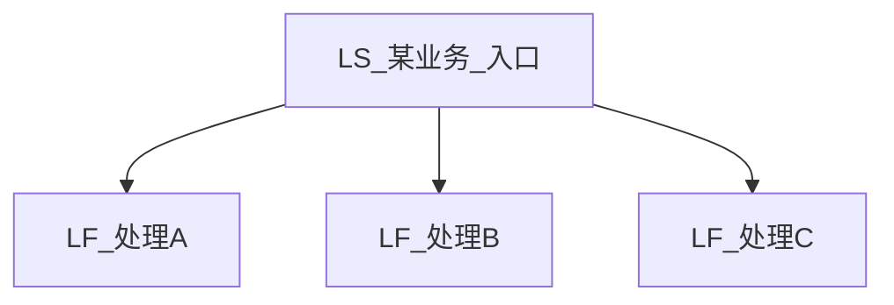
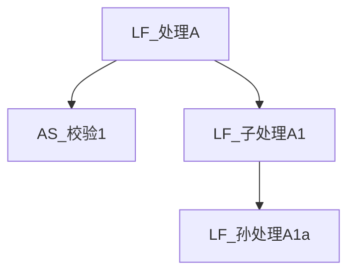
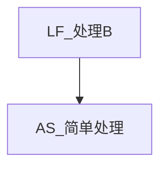
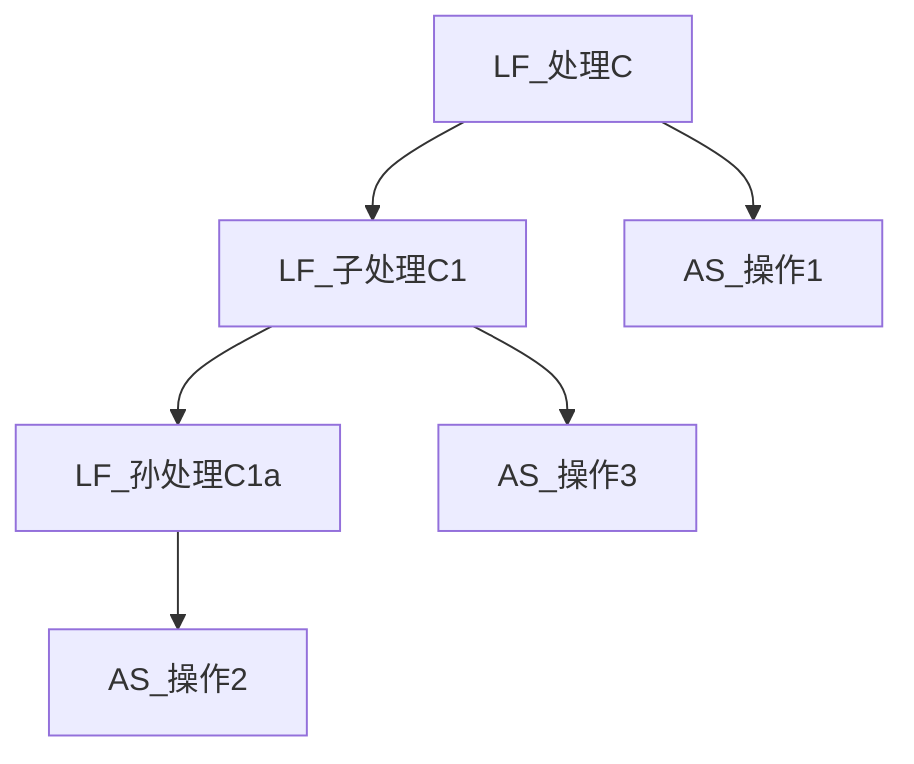

# 调用链路文档生成 Skill

## 1 描述

**输入**：一个 LS 服务名（如 `LS_期货业务公共_期货资金可用查询`）。

从该 LS 入口出发，利用 `generate_call_depth.ts` 脚本获取调用树，结合源码深度分析，生成两类文档：

1. **链路文档**（`design2/trace_chains/`）：导航地图——mermaid 调用图 + 各节点简要说明 + 子文档/服务文档链接
2. **服务文档**（`design2/{域}/{子模块}/`）：每个经过的 LS/LF/AS/AF 服务的 9 章节详细文档

**完成条件**：所有链路子文档 + 所有服务文档均标记为 done，才视为当前 LS 任务完成。

## 2 适用条件

- 已运行 `generate_layer_index.ts` 生成调用关系 CSV
- 调用方已选定目标 LS 服务名

## 3 核心流程

```
输入LS名 → 运行脚本获取调用树 → 评估规模 → 创建工作空间+SQLite → 按LF分支拆分层级文档 → 每个子文档1个子任务(可并行) → 服务文档任务注册 → 总入口文档 → 生成服务文档 → 验证全部完成
```

## 4 工作空间与 SQLite 持久化

### 4.1 为什么需要 SQLite

调用链深度可达 5000+ 条 AS 路径，分析跨越多个子任务 session。session compact 会丢失上下文。SQLite 解决：结构化数据统一存储、SQL 查询进度、子任务通过写 DB 行自动协调。

### 4.2 工作空间结构

```
engineering/call_depth/workspace/{LS名}/
├── workspace.db                # SQLite 数据库（4张核心表）
└── call_tree.md                # 脚本原始输出（调用树+路径+统计）
```

### 4.3 workspace.db 表结构（4张核心表）

```sql
-- ===== 元信息 =====
CREATE TABLE IF NOT EXISTS workspace_meta (
    key     TEXT PRIMARY KEY,
    value   TEXT
);
-- 固定行: ls_name, created_at, as_path_count, ls_count, lf_count, as_count, af_count,
--          scale_level, target_doc_dir, status

-- ===== 服务文档任务 =====
CREATE TABLE IF NOT EXISTS cres_doc (
    service_name   TEXT PRIMARY KEY,
    layer          TEXT NOT NULL,           -- LS/LF/AS/AF
    object_id      INTEGER,
    source_file    TEXT,                    -- 源码相对路径
    chinese_name   TEXT,
    one_liner      TEXT,                    -- 一句话说明
    lf_branch      TEXT,                    -- 所属 LF 分支标识
    source_read    INTEGER DEFAULT 0,       -- 1=已读取源码
    doc_status     TEXT DEFAULT 'pending'   -- pending/done 服务文档生成状态
);

-- ===== AS 路径 =====
CREATE TABLE IF NOT EXISTS as_path (
    path_id        INTEGER PRIMARY KEY,     -- 1, 2, 3, ...
    path_str       TEXT NOT NULL,           -- LS→LF→...→AS 完整路径串
    core_service   TEXT,                    -- 末端 AS 服务名
    lf_branch      TEXT,                    -- 所属 LF 分支
    doc_id         TEXT                     -- 所属子文档 ID
);

-- ===== 链路导航文档索引 =====
CREATE TABLE IF NOT EXISTS index_sub_doc (
    doc_id         TEXT PRIMARY KEY,        -- master, L2-1, L3-1-1, ...
    doc_type       TEXT NOT NULL DEFAULT 'trace_chain',  -- trace_chain
    lf_branch      TEXT,                    -- 对应 LF 分支（master 为 NULL）
    description    TEXT,                    -- 子文档描述/标题
    path_ids       TEXT,                    -- 包含的路径 ID（逗号分隔）
    doc_file       TEXT,                    -- 目标文件名
    status         TEXT DEFAULT 'pending',  -- pending/running/done
    parent_doc_id  TEXT,                    -- 父文档 ID（表达层级）
    level          INTEGER DEFAULT 1,       -- 层级深度 1-4
    started_at     TEXT,
    finished_at    TEXT,
    FOREIGN KEY (parent_doc_id) REFERENCES index_sub_doc(doc_id)
);
```

**设计原则**：
- 不存中间分析数据（决策节点、数据流转、内存表依赖等属于服务文档范畴，链路文档不承载）
- index_sub_doc 是链路导航文档的产出调度中心
- cres_doc.doc_status 追踪服务文档生成状态

### 4.4 完成条件

```sql
-- 以下两个查询均返回 0 时，当前 LS 任务完成
SELECT COUNT(*) FROM index_sub_doc WHERE status != 'done';          -- 链路文档
SELECT COUNT(*) FROM cres_doc WHERE doc_status != 'done';  -- 服务文档
```

### 4.5 常用查询

```bash
# 进度总览
python3 scripts/call_depth_db.py progress

# 验证完成
python3 scripts/call_depth_db.py verify

# 某层级子文档
sqlite3 workspace.db "SELECT doc_id, description, status FROM index_sub_doc WHERE level=2"

# 待生成的服务文档
sqlite3 workspace.db "SELECT service_name, layer FROM cres_doc WHERE doc_status='pending'"
```

### 4.6 进度恢复规则

当新 session（子任务或 compact 后的主 session）开始工作时：

1. **查 workspace_meta**：`SELECT key, value FROM workspace_meta`
2. **查 index_sub_doc**：`SELECT doc_id, status, level FROM index_sub_doc`
3. **查 cres_doc**：`SELECT doc_status, COUNT(*) FROM cres_doc GROUP BY doc_status`

**禁止**从 session 记忆中假设进度，必须从 DB 确认。

## 5 文档层级与拆分策略

### 5.1 核心原则：按 LF 层级拆分，一次开3层LF

调用链从 LS 进入后，LF 层是天然的分叉点。拆分截止到 LF——在 LF 文档中展示往下调用的 AS/AF 即可结束。

**3层LF窗口**：每个层级节点一次展开3层LF调用，不层层打开。如果一个 LF 在3层窗口内没有子 LF，则该节点为叶子（leaf），在文档内画完整的 LF→AS→AF 调用图。如果3层窗口内仍有子 LF 需要深入，则该 LF 成为总结点，产生子文档。

**最多4层**：L1(LS总入口) → L2(LF分支) → L3(LF子分支) → L4(LF孙分支)

### 5.2 层级文档树示例

```
L1: 某业务_入口.md                     ← 总入口：mermaid只画 LS→直接LF
├── L2: 某业务_处理A.md                ← LF_A: 开3层(A→A1→A1a)，A1a还有子调用→产生L3
│   └── L3: 某业务_孙处理A1a.md        ← 从A1a继续开3层，leaf
├── L2: 某业务_处理B.md                ← LF_B: 无子LF，leaf
└── L2: 某业务_处理C.md                ← LF_C: C→C1→C1a 仅2层LF，3层窗口内，leaf
```

### 5.3 Mermaid 规则：有子节点只画当前→下一层（仅限链路文档）

> **适用范围**：本规则仅适用于链路文档（`design2/trace_chains/`）及其子文档。服务文档（`design2/{域}/{子模块}/`）中的 Mermaid 图应遵循项目统一约束。

**核心规则**：每个节点的 mermaid 图只展示以下内容：
- 当前 LF 及其直接调用的 AS/AF
- 当前 LF 调用的下一层 LF（作为子节点入口）
- 不画更深层级的展开（由子文档负责）

**叶子节点**：没有子文档的节点画完整调用图（当前 LF → 所有子 LF → AS → AF，3层窗口内完整展示）

**示例**：

L1 总入口（有子节点，只画 LS→直接LF）：


L2 处理A（有子节点，画当前LF调用的AS + 下一层LF）：


L2 处理B（leaf，画完整3层LF+AS/AF）：


L2 处理C（leaf，画完整3层LF+AS/AF）：


### 5.4 篮子交易实例

LS→LF最多2层（LF_风控可用→LF_委托下单），全在3层窗口内，**所有L2都是leaf，没有L3**：

```
L1: 1301734_篮子交易投资建议委托.md      ← 总入口
├── L2: 1301734_前置校验.md (leaf)
├── L2: 1301734_总控直接调用.md (leaf)
├── L2: 1301734_业务规则检查.md (leaf)
├── L2: 1301734_投资建议处理.md (leaf)
├── L2: 1301734_风控入参包准备.md (leaf)
├── L2: 1301734_风控可用委托下单.md (leaf, 内含LF_委托风控/LF_可用/LF_委托下单)
└── L2: 1301734_消息发送.md (leaf)
```

### 5.5 规模与拆分对应

| 规模 | AS路径数 | 文档策略 |
|------|---------|---------|
| 简单 | ≤10 | 单文档（不拆分） |
| 中等 | 11-50 | L1 + 按LF分支拆L2 |
| 复杂 | 51-200 | L1 + L2 + 可能L3 |
| 超复杂 | >200 | L1 + L2 + L3 + 可能L4 |

**判断标准**：预估单文档超过 800 行时触发拆分。简单链路不拆，避免碎片化。

### 5.6 最小分支粒度（防碎片化）

LF 分支含 <3 个服务时不独立拆出文档，合并策略：
- 有总控 LF 时 → 合并到"总控直接调用"文档
- 无总控 LF 时 → 合并创建"其他调用"文档

**原理**：一个 LF 如果没有实质的 AS/AF 子节点，独立成文档没有导航价值，反而增加碎片。

### 5.7 LF 去重（防重复文档）

同一 LF 在调用树中被多处调用时，只在首次出现处生成独立文档，后续出现标记为去重引用（`scope_type: lf_branch_dedup`），指向已生成的文档。

**原理**：LF 的源码是唯一的，生成文档时 LLM 直接读源码，同一 LF 无论被调用多少次，文档内容完全相同。去重引用在链路文档中表现为"同 {已有文档ID}"的链接。

**对生成文档的影响**：遇到 dedup 节点时，链路文档中画一个引用节点指向被引用文档即可，不需要重新生成内容。

### 5.8 文档集目录结构

```
design2/trace_chains/{域}/{子模块}/
├── {ObjectID}_{中文名}.md                         # L1 总入口
└── {ObjectID}_{中文名}/                            # 同名子目录
    ├── {ObjectID}_{中文名}_{分支描述}.md             # L2
    └── {ObjectID}_{中文名}_{分支描述}_{子描述}.md    # L3/L4
```

## 6 链路文档模板

### 6.1 L1 总入口文档模板

```markdown
# {中文名}

## 1 概述

入口服务、核心功能、典型使用场景。

## 2 调用关系图

（mermaid: 只画 LS → 直接调用的 LF，体现执行顺序）

## 3 分支导航

| 分支 | LF入口 | 功能概述 | 详细文档 |
|------|--------|---------|---------|
| 前置校验 | LF_xxx | ... | [L2文档](链接) |
| ... | ... | ... | ... |

## 4 服务清单

| 序号 | 层级 | 服务名称 | Object ID | 一句话说明 | 服务文档 |
```

### 6.2 L2/L3 链路子文档模板

```markdown
# {中文名} — {分支描述}

> 本文档为 [{中文名}](总入口链接) 的子文档，覆盖 {LF分支} 分支。

## 1 分支概述

该分支的业务角色、触发条件、核心功能。

## 2 调用关系图

（mermaid: 当前LF调用的AS/AF + 下一层LF入口；leaf则画完整3层LF→AS→AF）

## 3 调用路径

| 路径 | 经过服务 | 功能 |

## 4 关键决策点

（简要列出本分支的关键 if/switch 判断，详细内容在对应服务文档中）

## 5 子分支导航（仅非leaf节点）

| 子分支 | LF入口 | 功能概述 | 详细文档 |
```

**关键原则**：链路文档是导航地图，不重复承载服务文档的详细内容（决策逻辑、数据流转、内存表等从各服务文档获取）。

## 7 步骤详解

### 7.1 Step 1：运行脚本，评估规模

```bash
# 一条命令完成：创建目录 + 生成调用树 + 初始化DB + 解析 + 补充
python3 scripts/call_depth_db.py init "LS_xxx" --all -o engineering/call_depth/workspace/{LS名}/call_tree.md
```

或者分步执行（先看调用树再决定是否继续）：

```bash
# 先只生成调用树
bun run scripts/generate_call_depth.ts "LS_xxx" -o engineering/call_depth/workspace/{LS名}/call_tree.md

# 确认后一键初始化
python3 scripts/call_depth_db.py init "LS_xxx" --all
```

读取输出，提取关键指标（AS路径数、各层服务数），确定规模等级。

### 7.2 Step 2：创建工作空间与初始化 DB

```bash
# 一条命令完成 init + parse-call-tree + supplement
python3 scripts/call_depth_db.py init "LS_xxx" --all
```

初始化完成后，DB 包含：
- `workspace_meta`：LS名、规模等级、各层服务数、状态
- `cres_doc`：所有服务（层、源文件路径、ObjectID、doc_status=pending）
- `as_path`：所有 AS 路径（编号、完整路径串、核心服务）

验证：`python3 scripts/call_depth_db.py progress`

### 7.3 Step 3：规划文档拆分 + 注册到 DB

```bash
# 3a. 运行拆分脚本，生成 split_plan.json
python3 scripts/split_chain_docs.py engineering/call_depth/workspace/{LS名}

# 3b. 读取拆分方案注册到 DB
python3 scripts/call_depth_db.py split
```

**split 命令自动完成**：

1. 读取 split_plan.json（由 split_chain_docs.py 生成）
2. 按3层LF窗口规划层级文档树，INSERT index_sub_doc 行：
   - `master` (level=1)：总入口链路文档
   - `L2-N` (level=2, parent=master)：各 LF 分支链路文档
   - `L3-N-M` (level=3, parent=L2-N)：需要深入展开的子分支
   - dedup 节点不注册 index_sub_doc 行（其内容已在被引用文档中覆盖）
3. 每个 LF 分支涉及的所有服务，其 doc_status 保持 pending

**子任务规划**：

- **1 个链路子文档 = 1 个子任务**
- 子任务可多路并行（不同子文档之间无依赖）
- 简单链路：1 个子任务产出单文档

### 7.4 Step 4：逐链路子文档生成（子任务执行）

**核心原则：1 个子任务产出 1 个完整的链路子文档。**

每个子任务收到以下上下文信息：

```
1. 任务：生成链路子文档 {doc_id}（{描述}）
2. 工作空间：engineering/call_depth/workspace/{LS名}/
3. 数据库：engineering/call_depth/workspace/{LS名}/workspace.db
4. 恢复步骤：
   - SELECT key, value FROM workspace_meta
   - SELECT * FROM index_sub_doc WHERE doc_id='{doc_id}'
   - SELECT path_id, path_str FROM as_path WHERE doc_id='{doc_id}'
   - SELECT * FROM cres_doc WHERE lf_branch='{本分支}'
5. 产出：
   - 完整链路子文档 → design2/trace_chains/{域}/{子模块}/{doc_file}
   - （不写分析数据到 DB，链路文档是导航地图）
6. 完成后：
   - UPDATE index_sub_doc SET status='done', finished_at=datetime('now') WHERE doc_id='{doc_id}'
```

**子任务分析流程**：

```
1. 读取本分支所有服务的源码（提取一句话说明、chinese_name）
2. UPDATE cres_doc SET one_liner=..., chinese_name=..., source_read=1
3. 识别本 LF 分支的调用结构（当前LF → 子LF + AS/AF）
4. 按 mermaid 规则绘制调用关系图
5. 列出关键决策点（简要，详细在服务文档中）
6. 按子文档模板组装完整文档
7. 写入 design2/trace_chains/{域}/{子模块}/{doc_file}
8. UPDATE index_sub_doc SET status='done'
```

**关键规则**：
- 链路文档是导航地图，不承载详细分析数据
- 需要的详细信息从代码和服务文档中获取
- **子文档必须完整写入文件后才标记 status='done'**

### 7.5 Step 5：生成总入口文档（L1）

**前置**：`SELECT COUNT(*) FROM index_sub_doc WHERE doc_type='trace_chain' AND status='done'` 等于链路子文档总数。

**从 DB + call_tree.md 组装 L1 文档**：
1. mermaid 图：只画 LS → 直接调用的 LF（体现执行顺序）
2. 分支导航表：列出所有 L2 子文档链接
3. 服务清单：从 cres_doc 获取所有服务的简要信息
4. 写入 `design2/trace_chains/{域}/{子模块}/{ObjectID}_{中文名}.md`
5. UPDATE index_sub_doc SET status='done' WHERE doc_id='master'

**简单链路**（未拆分）：子任务已产出单文档，此步骤跳过。

### 7.6 Step 6：生成服务文档

**前置**：所有链路文档已完成（index_sub_doc status=done）。

**与 doc-subtask-control.md 的关系**：本节定义链路文档生成工作流专用的子任务模式（claim→execute→done + workspace DB），覆盖 doc-subtask-control.md 的通用子任务规则。不覆盖的部分（表格阐释、mermaid阐述、1文档/子任务、质量验证）仍遵循 doc-subtask-control.md。

#### 认领-执行-完成模型

服务文档采用 **claim → execute → done** 三态模型：

```
pending → running → done/error
             ↓
          (doc-release → pending)  # 崩溃恢复
```

**主 session 循环**：

```bash
# 1. 认领 N 个任务
python3 scripts/call_depth_db.py doc-claim --limit 5 -w <workspace>

# 2. 并行 spawn 子 agent，每个处理 1 个服务
#    子 agent 内：读源码 → 生成文档 → doc-done

# 3. 标记完成
python3 scripts/call_depth_db.py doc-done --service-name <svc> -w <workspace>

# 4. 如果 agent 崩溃，释放 running 任务
python3 scripts/call_depth_db.py doc-release -w <workspace>
```

#### 命令详解

| 命令 | 用途 |
|------|------|
| `doc-claim --limit N [--lf-branch X] [--json]` | 认领 N 个 pending 任务 → running，输出任务详情 |
| `doc-done --service-name X [--status done\|error]` | 标记单个任务完成或错误 |
| `doc-done --services-file F` | 批量标记完成 |
| `doc-release [--batch-id X]` | 释放 running → pending（崩溃恢复） |

#### 子 agent 执行步骤

1. 认领时获取服务元数据（source_file, target_dir, doc_file 等）
2. 读取源码
3. 按 9 章节模板生成服务文档（参考 doc-writing-guide.md）
4. 写入 `design2/{target_dir}/{doc_file}` — 文件名从 `cres_doc.doc_file` 获取
5. `doc-done --service-name <svc>`

**服务文档命名规则**（权威定义见 [doc-naming-verification.md](../../engineering/constraints/doc-naming-verification.md) §1.1）：
- AS/AF：`{layer}_{中文名}.md`（如 `AS_操作员合法性验证.md`）
- LS/LF：同目录下有同名LS/LF时加前缀（`LS_中文名.md`/`LF_中文名.md`），否则纯中文名
- **禁止** Object ID 前缀（如 `21102008_AS_xxx.md` ❌）—— Object ID 前缀仅用于链路文档

**并行规则**：1个子任务只生成1个服务文档，可多路并行。**同一波次的多个 Task 调用必须在同一条消息中发出**才能实现并行（见 §14.1）。

#### Subagent Prompt 模式：方案B 短提示词派发（强制使用）

**⚠️ 主 session 每次 dispatch subagent 时，必须使用方案B，禁止将模板全文内联到 prompt 中。**

##### 为什么用方案B

方案A（主 session 读模板 → 替换 → 发送全文）每次消耗 300+ 行 prompt，严重浪费上下文。方案B 让 subagent 自己读模板，主 session 只发 5 行占位符，已被 75+ 次连续验证稳定。

##### 方案B 工作方式

1. **主 session**：只发送简短 prompt，包含5个占位符的实际值
2. **subagent**：收到后自行读取 `engineering/prompt/doc_gen_prompt_template.md`，替换占位符后执行所有 7 个 STEP
3. 模板设计确保约束随模板文件传递，不依赖主 session 记忆

##### 主 session 派发格式

```
You are a CRES/UFT service documentation generator. Generate a service document by reading source code and constraints.

**TASK**:
- Source file: {SOURCE_FILE}
- Service name: {SERVICE_NAME}
- Layer: {LAYER} (LS/LF/AS/AF)
- Target file: {TARGET_FILE}
- Workspace: {WORKSPACE_PATH}

Read the prompt template from `engineering/prompt/doc_gen_prompt_template.md`, replace the placeholders with the values above, and execute ALL 7 STEPS as described in the template. Do NOT skip any step.
```

##### 主 session 使用流程

1. `doc-claim --limit 5` 获取任务列表（含 source_file, target_dir, doc_file 等）
2. 对每个任务，用认领结果填充5个占位符，按上述格式发送给 subagent
3. **禁止内联模板全文**、禁止自行缩写模板内容
4. 模板文件 `engineering/prompt/doc_gen_prompt_template.md` 是唯一的 prompt 定义源

##### 占位符说明

| 占位符 | 来源 | 说明 |
|--------|------|------|
| `{SOURCE_FILE}` | `cres_doc.source_file` | 源码相对路径 |
| `{SERVICE_NAME}` | `cres_doc.service_name` | 服务名称 |
| `{LAYER}` | `cres_doc.layer` | LS/LF/AS/AF |
| `{TARGET_FILE}` | `design2/{target_dir}/{doc_file}` | 文档输出路径 |
| `{WORKSPACE_PATH}` | 当前 workspace 路径 | 用于 doc-done 命令 |

### 7.7 Step 7：验证完成 + 索引更新

```bash
python3 scripts/call_depth_db.py verify
```

验证通过后，更新 `design2/trace_chains/_index.md` 全局索引。

## 8 子任务依赖图

```
Step 1 (脚本运行+规模评估) ── 必须先完成
  └── Step 2 (工作空间+DB初始化) ── 必须先完成
        └── Step 3 (split: 按LF分支拆分+注册服务文档任务) ── 必须先完成
              ├── Step 4-1 (L2-1链路子文档) ──┐
              ├── Step 4-2 (L2-2链路子文档) ──┤  可并行
              ├── Step 4-3 (L2-3链路子文档) ──┤
              └── ...                         ┘
                    └── Step 5 (L1总入口文档) ── 从 DB 确认所有链路子文档完成
                          └── Step 6 (服务文档生成) ── 可批量并行
                                └── Step 7 (verify + 索引更新) ── 全部完成
```

## 9 子任务上下文规范

### 9.1 链路子任务 prompt 必须包含

```
1. 任务：生成链路子文档 {doc_id}（{描述}），产出1个完整的 markdown 文档
2. 工作空间：engineering/call_depth/workspace/{LS名}/
3. 数据库：engineering/call_depth/workspace/{LS名}/workspace.db
4. 目标文件：design2/trace_chains/{域}/{子模块}/{doc_file}
5. 层级信息：level={N}, parent_doc_id={pid}, 是否leaf
6. Mermaid规则：
   - 非leaf：只画当前LF调用的AS/AF + 下一层LF入口
   - leaf：画完整3层LF→AS→AF调用图
   - dedup引用：画一个链接节点指向被引用文档（标注"同 {dedup_ref}"）
7. 恢复步骤：
   - SELECT key, value FROM workspace_meta
   - SELECT * FROM index_sub_doc WHERE doc_id='{doc_id}'
   - SELECT path_id, path_str FROM as_path WHERE doc_id='{doc_id}'
   - SELECT * FROM cres_doc WHERE lf_branch='{本分支}'
8. 产出：
   a. 完整链路子文档 → 目标文件（导航地图，不承载详细分析数据）
   b. 更新 cres_doc 的一句话说明
9. 完成后：UPDATE index_sub_doc SET status='done', finished_at=datetime('now') WHERE doc_id='{doc_id}'
```

### 9.2 子任务禁止事项

- 禁止修改 workspace_meta
- 禁止修改其他 index_sub_doc 记录
- 禁止修改 call_tree.md
- 禁止生成总入口文档（Step 5）
- 禁止更新全局索引（Step 7）
- 禁止在 DB 中创建分析数据表

## 10 质量要点

### 10.1 准确性保障

- **Object ID 必须从源码 objectId 属性获取**：不可猜测
- **服务的一句话说明必须来自源码**：读取源码确认，不可推断
- **链路文档是导航地图**：详细内容（决策逻辑、数据流转、内存表）在服务文档中

### 10.2 命名与路径

**链路文档**（design2/trace_chains/）：
- L1 总入口：`{ObjectID}_{中文名}.md`
- L2 子文档：`{ObjectID}_{中文名}_{分支描述}.md`
- L3 子文档：`{ObjectID}_{中文名}_{分支描述}_{子描述}.md`

**服务文档**（design2/{域}/{子模块}/，命名权威定义见 [doc-naming-verification.md](../../engineering/constraints/doc-naming-verification.md) §1.1）：
- AS/AF：`{layer}_{中文名}.md`（如 `AS_操作员合法性验证.md`）
- LS/LF：同目录同名时加前缀（`LS_中文名.md`/`LF_中文名.md`），否则纯中文名
- **禁止** Object ID 前缀
- 文件名从 `cres_doc.doc_file` 获取

## 11 与现有技能/工具的关系

| 工具/技能 | 本 Skill 中的用途 |
|----------|-----------------|
| `generate_call_depth.ts` | Step 1 获取调用树 |
| `generate_layer_index.ts` | 前置：生成调用关系 CSV |
| `split_chain_docs.py` | Step 3 按三层LF窗口算法规划文档拆分，含最小分支粒度（<3 svc合并）+ LF去重，输出 split_plan.json |
| `call_depth_db.py` | Step 2-7 工作空间管理（init/parse-call-tree/supplement/split/progress/verify） |
| `cres-expert.md` | 源码分析时的伪代码解读能力 |
| `test-analysis.md` | 下游：基于链路文档生成测试分析 |
| `layer-index-scripts.md` | 脚本参考手册 |
| `doc-writing-guide.md` | Step 6 服务文档 9 章节写作指南 |

## 12 CLI 工具参考

### split_chain_docs.py

文档拆分规划工具，纯计算，无副作用：

```bash
# 输入 call_tree.md → 输出 split_plan.json
python3 scripts/split_chain_docs.py engineering/call_depth/workspace/{LS名}
```

算法：三层LF窗口 + 递归拆分 + 最小分支粒度（<3 svc合并）+ LF去重。输出文档层级、leaf/summary 判定、每个文档包含的服务列表。dedup 节点的 `services` 为空、`scope_type` 为 `lf_branch_dedup`、`dedup_ref` 指向已有文档 ID。

### call_depth_db.py

工作空间管理 CLI，所有命令支持 `--workspace` 参数（仅1个工作空间时自动检测）：

```bash
# 初始化工作空间（一条命令完成 init + parse + supplement）
python3 scripts/call_depth_db.py init "LS_xxx" --all

# 从 call_tree.md 解析调用树入库
python3 scripts/call_depth_db.py parse-call-tree

# 从 CSV 补充源文件路径 + 从源码提取 ObjectID
python3 scripts/call_depth_db.py supplement

# 从 split_plan.json 读取拆分方案，注册到 DB
python3 scripts/call_depth_db.py split [--force]

# Step4: 子任务回写源码分析结果
python3 scripts/call_depth_db.py update-svc "AS_xxx" --chinese-name "中文名" --one-liner "一句话说明" --source-read

# Step6: 认领服务文档任务（返回 pending→running 的任务列表）
python3 scripts/call_depth_db.py doc-claim --limit 5 [--lf-branch X] [--json] -w <workspace>

# Step6: 标记服务文档完成（单个）
python3 scripts/call_depth_db.py doc-done --service-name "AS_xxx"

# Step6: 标记服务文档完成（批量，从文件读取服务名列表）
python3 scripts/call_depth_db.py doc-done --services-file done_services.txt

# Step6: 释放 running→pending（subagent 崩溃恢复）
python3 scripts/call_depth_db.py doc-release [--batch-id X] -w <workspace>

# 重新计算 workspace 中所有服务的 target_dir
python3 scripts/call_depth_db.py remap -w <workspace>

# 查看进度（链路文档 + 服务文档）
python3 scripts/call_depth_db.py progress

# 验证所有文档是否完成
python3 scripts/call_depth_db.py verify
```

也可直接用 `sqlite3` 命令行操作 DB，脚本为便利工具。

## 13 全局索引模板

`design2/trace_chains/_index.md` 结构：

```markdown
# 调用链路索引

## 1 概览

| 域 | 已分析链路数 | 涉及服务数 |
|----|-----------|-----------|
| 公共支撑 | 0 | 0 |
| 权益 | 0 | 0 |
| 衍生品 | 1 | 19 |
| ... | ... | ... |

## 2 调用链路文档列表

| Object ID | 链路名称 | 域 | 总入口文档 | 子文档数 | AS路径数 | 服务文档完成 |
|-----------|---------|-----|---------|---------|---------|------------|
| 1401610 | 期货资金可用查询 | 衍生品/期货 | [链接](...) | 1 | 3 | ✅ |
```

## 14 生产经验与注意事项

### 14.1 波次派发模式（Step6 服务文档生成）

当服务文档数量较多（>20）时，采用波次派发模式：

1. 每波 `doc-claim --limit 5` 认领 5 个任务（并发上限为 5）
2. 每个 claim 的任务 dispatch 1 个 subagent 执行（1 subagent = 1 doc）
3. 等当前波次全部 subagent 返回后，再 claim 下一波
4. 重复直到 `doc-claim` 返回 0 个待认领

**⚠️ 并行关键约束：同一波次的 N 个 Task 调用必须在同一条消息中发出**。一条消息发1个 Task = 串行执行；一条消息发5个 Task = 并行执行。这是工具系统的调度机制决定的，不是可选建议。

**波次循环伪代码**：
```
while True:
    names = claim(5)
    if len(names) == 0: break
    # 关键：在一条消息中同时发出所有 Task 调用
    single_message([
        Task(prompt=task_1),
        Task(prompt=task_2),
        Task(prompt=task_3),
        Task(prompt=task_4),
        Task(prompt=task_5),
    ])
    await all subagents
```

### 14.2 Subagent 空返回处理

极少数情况下 subagent 可能返回空结果（192个中观察到1个），导致任务卡在 `running` 状态。

**对策**：每波结束后检查 running 状态的任务，手动执行 `doc-done` 补完：

```bash
# 检查是否有卡住的 running 任务
python3 -c "
import sqlite3
db = sqlite3.connect('engineering/call_depth/workspace/{LS名}/workspace.db')
rows = db.execute(\"SELECT service_name FROM cres_doc WHERE doc_status='running'\").fetchall()
for r in rows: print(r[0])
db.close()
"
# 手动补完
python3 scripts/call_depth_db.py doc-done --service-name "AS_xxx" --status done
```

### 14.3 macOS 兼容性

- `grep -P`（Perl 正则）在 macOS 默认 grep 不可用，会报错
- 替代方案：使用 `rg`（ripgrep）或 Python 处理正则匹配
- 项目已提供 `rg` 作为 grep 工具，优先使用

### 14.4 Compact 后恢复

- 大批量任务跨多个波次，session compact 后上下文会丢失
- 恢复方式：运行 `python3 scripts/call_depth_db.py progress -w <workspace>` 从 workspace.db 确认当前状态，继续波次派发
- workspace.db 是持久化的，不受 compact 影响
