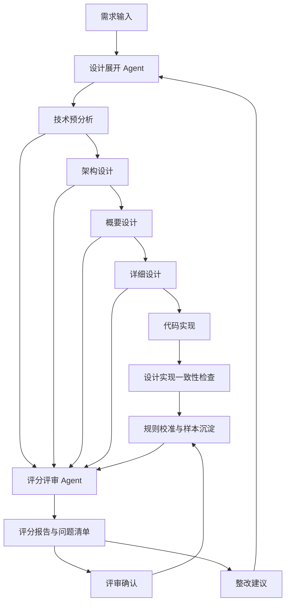

# AI设计文档评分机制建设方案 V3

> 版本：V3.0  
> 状态：评审稿  
> 适用范围：技术预分析文档、架构设计说明书、概要设计说明书、详细设计说明书；代码实现阶段仅作为设计与实现一致性检查衔接，不纳入100分制评分对象  
> 配套关系：作为《软件设计指引体系建设方案》中“05 配套资产”的组成部分，与通用设计要求、DFX专项设计指引、问题场景导向设计指引、设计评审Checklist、架构守护规则配套使用

## 1. 建设背景与目标

### 1.1 建设背景

软件设计指引体系建设完成后，需要建立一套配套的AI协同机制，把需求理解、方案展开、设计评分、评审整改和代码落地串成闭环。

V3方案不再只定位为“设计文档打分工具”，而是建设“双Agent协同机制”：

- 设计展开 Agent：负责把需求输入逐级展开为技术预分析、架构设计、概要设计、详细设计和代码实现方案。
- 评分评审 Agent：负责对四类设计文档进行规则化评分、评审辅助、问题定位和修改后复评；代码实现阶段只承接一致性检查，不输出总分和等级。

两类Agent共同服务于设计质量治理：前者提升设计产物生成质量，后者提供可度量、可追溯、可复评的质量反馈。

### 1.2 当前问题

当前设计质量治理主要存在以下问题：

| 问题 | 表现 |
|---|---|
| 设计展开链路不连续 | 技术预分析、架构设计、概要设计、详细设计和代码实现之间容易断层，需求意图、架构约束和实现细节缺少稳定传递 |
| 设计文档质量评价主观性较强 | 不同评审人员对“设计是否充分”“影响范围是否清楚”“风险是否闭环”的判断尺度不一致 |
| 设计指引与评审结果缺少量化连接 | DFX指引、问题场景指引和通用设计要求未充分转化为可检查、可打分、可门禁的规则 |
| AI检查容易停留在泛化建议 | 如果没有规则库、评分维度、证据要求和阻断项，AI容易输出不可执行的笼统意见 |
| 缺陷复盘反哺不足 | 现场缺陷暴露出的设计遗漏若不能进入评分项和扣分规则，后续仍可能重复出现 |

### 1.3 双Agent建设目标

双Agent机制应实现以下目标：

1. 建立从需求输入到代码实现的逐级展开链路，使阶段产物之间保持追溯关系和一致性。
2. 建立统一评分框架，使技术预分析、架构设计、概要设计、详细设计能够按统一口径分阶段评价。
3. 将通用设计要求、DFX专项指引、问题场景指引转化为可检查、可打分、可复评的评价项。
4. 对影响范围分析进行重点治理，按阶段检查系统、模块、接口、数据库、配置、目录、文件、类、函数等对象。
5. 输出总分、等级、准入结论、问题清单、规则引用和修改建议，支撑正式评审。
6. 支持提交前自检、正式评审辅助、修改后复评，并将评分结果反馈给设计展开 Agent。
7. 建立评分规则、Prompt、样本校准、专家复核和规则版本机制，确保评分稳定可信。

### 1.4 建设原则

| 原则 | 说明 |
|---|---|
| 基于规则，不凭感觉 | 评分结论必须能追溯到设计指引、规则编号、模板要求或文档证据 |
| 先判准入，再给分数 | 先识别阻断项，再进行量化评分；关键风险未闭环时限制最高得分 |
| 分阶段评价，粒度不同 | 不同阶段使用同一评分框架，但按阶段调整权重和证据粒度 |
| 证据优先，避免空泛 | 每个扣分项说明缺少什么、违反哪条规则、影响哪个对象、建议如何补充 |
| AI辅助，不替代专家裁决 | AI提供评分、证据和问题定位，关键架构决策仍由人工评审确认 |
| 持续校准，动态演进 | 评分规则随设计指引、历史缺陷、评审实践和平台能力持续更新 |

## 2. 总体机制设计

### 2.1 机制定位

双Agent机制定位为设计质量治理的执行层和反馈层，不新增独立设计标准。它把设计指引体系中的通用要求、DFX专项规则、问题场景规则和Checklist转化为可执行链路：

```text
需求输入
    ↓
设计展开 Agent 逐级展开
    ↓
阶段产物生成
    ↓
评分评审 Agent 评分与评审辅助
    ↓
问题整改和复评
    ↓
代码实现与一致性检查（不计入文档评分等级）
    ↓
样本校准和规则演进
```

### 2.2 双Agent职责分工

| Agent | 核心职责 | 主要产物 | 不负责事项 |
|---|---|---|---|
| 设计展开 Agent | 从需求输入逐级展开设计方案，保持阶段间追溯与一致性 | 技术预分析、候选方案、架构方案、概要设计、详细设计、代码变更说明 | 不给出正式评审通过结论，不替代专家做高风险裁决 |
| 评分评审 Agent | 基于规则对四类设计文档评分，生成问题清单、评审辅助材料和复评结论；衔接代码实现一致性检查 | 评分报告、阻断项清单、P0/P1/P2问题、整改建议、复评对比、一致性检查问题 | 不直接改写业务设计意图，不替代专家审批，不对代码实现结果输出总分和等级 |

### 2.3 双Agent协同闭环



协同重点是“展开有依据、评分有证据、整改可回流”：设计展开 Agent 根据评分问题修订后续产物，评分评审 Agent 根据阶段产物和规则库持续输出可追溯反馈。

## 3. 设计展开 Agent 机制

### 3.1 展开链路总览：从需求输入到代码实现

设计展开 Agent 按阶段推进，不把四类文档视为彼此独立的并列产物，而是把它们作为逐级细化链路：

| 阶段 | 核心问题 | 产物重点 |
|---|---|---|
| 需求输入 | 要解决什么问题，边界是什么 | 需求来源、业务目标、约束、非目标项、验收口径 |
| 技术预分析 | 是否值得做、有哪些候选路径、风险是否可控 | 候选方案、可行性判断、关键风险、前置条件 |
| 架构设计 | 系统如何组织，关键架构决策是什么 | 系统边界、架构视图、关键决策、质量属性措施 |
| 概要设计 | 模块如何划分，契约如何定义 | 模块划分、接口契约、数据方案、工程结构 |
| 详细设计 | 具体改哪些代码，逻辑如何实现 | 文件、类、函数、字段、流程、异常、测试点 |
| 代码实现 | 设计如何落地并保持一致 | 代码变更、脚本、配置、接口定义、验证结果 |

### 3.2 技术预分析展开：从需求输入形成候选方案与可行性判断

技术预分析阶段重点回答“是否做、怎么做、风险在哪里”。设计展开 Agent 应完成：

- 澄清需求来源、业务目标、成功标准和非目标项。
- 识别系统边界、关键依赖、外部约束和潜在受影响能力。
- 给出候选方案，并从实现复杂度、收益、风险、兼容性、交付成本等方面比较。
- 判断技术可行性，说明关键假设、验证方式和前置条件。
- 识别NFR和DFX触发项，形成后续架构设计输入。

### 3.3 架构设计展开：从技术预分析形成系统方案

架构设计阶段承接技术预分析结论，重点形成系统级方案。设计展开 Agent 应完成：

- 明确系统、子系统、核心组件、跨系统接口和数据域影响。
- 给出逻辑视图、数据视图、部署视图、运行链路等必要架构视图。
- 说明关键架构决策、备选方案取舍和约束条件。
- 对性能、可靠性、安全、兼容性、可观测性等DFX质量属性给出架构级措施。
- 识别需要架构守护、技术验证或专家重点确认的事项。

### 3.4 概要设计展开：从架构设计形成模块、接口与数据方案

概要设计阶段把系统方案拆解为可开发、可评审的模块级设计。设计展开 Agent 应完成：

- 明确模块、服务、任务、消息、配置和工程目录的边界。
- 定义接口契约，包括请求响应、错误码、兼容策略、调用方和依赖方。
- 形成数据方案，包括表、字段、索引、脚本、历史数据处理和数据一致性策略。
- 说明模块间依赖关系、复用关系和约束边界。
- 覆盖配置、缓存、并发、接口调用、数据一致性等典型问题场景。

### 3.5 详细设计展开：从概要设计形成代码级方案

详细设计阶段把模块方案展开到代码级。设计展开 Agent 应完成：

- 明确目录、文件、类、函数、字段、SQL、配置键等具体影响对象。
- 说明核心流程、分支逻辑、异常路径、兼容逻辑和降级策略。
- 描述新增、修改、删除代码单元的实现顺序和依赖关系。
- 给出单元测试、集成测试、回归测试和数据验证点。
- 明确发布、灰度、回滚、监控和遗留问题处理方式。

### 3.6 代码实现落地与一致性检查：从详细设计形成代码变更

代码实现阶段重点检查“代码是否按设计落地”，不作为100分制评分对象。设计展开 Agent 应保证：

- 代码变更与详细设计中的影响对象一致。
- 数据库脚本、接口定义、配置变更、任务调度和权限调整与设计说明一致。
- 关键DFX措施有可检查的代码、配置、测试或监控支撑。
- 实现过程中发现的设计偏差能够回写到设计文档、一致性检查证据和后续评审上下文。
- 交付物包含验证结果、未关闭风险和后续跟踪事项。

### 3.7 跨阶段追溯与一致性检查

设计展开 Agent 应维护跨阶段追溯关系：

| 追溯关系 | 检查重点 |
|---|---|
| 需求到技术预分析 | 候选方案是否覆盖需求目标和约束 |
| 技术预分析到架构设计 | 最终架构决策是否承接可行性判断和风险识别 |
| 架构设计到概要设计 | 模块、接口、数据方案是否落实系统级约束 |
| 概要设计到详细设计 | 代码级影响对象是否覆盖模块、接口和数据变更 |
| 详细设计到代码实现 | 实际提交是否与文件、函数、配置、脚本和验证项一致 |

## 4. 评分评审 Agent 机制

### 4.1 评分介入点

评分评审 Agent 在四类设计文档形成后介入，采用“阻断项判断 + 维度评分 + 问题清单 + 修改建议”的方式给出反馈。代码实现后只开展设计与实现一致性检查，不计入文档评分等级。

| 介入阶段 | 评分或检查重点 |
|---|---|
| 技术预分析后 | 需求理解、候选方案、可行性、NFR触发项、关键风险 |
| 架构设计后 | 系统影响、架构决策、架构视图、DFX质量属性、演进约束 |
| 概要设计后 | 模块划分、接口契约、数据方案、工程结构、典型问题场景 |
| 详细设计后 | 文件函数级影响、逻辑分支、异常处理、测试点、回滚措施 |
| 代码实现后 | 设计与实现一致性检查、验证证据、遗留风险、规则执行情况；不输出总分和等级 |

### 4.2 提交前自检

设计人员在提交评审前使用评分评审 Agent 自检，重点获得：

- 当前得分、等级和准入建议。
- P0阻断项、P1重要项和P2建议项。
- 缺失章节、缺失影响对象和证据不足项。
- 建议补充的DFX规则和问题场景规则。

建议准入口径：

| 等级 | 处理建议 |
|---|---|
| A/B | 可提交正式评审 |
| C | 可提交评审，但需说明未关闭问题和处理计划 |
| D/E | 原则上不提交正式评审，应先补充后复评 |

### 4.3 正式评审辅助

正式评审前，评分评审 Agent 生成评分报告，帮助评审人员聚焦：

- P0阻断项。
- 分数低于阈值的维度。
- 高风险DFX和问题场景。
- AI无法判断、需要人工确认的问题。
- 与历史缺陷模式相似的问题。

评分报告作为评审材料和证据索引，不直接替代评审结论。

### 4.4 修改后复评

设计文档修改后，评分评审 Agent 应再次评分并输出差异；代码修改后只输出一致性检查差异、验证证据和偏差问题：

| 对比项 | 内容 |
|---|---|
| 分数变化 | 仅设计文档复评输出总分、等级和各维度得分变化 |
| 问题关闭 | 已关闭的P0/P1/P2问题 |
| 新增问题 | 修改后引入的新问题 |
| 证据变化 | 新增、删除或仍然不足的证据 |
| 仍需确认 | 需要评审人员确认的剩余问题 |

### 4.5 评分结果反馈到设计展开

评分结果不应只作为评审附件归档，还应反馈给设计展开 Agent：

- P0问题驱动当前阶段重新展开或补充关键设计。
- P1问题进入下一版设计产物的明确整改项。
- P2问题沉淀为表达优化、模板完善或Prompt优化建议。
- 阶段性低分维度用于提示后续阶段重点展开。
- 多次复评仍未闭环的问题进入专家评审重点确认。

## 5. 评分规则体系

本章评分规则体系已抽取到 [repo/评分/AI设计评分规则库/评分规则体系-v2.md](AI设计评分规则库/评分规则体系-v2.md)，该文件作为评分对象、评分模型、准入规则、阻断项和维度评分细则的维护入口。量化评分对象限定为技术预分析、架构设计、概要设计、详细设计四类设计文档；代码实现结果只用于后续一致性检查，不进入100分制评分、不输出A/B/C/D/E等级。

## 6. 评分报告输出模板

本章评分报告输出模板已抽取到 [repo/评分/AI设计评分规则库/评分报告输出模板.md](AI设计评分规则库/评分报告输出模板.md)，该文件作为评分报告格式和字段要求的维护入口。

## 7. 规则库与Prompt建设

### 7.1 规则库结构

AI评分规则库按当前 SSOT 目录 `repo/评分/AI设计评分规则库/` 维护，结构如下：

```text
AI设计评分规则库
├── README.md
├── 评分规则体系-v2.md
├── 评分报告输出模板.md
├── 技术预分析评分规则.md
├── 架构设计评分规则.md
├── 概要设计评分规则.md
└── 详细设计评分规则.md
```

### 7.2 Prompt模块化

不建议使用一个超大Prompt完成所有评分，应拆成多个Prompt模块：

| Prompt模块 | 作用 |
|---|---|
| 文档识别Prompt | 判断文档类型、设计阶段、风险等级、关键场景 |
| 结构抽取Prompt | 抽取需求、范围、影响对象、方案、DFX、风险、验证等信息 |
| 阻断项判断Prompt | 判断是否存在P0阻断项和最高分限制 |
| 通用评分Prompt | 按通用设计要求评分 |
| 阶段评分Prompt | 按技术预分析、架构、概要、详细设计阶段重点评分 |
| DFX评分Prompt | 根据触发条件检查质量属性 |
| 场景评分Prompt | 根据触发条件检查问题场景规则 |
| 报告生成Prompt | 生成结构化评分报告 |
| 复评对比Prompt | 对比前后版本得分和问题关闭情况 |

### 7.3 评分证据要求

Prompt应强制要求AI输出评分证据：

- 如果认为已满足，应引用文档中的对应章节或内容摘要。
- 如果认为未满足，应说明缺少什么内容。
- 如果无法判断，应标识为“证据不足”，不能默认通过。
- 对P0和P1问题，应引用对应规则编号。

### 7.4 输出结构化

AI评分结果应同时支持人工阅读和系统集成。建议输出Markdown报告，同时保留结构化字段。

```json
{
  "document_type": "概要设计说明书",
  "stage": "概要设计",
  "score": 82,
  "grade": "B",
  "admission": "可进入评审，需补充后归档",
  "blockers": [],
  "dimensions": [
    {
      "name": "影响范围分析",
      "weight": 20,
      "score": 15,
      "level": 4,
      "evidence": "已列出模块、接口和数据库表，但未明确配置项",
      "issues": ["配置项影响未说明"]
    }
  ],
  "issues": [
    {
      "severity": "P1",
      "description": "接口变更未说明调用方兼容性影响",
      "rule_id": "COMMON-TRG-COMP",
      "suggestion": "补充调用方清单、兼容策略和灰度方案"
    }
  ]
}
```

## 8. 评分校准与规则演进

### 8.1 样本库建设

建议建立评分样本库，至少包括：

- 已通过评审的优秀设计文档。
- 评审中发现较多问题的设计文档。
- 引发现场缺陷的历史设计文档。
- 不同阶段、不同产品、不同风险等级的典型样本。

每份样本应包含专家评分、专家问题清单、AI评分、差异分析和校准结论。

### 8.2 专家一致性校准

AI评分上线前，应选择样本进行专家和AI对比。

| 校准指标 | 说明 |
|---|---|
| 总分偏差 | AI总分与专家平均分的差异 |
| 维度偏差 | 各维度AI评分与专家评分的差异 |
| P0召回率 | 专家认为阻断的问题，AI是否识别 |
| P1召回率 | 重要问题识别能力 |
| 误报率 | AI提出但专家认为不成立的问题比例 |
| 规则引用准确率 | AI引用规则是否正确 |

### 8.3 缺陷复盘反哺

缺陷复盘后，应判断该缺陷是否暴露评分机制不足：

- AI是否应该识别但未识别。
- 评分维度是否缺少对应检查项。
- 规则权重是否偏低。
- 阻断项是否需要新增。
- Prompt是否需要调整。
- 是否需要新增DFX或问题场景规则。

### 8.4 权重与阈值调整

评分机制初版不应一次性固化。建议通过试点评审后调整：

- 各阶段维度权重。
- A/B/C/D/E等级阈值。
- 阻断项最高得分限制。
- P0/P1/P2问题定义。
- 不同风险等级的准入条件。

### 8.5 评分版本管理

AI评分规则应版本化管理：

- 评分规则版本。
- Prompt版本。
- 设计指引版本。
- 样本校准版本。
- 生效日期。
- 变更说明。

评分报告必须记录使用的规则版本，避免不同时间评分结果不可比较。

## 9. 治理协同关系

### 9.1 与设计指引体系的关系

双Agent机制是设计指引体系的执行层，不新增独立设计标准。

```text
设计指引体系总则
    ↓
通用设计要求、DFX指引、问题场景指引
    ↓
设计展开规则、Checklist与评分规则
    ↓
设计产物、评分报告、评审结论
    ↓
问题整改、样本校准、规则演进
```

### 9.2 与人工评审的关系

AI负责规则覆盖检查、影响范围遗漏识别、常见缺陷模式识别、评分报告生成和复评问题跟踪。人工评审负责架构决策合理性最终判断、复杂业务取舍、高风险安全性能可靠性确认、准入审批和评分争议裁决。

### 9.3 与架构守护的关系

评分评审 Agent 主要评价四类设计文档质量，并在代码实现后衔接设计实现一致性检查；架构守护主要验证实现是否符合架构规则。二者衔接方式：

- 评分发现需要架构守护的规则时，生成守护计划建议。
- 架构守护发现实现偏差时，反向补充一致性检查证据和后续规则校准依据。
- 现场缺陷证明评分或守护遗漏时，更新规则库和样本库。

## 10. 运营指标

### 10.1 效果指标

| 指标 | 说明 |
|---|---|
| 设计遗漏类缺陷数量 | 双Agent机制上线后相关缺陷是否下降 |
| 高频缺陷重复率 | 已沉淀规则覆盖的问题是否减少重复发生 |
| 评审后返工率 | 正式评审后大幅返工比例是否下降 |
| 设计实现不一致问题数 | 代码落地阶段发现的一致性问题是否下降，不作为文档评分得分项 |

### 10.2 过程指标

| 指标 | 说明 |
|---|---|
| 设计展开覆盖率 | 需求进入开发前完成阶段展开的比例 |
| AI评分覆盖率 | 进入评审的设计产物中完成AI评分的比例 |
| 自检使用率 | 设计人员提交前主动使用AI评分的比例 |
| P0/P1问题关闭率 | AI发现问题在评审前关闭的比例 |
| 复评完成率 | 修改后重新评分的比例 |

### 10.3 评分质量指标

| 指标 | 说明 |
|---|---|
| 专家一致性 | AI评分与专家评分差异 |
| P0召回率 | 阻断项识别能力 |
| P1召回率 | 重要问题识别能力 |
| 误报率 | AI误判问题比例 |
| 规则引用准确率 | AI引用设计规则是否准确 |

## 11. 落地实施建议

### 11.1 第一阶段：规则框架与样例验证

目标：完成双Agent机制最小可用版本。

建议动作：

1. 确认阶段链路、评分维度、权重、等级和阻断项。
2. 建立技术预分析、架构设计、概要设计、详细设计四个阶段的展开规则和评分规则。
3. 选取10-20份历史设计文档作为样本。
4. 由专家进行人工评分，形成基准样本。
5. 使用AI评分并与专家结果对比，修订规则和Prompt。

### 11.2 第二阶段：试点接入设计评审

目标：让AI评分进入真实评审流程。

建议动作：

1. 选择1-2个产品线或项目试点。
2. 要求正式评审前必须附评分报告。
3. 将P0问题作为评审准入条件。
4. 将P1问题纳入评审会议重点确认。
5. 记录AI评分与专家结论差异。

### 11.3 第三阶段：接入模板和工具链

目标：提升展开、评分和复评的自动化程度。

建议动作：

1. 在设计模板中增加阶段追溯和评分记录区。
2. 建立规则编号和模板章节映射。
3. 接入文档平台或评审平台，实现四类设计文档一键评分。
4. 对接架构资产登记、接口文档、数据库脚本和代码仓库，支持设计与实现一致性检查。
5. 建立评分看板，统计各团队、各阶段、各维度得分趋势。

### 11.4 第四阶段：持续运营和门禁化

目标：让双Agent机制成为设计质量治理机制的一部分。

建议动作：

1. 对低风险设计，可逐步将AI评分作为准入门槛。
2. 对高风险设计，AI评分作为专家评审前置材料。
3. 定期复盘评分准确性，优化权重、Prompt和规则。
4. 将设计质量得分与设计遗漏缺陷、评审效率、发布质量联动分析。

## 12. 风险与控制措施

| 风险 | 表现 | 控制措施 |
|---|---|---|
| 设计展开脱离真实需求 | 阶段产物看似完整，但偏离业务目标 | 强制维护需求追溯、非目标项和验收口径 |
| 评分过于机械 | 只按章节完整性打分，忽略真实设计质量 | 增加规则证据、专家校准和关键决策人工确认 |
| 输出泛化建议 | 问题不可操作 | 要求每个问题引用规则、证据和修改建议 |
| 误报影响评审效率 | AI提出大量低价值问题 | 设置P0/P1/P2分级，定期统计误报并调优 |
| 漏报高风险问题 | AI未识别关键设计缺陷 | 建立历史缺陷模式库，提高P0/P1召回率 |
| 分数被形式化应付 | 文档堆砌内容但设计质量不高 | 保留人工最终裁决，评分关注证据与一致性 |
| 规则版本不一致 | 不同时间评分不可比较 | 评分规则、Prompt和指引版本统一记录 |
| 材料不足 | AI无法判断真实风险 | 输出“证据不足”，不允许默认通过 |

## 13. 待评审决策项

| 序号 | 决策项 | 建议方案 | 需确认问题 |
|---|---|---|---|
| 1 | 是否采用双Agent机制作为正式方案 | 建议采用 | 两类Agent的建设优先级和系统边界如何划分 |
| 2 | 是否采用100分制 | 建议采用 | 是否需要按部门或产品线调整权重 |
| 3 | 是否设置A/B/C/D/E等级 | 建议采用 | 各等级是否与评审准入直接绑定 |
| 4 | 是否设置P0阻断项 | 建议采用 | 哪些阻断项进入正式门禁 |
| 5 | 影响范围分析权重 | 建议概要和详细设计阶段提高权重 | 是否作为所有设计产物必评项 |
| 6 | AI评分与评审关系 | 建议AI辅助，人工最终裁决 | 哪些低风险场景可由AI评分直接准入 |
| 7 | 样本校准机制 | 建议上线前必须校准 | 首批样本由哪些产品线提供 |
| 8 | 评分报告是否作为评审附件 | 建议正式评审必须附带 | 从哪个评审节点开始强制 |
| 9 | 规则版本管理 | 建议纳入设计资产演进台账 | 由哪个组织维护规则和Prompt版本 |
| 10 | 是否接入工具链 | 建议先文档评分，再接入代码、接口、数据库一致性检查 | 工具链接入优先级如何安排 |
| 11 | 评分结果是否纳入质量度量 | 建议纳入过程指标，不直接作为个人考核 | 统计口径和使用边界需明确 |

## 14. 总结

AI设计文档评分机制V3应定位为“双Agent协同机制”：设计展开 Agent 负责把需求输入逐级展开到代码实现，评分评审 Agent 负责以规则化、证据化方式评价技术预分析、架构设计、概要设计、详细设计四类设计文档，并把问题反馈到设计展开链路。代码实现阶段只作为设计与实现一致性检查衔接，不纳入100分制评分对象。

通过该机制，设计质量治理可以从单次文档打分升级为持续闭环：需求有追溯、设计有展开、评分有证据、整改有复评、实现有一致性检查、规则有持续演进。最终目标是让设计指引体系真正落地为可执行、可度量、可治理的工程能力。
