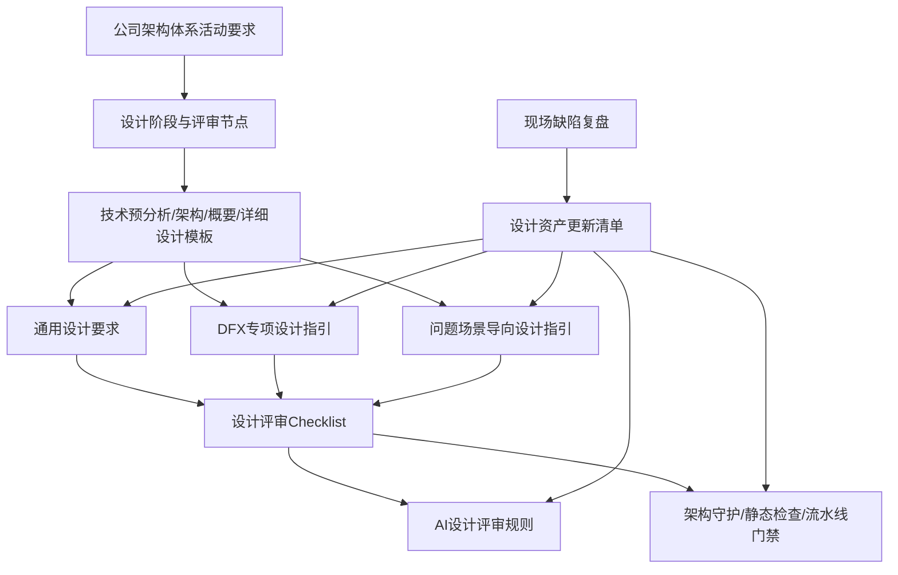

# 软件设计指引体系建设方案

> 版本：V0.1  
> 状态：评审稿  
> 适用范围：架构设计、概要设计、详细设计、技术预分析、设计评审、缺陷复盘与设计资产建设  
> 参考材料：前期DFX设计指引建设成果、问题场景导向设计指引建设成果、缺陷复盘分析成果、《架构体系工作开展汇报（202605）V0.5.pptx》、《架构设计说明书模板》、《概要设计说明书模板》、《详细设计说明书模板》

## 1. 建设背景与问题

### 1.1 建设背景

公司架构体系工作要求从方案拟定阶段前置介入，围绕架构设计、概要设计、详细设计、开发测试、发布结项等阶段，持续推动风险前置识别、架构资产沉淀、架构守护和设计质量提升。

前期已围绕设计质量治理开展了多项工作，包括：

- 建立DFX专项设计指引，覆盖性能、可靠性、安全、兼容性、可维护性、可观测性等质量属性。
- 建立问题场景导向设计指引，围绕资源管理、配置项、缓存、并发、接口调用等典型场景沉淀设计规则。
- 基于2026年3~5月现场缺陷分析，识别缺陷引入原因，并尝试将共性问题转化为设计规则、AI评审规则和检查项。
- 梳理公司架构体系活动要求及架构设计、概要设计、详细设计模板，明确各阶段设计交付物和评审要求。

这些工作已经形成了较好的内容基础，但目前仍需要通过体系化建设，解决设计指引分散、使用路径不清晰、模板与规则衔接不足、缺陷复盘成果难以稳定沉淀等问题。

### 1.2 当前主要问题

#### 1.2.1 设计资产类型混杂

当前部分材料都被泛称为“设计要求”或“设计指引”，但其性质并不相同：

- 有些是流程要求，回答什么时候做、谁来做、输出什么。
- 有些是设计模板，回答设计内容写在哪里、以什么结构呈现。
- 有些是通用设计规范，回答每份设计文档必须说明什么。
- 有些是DFX规则，回答如何满足某项质量属性。
- 有些是问题场景经验，回答遇到某类典型问题时应如何设计。
- 有些是检查规则，回答如何评审、如何守护、如何自动发现问题。

如果不做清晰分层，后续持续新增文档会导致使用者不知道该看哪份材料、按什么顺序使用、哪些内容是强制要求。

#### 1.2.2 前期成果纵向较深，但横向入口不足

前期DFX和问题场景指引已经沉淀了大量规则和案例，但使用者在实际设计过程中仍可能面临以下问题：

- 不清楚某个设计阶段应使用哪些指引。
- 不清楚DFX指引与问题场景指引之间的关系。
- 不清楚设计模板中哪些章节需要引用哪些规则。
- 不清楚哪些规则需要进入TR2、详细设计评审或TR5检查。
- 不清楚缺陷复盘后新增规则应进入哪类资产。

因此，需要建立一个统一入口，将“流程、模板、规则、检查、演进”串成一条完整链路。

#### 1.2.3 设计文档对影响范围描述不足

缺陷复盘中暴露出一类共性问题：设计文档往往描述“要做什么”，但没有清晰说明“会改哪里、影响哪些对象”。

典型表现包括：

- 未明确影响的代码仓库、工程、目录和文件。
- 未明确新增或修改的数据库表、字段、索引、脚本。
- 未明确接口、消息、配置、缓存、权限、定时任务等关联对象。
- 未明确关键类、函数、方法及调用链变化。
- 未明确影响范围与测试范围、回归范围、发布范围之间的关系。

这类问题容易导致开发遗漏、测试遗漏、兼容性问题、数据不一致和现场缺陷，因此应作为通用设计要求纳入整体设计指引体系。

#### 1.2.4 缺陷复盘到设计资产的闭环不稳定

当前缺陷复盘已经能够识别部分共性问题，但仍需明确：

- 哪类缺陷应沉淀为DFX规则。
- 哪类缺陷应沉淀为问题场景指引。
- 哪类缺陷应进入通用设计要求、技术规范或平台能力建设。
- 哪类缺陷可以转化为AI设计评审规则、Checklist或架构守护规则。
- 如何记录规则来源、版本变化和治理效果。

如果缺陷复盘只形成一次性分析报告，不能进入稳定的设计资产更新机制，就难以实现“复盘一次、预防一类”的治理目标。

## 2. 建设目标与原则

### 2.1 建设目标

本次建设目标不是新增若干零散文档，而是建立一套统一、可落地、可演进的软件设计指引体系。

总体目标包括：

1. 建立统一入口，使设计人员能够快速判断当前阶段应使用哪些指引、模板和检查项。
2. 将公司架构体系活动要求、各阶段设计模板、DFX指引、问题场景指引、缺陷复盘机制纳入同一套结构。
3. 明确各类设计资产的定位、边界和关系，避免重复建设和文档割裂。
4. 明确架构设计、概要设计、详细设计不同阶段的设计粒度和影响范围分析要求。
5. 将设计指引转化为评审Checklist、AI设计评审规则和架构守护规则，提升规则执行力。
6. 建立缺陷复盘驱动设计资产持续演进机制，使现场缺陷能够稳定转化为可复用规则。
7. 支撑后续设计质量度量，包括设计遗漏缺陷下降、规则覆盖率、评审发现率、架构守护命中率等。

### 2.2 建设原则

#### 2.2.1 不推倒重来，体系化整合

前期DFX、问题场景和缺陷复盘成果总体方向正确，应保留其有效内容。当前重点是重构材料之间的关系，建立总则、分类、映射和落地机制，而不是重新编写所有规则。

#### 2.2.2 分层建设，职责清晰

流程、模板、规则、检查、演进机制应分层管理：

- 流程规定何时使用。
- 模板规定写在哪里。
- 规则规定如何设计。
- 检查规定如何证明。
- 缺陷复盘负责持续更新。

#### 2.2.3 阶段适配，逐步细化

不同设计阶段的关注粒度不同。架构设计阶段关注系统级影响，概要设计阶段关注模块和工程级影响，详细设计阶段关注文件、函数、字段和逻辑分支级影响。不能要求架构设计阶段列出所有函数，也不能等到详细设计阶段才识别系统级风险。

#### 2.2.4 规则可执行，可检查，可追溯

每条设计规则不仅要说明要求，还应尽可能明确：

- 适用阶段。
- 触发条件。
- 强制等级。
- 对应模板章节。
- 评审方式。
- 自动检查可行性。
- 来源缺陷或实践依据。

#### 2.2.5 缺陷驱动，持续演进

设计指引体系应随着真实缺陷、评审问题、架构守护结果和平台能力变化持续迭代。每次缺陷复盘后，应评估是否需要新增或修订设计规则、模板、Checklist、AI规则或平台能力。

## 3. “1+3+4”总体结构

建议采用“1个总则 + 3类设计规则库 + 4项配套机制”的整体结构。

```text
软件设计指引体系
│
├── 1个总则
│   └── 软件设计指引体系总则
│
├── 3类设计规则库
│   ├── 通用设计要求
│   ├── DFX专项设计指引
│   └── 问题场景导向设计指引
│
└── 4项配套机制
    ├── 设计阶段适用矩阵
    ├── 模板映射与改造机制
    ├── 评审与架构守护机制
    └── 缺陷复盘与持续演进机制
```

### 3.1 1个总则

《软件设计指引体系总则》作为整个体系的统一入口，主要说明：

- 体系建设目的、适用范围和适用对象。
- 各类设计资产之间的关系。
- 各设计阶段应使用哪些指引。
- 规则分类、编号、强制等级和裁剪方式。
- 与架构设计、概要设计、详细设计模板的关系。
- 设计评审、AI评审和架构守护的执行方式。
- 缺陷复盘驱动设计资产更新的机制。
- 版本管理、责任分工和维护节奏。

总则不替代具体规则库，不重复DFX和问题场景正文，而是解决“如何使用整套体系”的问题。

### 3.2 3类设计规则库

#### 3.2.1 通用设计要求

通用设计要求回答：

> 不论设计什么内容，一份合格的设计文档都必须分析和说明什么。

建议包括：

- 需求与设计追溯要求。
- 设计范围与边界要求。
- 设计变更影响分析要求。
- 技术方案与决策记录要求。
- 风险、约束及遗留问题管理要求。
- 设计验证与架构守护要求。
- 架构资产识别、登记和版本管理要求。

其中，“明确影响的文件、目录、数据库表和函数”应归入“设计变更影响分析要求”，作为通用设计要求中的核心条款。

#### 3.2.2 DFX专项设计指引

DFX专项设计指引回答：

> 如何满足性能、可靠性、安全、兼容性、可维护性、可观测性等质量属性要求。

建议保留前期已形成的DFX结构，并统一纳入以下方向：

- 性能设计指引。
- 可靠性设计指引。
- 安全设计指引。
- 兼容性设计指引。
- 可维护性设计指引。
- 可观测性设计指引。
- 可测试性设计指引，建议作为待补齐专项或纳入通用验证设计要求。

DFX指引应重点沉淀设计原则、设计约束、推荐方案、反例、检查项、验证方法和来源案例。

#### 3.2.3 问题场景导向设计指引

问题场景导向设计指引回答：

> 遇到某类典型技术场景或高频问题对象时，应如何综合应用多项设计规则。

建议覆盖：

- 资源管理。
- 配置项。
- 缓存。
- RPC和接口调用。
- MQ和事件。
- 并发与多线程。
- 数据一致性。
- 文件管理。
- 定时任务。
- JVM与运行环境。
- 权限与会话。

问题场景指引不是与DFX并列的另一套质量标准，而是面向具体场景的综合应用方案。一个场景往往同时涉及多个DFX维度。

示例：

```text
缓存设计
│
├── 性能：减少重复计算和远程访问
├── 可靠性：缓存故障降级、穿透/击穿/雪崩防护
├── 一致性：缓存更新、失效和回源策略
├── 兼容性：缓存Key版本、灰度隔离
└── 可观测性：命中率、延迟、热点Key、异常告警
```

### 3.3 4项配套机制

#### 3.3.1 设计阶段适用矩阵

建立阶段与指引之间的映射，明确不同阶段应使用哪些内容。

#### 3.3.2 模板映射与改造机制

将设计指引落入架构设计、概要设计、详细设计模板，明确每类规则对应模板章节和交付形式。

#### 3.3.3 评审与架构守护机制

将规则转化为Checklist、AI设计评审规则、架构守护用例、静态检查和流水线门禁。

#### 3.3.4 缺陷复盘与持续演进机制

建立缺陷到规则、规则到检查、检查到效果验证的闭环。

## 4. 各类资产定位及关系

### 4.1 设计资产分类

| 资产类型 | 回答的问题 | 主要使用者 | 主要输出形态 |
|---|---|---|---|
| 架构活动与流程 | 什么时候做、谁来做、输出什么 | 架构师、项目经理、技术负责人 | 活动要求、阶段流程、评审节点 |
| 设计模板 | 设计内容写在哪里、以什么结构呈现 | 架构师、设计人员、开发人员 | 技术预分析文档、架构设计说明书、概要设计说明书、详细设计说明书 |
| 通用设计要求 | 每份设计文档必须分析和交代什么 | 设计人员、评审人员、AI评审助手 | 通用规范、必填章节、检查项 |
| DFX专项设计指引 | 如何满足某项质量属性 | 架构师、设计人员、专家评审人员 | 设计规则、推荐方案、反例、验证方法 |
| 问题场景导向设计指引 | 某类典型场景应如何设计 | 设计人员、开发人员、测试人员 | 场景规则包、案例、方案、检查项 |
| 评审与守护规则 | 如何证明已经满足要求 | 评审人员、架构办、流水线、AI工具 | Checklist、AI规则、架构守护规则 |
| 缺陷复盘机制 | 体系如何持续更新 | 架构办、质量团队、技术负责人 | 缺陷分析、规则更新清单、演进台账 |

### 4.2 各类资产关系



### 4.3 使用路径

设计人员在开展设计时，建议按以下路径使用：

1. 先查看《软件设计指引体系总则》，明确当前阶段、交付物和适用规则。
2. 按对应设计模板编写技术预分析、架构设计、概要设计或详细设计。
3. 使用《通用设计要求》检查设计文档完整性。
4. 根据本次变更涉及的质量属性，查阅对应DFX专项设计指引。
5. 根据本次变更涉及的技术场景，查阅问题场景导向设计指引。
6. 在评审前使用Checklist和AI设计评审规则进行自检。
7. 在开发测试和TR5阶段，通过架构守护、资产登记和实现一致性检查验证落地效果。
8. 在发布结项和缺陷复盘阶段，推动规则、模板和检查机制持续更新。

## 5. 设计阶段适用矩阵

| 设计阶段 | 阶段关注重点 | 重点使用内容 | 主要输出 |
|---|---|---|---|
| OBP规划 | 技术领先目标、技术债目标、重点能力规划 | 架构体系活动要求、DFX目标、技术债治理目标 | 年度/周期技术规划、重点设计资产建设计划 |
| Release规划 | 架构变更点、关键依赖、技术难点、质量风险 | 通用设计要求、历史缺陷库、DFX高风险规则 | Release架构风险清单、设计工作计划 |
| 需求阶段 | 需求澄清、需求分级、NFR识别、历史问题识别 | 技术预分析模板、需求追溯要求、DFX触发条件、问题场景触发条件 | 技术预分析文档、需求与设计追溯表、NFR清单、预分析结论 |
| 架构设计 | 系统级方案、架构视图、关键质量属性、跨系统影响 | 架构设计模板、DFX专项指引、通用设计要求 | 架构设计说明书、系统级影响范围、架构决策记录 |
| 概要设计 | 模块划分、接口、数据模型、工程结构、运行单元 | 概要设计模板、通用设计要求、问题场景指引 | 概要设计说明书、模块/接口/数据库影响清单 |
| 详细设计 | 文件、类、函数、字段、逻辑分支、异常处理 | 详细设计模板、影响范围分析要求、场景检查项 | 详细设计说明书、文件/函数/字段变更清单 |
| 开发测试 | 设计实现一致性、单元测试、集成测试、资产登记 | 设计验证要求、架构守护规则、代码检查规则 | 代码实现、测试结果、资产登记记录、守护结果 |
| TR5/发布前 | 设计与实现一致性、风险关闭、发布与回滚准备 | TR5检查表、架构守护、配置/数据库/接口核对 | 发布准入结论、遗留风险、回滚方案 |
| 发布结项 | 缺陷复盘、经验沉淀、规则更新、效果度量 | 缺陷复盘机制、设计资产演进台账 | 缺陷分析报告、规则更新清单、治理效果报告 |

## 6. 模板映射与改造

### 6.1 总体思路

四类设计文档模板采用“基线结构 + 阶段专项结构 + 统一评分证据区”的定义方式。团队基线模板维护在 `repo/评分/设计文档基线模板/`，PDU 派生模板可在不破坏评分必填证据的前提下扩展。

现有技术预分析、架构设计、概要设计、详细设计模板建议采用增量改造方式：

- 保留现有模板主体结构。
- 补充统一的“设计变更影响分析”章节或清单。
- 明确不同阶段影响分析粒度。
- 增加设计规则编号引用。
- 增加Checklist和AI评审结果记录。
- 增加架构守护计划与实现一致性检查记录。
- 增加“偏离基线模板说明”，用于记录PDU派生模板或项目裁剪后的替代证据位置。

四类模板中的“设计规则引用”“Checklist 自检记录”“AI评审结果记录”“偏离基线模板说明”是公共必填区；不适用的章节不能删除，应填写 `N/A` 并说明理由。

### 6.2 技术预分析模板映射

技术预分析模板主要承载需求澄清、可行性判断、NFR/DFX触发和后续设计输入。

| 模板内容 | 建议映射规则 | 改造建议 |
|---|---|---|
| 需求目标与范围 | 需求追溯要求、通用设计要求 | 明确业务背景、目标指标、范围内外和验收口径 |
| 需求追溯与历史问题识别 | 缺陷复盘机制、历史问题模式 | 增加来源编号、关键诉求、历史缺陷模式和后续处理 |
| 影响范围与依赖分析 | 影响范围分析要求 | 明确受影响系统/模块、上下游、三方依赖、技术边界与约束 |
| 候选方案与可行性判断 | 技术方案合理性要求 | 增加候选方案对比、推荐结论、可行性依据、关键假设和验证方式 |
| NFR/DFX触发项 | DFX专项设计指引 | 按性能、可靠性、安全、兼容性、可维护性、可观测性识别后续设计要求 |
| 问题场景触发项 | 问题场景导向设计指引 | 按配置、缓存、接口、并发、数据一致性、定时任务、权限与会话识别后续设计要求 |

### 6.3 架构设计模板映射

架构设计模板主要承载系统级设计，应重点映射DFX专项设计指引和系统级通用设计要求。

| 模板内容 | 建议映射规则 | 改造建议 |
|---|---|---|
| 逻辑架构、开发架构、部署架构、运行架构、数据架构 | 架构级通用设计要求、DFX规则 | 增加“本次架构变更点”和“受影响系统/组件/数据对象”清单 |
| 性能设计 | 性能设计指引 | 引用性能规则编号，明确容量、并发、响应时间和验证方式 |
| 可靠性、高可用、异常处置 | 可靠性设计指引 | 明确超时、重试、熔断、降级、恢复和容灾策略 |
| 安全设计 | 安全设计指引 | 明确鉴权、授权、敏感数据、审计、依赖安全和攻击面 |
| 跨平台、数据库/操作系统适配、国产化 | 兼容性设计指引 | 明确版本兼容、灰度兼容、数据兼容和适配范围 |
| 日志、监控、调用链、告警 | 可观测性设计指引 | 明确日志字段、指标、Trace、告警阈值和排障入口 |
| 安装升级、维护工具、排查辅助 | 可维护性设计指引 | 明确升级、回滚、配置、排查工具和运维手段 |
| 测试策略、验证计划 | 可测试性或通用验证要求 | 明确架构守护用例和验收方式 |

### 6.4 概要设计模板映射

概要设计模板主要承载模块、接口、数据结构、物理模型、工程结构和运行单元设计。

| 模板内容 | 建议映射规则 | 改造建议 |
|---|---|---|
| 需求与模块映射 | 需求与设计追溯要求 | 增加需求编号、模块、接口、数据库对象、测试项之间的追溯关系 |
| 模块设计 | 设计范围与边界要求、问题场景指引 | 明确模块职责、边界、依赖、异常处理和扩展点 |
| 接口设计 | 接口与调用场景指引、兼容性指引 | 明确接口新增/修改/删除、兼容性、调用方和错误码 |
| 数据结构与物理模型 | 数据一致性场景指引、兼容性指引 | 明确表、字段、索引、约束、迁移脚本和历史数据影响 |
| 工程结构与交付件 | 影响范围分析要求 | 增加代码仓库、工程、目录、交付件和部署资源清单 |
| 约束条件与风险 | 风险与遗留问题管理要求 | 增加风险责任人、关闭标准和评审结论 |
| 架构守护计划 | 设计验证与架构守护要求 | 明确守护规则、检查方式和执行节点 |

### 6.5 详细设计模板映射

详细设计模板主要承载具体程序、类、函数、数据字段、内部接口和逻辑分支设计。

| 模板内容 | 建议映射规则 | 改造建议 |
|---|---|---|
| 程序/函数设计 | 影响范围分析要求 | 明确文件路径、类、函数、方法签名、输入输出和调用关系 |
| 内部接口 | 接口与调用场景指引 | 明确内部接口字段、异常、兼容性和调用约束 |
| 数据结构 | 数据库影响分析要求 | 明确字段、索引、约束、SQL脚本、初始化数据和回滚脚本 |
| 处理逻辑 | 问题场景指引、可靠性/安全/性能规则 | 明确主流程、异常分支、边界条件、幂等和并发处理 |
| 测试要点 | 通用验证要求、可测试性要求 | 明确单元测试、集成测试、回归测试和异常场景 |

建议在详细设计模板中增加统一表格：

| 需求/缺陷编号 | 仓库/工程 | 目录/文件 | 类/函数 | 数据库对象 | 操作类型 | 变更说明 | 验证方式 |
|---|---|---|---|---|---|---|---|
| 示例 | 示例工程 | src/main/java/... | OrderService.saveOrder() | t_order.status | 修改 | 增加状态流转处理 | 单元测试、集成测试 |

## 7. 影响范围分析要求

### 7.1 总体要求

设计文档应明确本次变更的影响范围，为开发、测试、评审、发布和运维提供可追踪依据。

影响范围分析应满足：

- 可定位：能够定位到受影响的系统、模块、文件、数据库对象、接口和函数。
- 可追踪：能够关联需求、缺陷、设计章节、代码实现和测试项。
- 可验证：能够支撑评审、测试、架构守护和发布前核对。

### 7.2 架构设计阶段影响范围

架构设计阶段说明“影响到哪里”，粒度为系统级和架构级。

应至少分析：

- 产品、系统、子系统。
- 业务域、业务能力、核心流程。
- 关键组件、公共组件、中间件。
- 核心数据对象和数据流向。
- 外部系统和上下游依赖。
- 接口类型、协议和集成方式。
- 部署节点、网络访问、运行环境。
- 二方库、三方库、开源组件和平台能力。
- 受影响的DFX质量属性。

此阶段不强制列出全部文件和函数，但必须识别系统级风险和关键影响对象。

### 7.3 概要设计阶段影响范围

概要设计阶段说明“需要改哪些实现单元”，粒度为模块、工程和接口级。

应至少分析：

- 代码仓库、工程、服务、模块。
- 包、目录或一级工程结构。
- 交付件、部署单元和运行单元。
- 数据库、Schema、表、视图、索引。
- 服务接口、页面接口、文件接口、消息接口。
- 配置项、配置文件、配置中心条目。
- 缓存Key、缓存策略、TTL。
- MQ Topic、事件、订阅关系。
- 定时任务、调度流程。
- 权限资源、菜单、角色、权限点。

### 7.4 详细设计阶段影响范围

详细设计阶段说明“具体改什么”，粒度为文件、函数、字段和逻辑分支级。

应至少分析：

- 完整文件路径。
- 新增、修改、删除的文件。
- 类、结构体、组件、函数、方法和签名。
- 函数调用关系和关键逻辑分支。
- 数据库字段、索引、约束、SQL脚本、初始化数据。
- 配置文件和配置键。
- 接口字段、消息字段、错误码。
- 异常分支、边界条件、并发处理、幂等处理。
- 单元测试、集成测试和回归测试范围。

### 7.5 通用填写规则

影响范围清单应遵循以下规则：

1. 涉及的内容必须填写具体对象，不得只写“相关模块”“相关接口”等模糊表述。
2. 不涉及的类别应填写“不涉及”，不建议直接删除，以便评审确认。
3. 暂时无法确认的内容应标识为“待确认”，并明确责任人和完成时间。
4. 影响范围清单用于总览，详细设计说明可通过章节编号或链接引用，避免重复编写。
5. 设计变更后应同步更新影响范围清单。
6. TR5或发布前应将影响范围清单与代码提交、数据库脚本、接口定义、配置变更、资产登记结果进行核对。

### 7.6 推荐清单模板

| 类别 | 影响对象 | 操作类型 | 变更说明 | 关联需求/缺陷 | 验证方式 | 状态 |
|---|---|---|---|---|---|---|
| 系统/模块 |  | 新增/修改/删除/不涉及 |  |  |  |  |
| 目录/文件 |  | 新增/修改/删除/不涉及 |  |  |  |  |
| 类/函数 |  | 新增/修改/删除/不涉及 |  |  |  |  |
| 数据库表 |  | 新增/修改/删除/不涉及 |  |  |  |  |
| 数据库字段/索引 |  | 新增/修改/删除/不涉及 |  |  |  |  |
| 接口 |  | 新增/修改/删除/不涉及 |  |  |  |  |
| 配置项 |  | 新增/修改/删除/不涉及 |  |  |  |  |
| 缓存 |  | 新增/修改/删除/不涉及 |  |  |  |  |
| 消息/MQ |  | 新增/修改/删除/不涉及 |  |  |  |  |
| 定时任务 |  | 新增/修改/删除/不涉及 |  |  |  |  |
| 权限资源 |  | 新增/修改/删除/不涉及 |  |  |  |  |
| 部署资源 |  | 新增/修改/删除/不涉及 |  |  |  |  |

## 8. 评审与守护机制

### 8.1 评审机制总体设计

设计指引体系不能只停留在文档层面，应通过评审、AI检查、架构守护和流水线门禁形成执行机制。

建议建立四层检查：

1. 文档完整性检查：检查设计文档是否按模板填写，是否覆盖通用设计要求。
2. 专项设计检查：检查是否满足DFX和问题场景规则。
3. 实现一致性检查：检查代码、数据库、接口、配置等实现是否与设计一致。
4. 运行结果检查：通过监控、告警、缺陷数据和发布反馈验证规则有效性。

### 8.2 分阶段评审重点

| 评审节点 | 检查重点 | 检查方式 |
|---|---|---|
| 需求/预分析评审 | 需求边界、NFR、历史缺陷模式、关键风险 | 人工评审、AI辅助检查 |
| TR2/架构评审 | 架构方案、关键DFX、系统级影响、风险闭环 | 架构办评审、专家评审、Checklist |
| 概要设计评审 | 模块、接口、数据模型、工程结构、影响范围 | 同行评审、AI检查、规则编号核对 |
| 详细设计评审 | 文件、函数、字段、逻辑分支、异常处理、测试点 | 同行评审、AI检查、代码走查准备 |
| 开发测试阶段 | 设计实现一致性、资产登记、架构守护用例 | 静态扫描、自动化测试、流水线检查 |
| TR5/发布前 | 设计资产与实现一致性、风险关闭、发布回滚 | 发布准入检查、守护结果核对 |
| 发布结项 | 缺陷复盘、规则更新、效果验证 | 复盘会议、规则更新清单、度量报告 |

### 8.3 AI设计评审规则

AI设计评审应作为设计体系的执行器，而不是单独的一套文档体系。

AI检查内容包括：

- 是否使用正确设计模板。
- 是否存在“影响范围分析”章节。
- 是否列出受影响系统、模块、文件、数据库对象、接口和函数。
- 是否识别NFR和受影响DFX属性。
- 是否引用相关DFX规则编号。
- 是否触发问题场景指引，例如缓存、配置项、并发、接口调用等。
- 是否说明兼容性、风险、回滚、验证和测试范围。
- 是否存在历史缺陷中高频出现的问题模式。
- 是否存在待确认项且缺少责任人或完成时间。

AI检查结果建议分为：

- 阻断项：缺少关键设计内容，不能进入下一评审节点。
- 重要项：存在明显风险，需要补充说明或评审确认。
- 建议项：可提升设计质量，但不阻断流程。

### 8.4 架构守护机制

架构守护用于验证设计规则是否在实现中得到执行。

建议覆盖：

- 元数据、表结构、接口定义、配置项等架构资产登记。
- 数据库变更脚本和回滚脚本检查。
- 接口兼容性检查。
- 依赖版本和开源组件准入检查。
- 日志、Trace、Metric和告警接入检查。
- 超时、重试、熔断、限流、幂等等关键机制检查。
- 权限、敏感数据和安全控制检查。
- 设计影响范围清单与代码提交、配置变更、数据库脚本之间的一致性检查。

### 8.5 Checklist体系

建议建立统一Checklist体系，并按阶段分层：

- 通用设计Checklist。
- 架构设计Checklist。
- 概要设计Checklist。
- 详细设计Checklist。
- DFX专项Checklist。
- 问题场景Checklist。
- TR5实现一致性Checklist。

Checklist中的检查项应尽量引用规则编号，避免与设计指引正文割裂。

## 9. 缺陷复盘与持续演进机制

### 9.1 缺陷复盘定位

缺陷复盘的目标不是完成一次缺陷分析报告，而是将现场问题转化为可复用设计资产。

建议采用：

```text
现场缺陷
    ↓
缺陷引入原因分析
    ↓
识别共性设计问题
    ↓
更新设计规则、模板、检查项、AI规则或平台能力
    ↓
进入后续设计评审和架构守护
    ↓
验证缺陷下降效果
```

### 9.2 缺陷沉淀路由

| 缺陷引入原因 | 主要沉淀方向 | 示例 |
|---|---|---|
| 架构设计活动 | DFX指引、架构级通用要求、架构模板 | 高可用缺失、容量设计不足、跨系统兼容性问题 |
| 方案设计活动 | 通用设计要求、问题场景指引、概要设计模板 | 配置项遗漏、缓存策略不完整、接口影响遗漏 |
| 详细设计活动 | 详细设计模板、问题场景检查项、单元测试要求 | 函数逻辑分支遗漏、异常处理不完整 |
| 编码活动 | 编码规范、静态检查规则、代码Review规则 | 命名不规范、空指针、SQL写法问题 |
| 需求问题 | 需求澄清规范、预分析模板、需求追溯规则 | 需求边界不清、NFR遗漏 |
| 平台能力不足 | 平台能力改进项、公共组件、框架默认能力 | 统一鉴权缺失、Trace默认透传缺失 |
| 第三方依赖问题 | 安全指引、依赖准入、SBOM机制 | 组件漏洞、版本不兼容 |
| 测试遗漏 | 测试设计要求、准出标准、回归策略 | 兼容性场景未测、异常场景未覆盖 |

### 9.3 设计资产更新清单

每次缺陷复盘后，应输出《设计资产更新清单》。

| 序号 | 缺陷编号 | 缺陷主题 | 根因分类 | 处理方式 | 更新资产 | 更新内容 | 状态 |
|---|---|---|---|---|---|---|---|
| 1 | DEF-001 | 配置项遗漏 | 方案设计活动 | 修订 | 配置项问题场景指引 | 新增配置默认值和灰度隔离检查项 | 已完成 |
| 2 | DEF-015 | RPC超时 | 架构设计活动 | 修订 | 可靠性设计指引 | 增加超时预算与重试策略要求 | 已完成 |
| 3 | DEF-028 | 权限校验遗漏 | 方案设计活动 | 新增 | 安全设计指引 | 新增统一鉴权接入要求 | 已完成 |
| 4 | DEF-036 | 重复实现缓存 | 平台能力不足 | 平台改进 | 公共组件能力 | 建设统一缓存组件 | 规划中 |

### 9.4 设计资产演进台账

建议建立《设计资产演进台账》，记录每次规则变化。

| 字段 | 说明 |
|---|---|
| 规则编号 | 设计规则唯一编号 |
| 规则名称 | 规则标题 |
| 所属资产 | 通用设计要求、DFX指引、问题场景指引等 |
| 变更类型 | 新增、修订、废止 |
| 变更原因 | 来源缺陷、评审问题、平台能力变化等 |
| 来源缺陷 | 缺陷编号、月份、产品或项目 |
| 影响模板 | 架构、概要、详细设计模板章节 |
| 检查方式 | 人工评审、AI检查、静态扫描、架构守护 |
| 生效版本 | 指引版本 |
| 责任人 | 规则维护人 |
| 效果验证 | 后续缺陷下降、评审命中、守护结果 |

### 9.5 沉淀原则

缺陷复盘时应避免“只要出缺陷就新增设计规则”。

建议遵循：

- 共性问题必须沉淀。
- 高风险问题必须沉淀。
- 重复出现的问题优先沉淀。
- 能够在设计阶段预防的问题优先进入设计指引。
- 纯实现问题优先进入编码规范、静态检查或代码Review规则。
- 平台能力缺失应形成平台改进项，并在能力建设完成后同步修订设计指引。

## 10. 前期DFX与问题场景成果处理方式

### 10.1 总体处理原则

前期成果不建议推倒重来，应采用“保留内容、重构关系、补齐元数据、接入机制”的处理方式。

### 10.2 可以直接保留的内容

- DFX指引现有规则正文、编号和版本记录。
- 性能、可靠性、安全、兼容性、可维护性、可观测性等质量属性分类。
- 问题场景指引中的真实缺陷、根因、NFR、设计方案、验证内容。
- 缺陷分析中“已有指引覆盖、已有指引扩展、新增指引、平台改进”的判断方式。
- 指引来源缺陷及版本记录。
- DFX与问题场景双维度问题分类模型。

### 10.3 需要补齐的内容

每条规则建议补齐以下元数据：

| 元数据 | 说明 |
|---|---|
| 规则编号 | 全局唯一，可按资产类型和领域编号 |
| 规则名称 | 可读、可检索 |
| 所属资产类型 | 通用设计要求、DFX、问题场景等 |
| 适用阶段 | 架构设计、概要设计、详细设计、开发测试、TR5等 |
| 触发条件 | 什么情况下必须应用该规则 |
| 强制等级 | 必须、应当、建议 |
| 对应模板章节 | 规则应落入哪个模板章节 |
| 检查方式 | 人工评审、AI检查、架构守护、静态扫描等 |
| 来源缺陷 | 关联缺陷编号或案例 |
| 自动检查可行性 | 可自动、半自动、人工判断 |

### 10.4 需要重构的关系

- 建立《软件设计指引体系总则》，作为统一入口。
- 建立DFX规则与架构模板非功能性设计章节的映射。
- 建立问题场景触发条件，帮助设计人员判断何时使用场景指引。
- 建立缺陷分类到资产类型的路由机制。
- 将规则同步转化为Checklist、AI评审规则和架构守护规则。
- 对架构、概要、详细设计模板做增量改造。

### 10.5 不建议继续新增的零散文件

不建议单独新增以下独立文档：

- 《影响范围分析规范》。
- 《设计完整性规范》。
- 《设计评审规范》。
- 《设计指引使用说明》。
- 《缺陷复盘设计指引提炼要求》。
- 《AI设计评审规则说明》。

这些内容应分别归入：

- 《通用设计要求》。
- 《软件设计指引体系总则》。
- 配套Checklist和AI规则库。
- 缺陷复盘与持续演进机制。

## 11. 建议资产目录

建议最终形成如下目录结构：

```text
软件设计指引体系
│
├── 01 软件设计指引体系总则
│
├── 02 通用设计要求
│   ├── 需求与设计追溯
│   ├── 设计范围与边界
│   ├── 设计变更影响分析
│   ├── 技术决策与风险管理
│   ├── 设计验证与架构守护
│   └── 架构资产与版本管理
│
├── 03 DFX专项设计指引
│   ├── 性能设计
│   ├── 可靠性设计
│   ├── 安全设计
│   ├── 兼容性设计
│   ├── 可维护性设计
│   ├── 可观测性设计
│   └── 可测试性设计（待评估补齐）
│
├── 04 问题场景导向设计指引
│   ├── 资源管理
│   ├── 配置项
│   ├── 缓存
│   ├── RPC与接口调用
│   ├── MQ与事件
│   ├── 并发与多线程
│   ├── 数据一致性
│   ├── 文件管理
│   ├── 定时任务
│   └── JVM与运行环境
│
└── 05 配套资产
    ├── 设计阶段适用矩阵
    ├── 模板章节映射表
    ├── TR2/概要设计/详细设计/TR5检查表
    ├── AI设计评审规则
    ├── 架构守护规则
    ├── 设计资产演进台账
    └── 缺陷与规则追溯关系
```

## 12. 落地实施建议

### 12.1 第一阶段：体系定版与样例打通

目标：先把体系框架定下来，完成一条端到端样例。

建议动作：

1. 评审并确认“1+3+4”总体结构。
2. 输出《软件设计指引体系总则》V1.0。
3. 选择1个DFX领域和1个问题场景，完成规则元数据补齐。
4. 选择一个真实需求或缺陷修复案例，试填架构、概要、详细设计中的影响范围分析。
5. 形成第一版模板改造样例和AI检查样例。

### 12.2 第二阶段：模板改造与规则入表

目标：让规则真正进入设计过程。

建议动作：

1. 改造架构设计、概要设计、详细设计模板。
2. 建立模板章节映射表。
3. 建立通用设计Checklist。
4. 将前期DFX规则批量补齐元数据。
5. 将问题场景指引按触发条件和适用阶段重新索引。

### 12.3 第三阶段：评审与AI规则落地

目标：让规则具备检查能力。

建议动作：

1. 建立TR2、概要设计、详细设计、TR5分阶段检查表。
2. 建立AI设计评审Prompt和规则库。
3. 将高频、高风险、可形式化的规则接入自动检查。
4. 将配置、接口、数据库、资产登记等内容纳入架构守护。
5. 形成评审问题到规则修订的反馈流程。

### 12.4 第四阶段：缺陷复盘闭环运营

目标：让体系持续演进。

建议动作：

1. 固化月度或版本级缺陷复盘机制。
2. 每次复盘输出设计资产更新清单。
3. 建立设计资产演进台账。
4. 度量规则来源、规则使用、评审命中和缺陷下降效果。
5. 定期清理重复、过时、不可执行的规则。

### 12.5 建议试点范围

建议优先选择以下方向试点：

- 现场缺陷较多、影响范围复杂的产品线。
- 涉及配置、缓存、接口、数据库、权限等高频问题场景的需求。
- 需要经过架构设计、概要设计、详细设计完整流程的版本。
- 适合接入AI设计评审和架构守护的团队。

## 13. 待评审决策项

| 序号 | 决策项 | 建议方案 | 需确认问题 |
|---|---|---|---|
| 1 | 是否采用“1+3+4”结构 | 建议采用 | 是否作为公司级软件设计指引体系的统一结构 |
| 2 | 是否将“影响范围分析”纳入通用设计要求 | 建议纳入并作为强制项 | 不同阶段强制粒度是否按架构/概要/详细设计分级 |
| 3 | 是否改造现有设计模板 | 建议增量改造 | 模板由哪个组织统一发布和维护 |
| 4 | DFX分类是否保持现有结构 | 建议保持，并补齐可测试性归属 | 可测试性是单独成册还是纳入通用验证要求 |
| 5 | 问题场景指引是否作为独立规则库 | 建议保留独立规则库 | 首批纳入哪些问题场景 |
| 6 | 规则元数据是否作为必填 | 建议新增规则必须填写，存量规则分批补齐 | 规则编号、强制等级和责任人如何统一 |
| 7 | AI设计评审是否纳入正式流程 | 建议先作为评审辅助，再逐步形成门禁 | 哪些检查项可设置为阻断项 |
| 8 | 架构守护覆盖范围 | 建议先覆盖资产登记、数据库、接口、配置、可观测性 | 是否接入现有流水线或HEP机制 |
| 9 | 缺陷复盘输出是否增加设计资产更新清单 | 建议作为复盘必交付物 | 由质量团队还是架构办牵头闭环 |
| 10 | 设计资产演进台账是否建立 | 建议建立 | 台账维护平台、频率和度量口径 |

## 14. 预期收益

通过本次体系化建设，预期可实现：

- 设计人员有统一入口，不再面对零散文档无从下手。
- 设计模板与设计规则建立明确关系，减少规则“写了但不用”的问题。
- 影响范围分析从经验要求变成模板化、可评审、可核对的强制内容。
- DFX和问题场景成果得到保留和复用，避免推倒重来。
- AI评审、Checklist和架构守护形成执行抓手。
- 缺陷复盘成果能够稳定进入设计资产库，形成持续改进闭环。
- 通过规则覆盖和实现一致性检查，减少设计遗漏、接口遗漏、数据库遗漏、配置遗漏和兼容性问题。

## 15. 总结

本方案建议将软件设计指引体系建设为“1个总则 + 3类设计规则库 + 4项配套机制”。

这套结构的核心链路是：

```text
架构活动决定何时做
        ↓
设计模板承载设计成果
        ↓
通用要求、DFX和问题场景指引指导如何设计
        ↓
Checklist、AI评审和架构守护检查是否做到
        ↓
缺陷复盘推动规则、模板和检查机制持续演进
```

该方案既能承接公司架构体系工作要求和现有设计模板，也能保留前期DFX、问题场景和缺陷复盘成果。后续建设重点不应是继续新增零散文档，而是围绕统一入口、模板映射、规则元数据、评审检查和缺陷闭环，推动设计指引从“知识材料”升级为“设计质量治理机制”。
